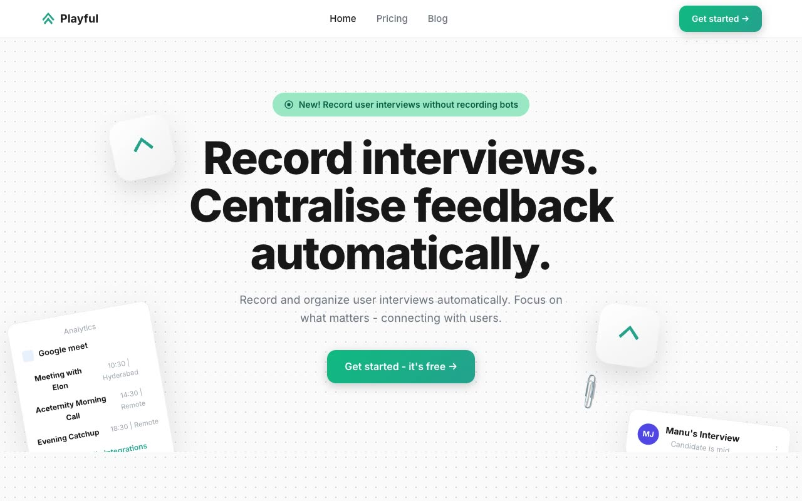

# Playful Marketing — SaaS Marketing Website Template Clone (Vanilla HTML/CSS/JS)

[](./demo.mp4)

Pixel-faithful clone of the Aceternity UI "Playful Marketing" template — a modern, five-page SaaS/marketing website aimed at interview recording and feedback management products. The design pairs a clean white background with a teal-green brand color (#25A18E), a subtle dot-grid background pattern, generously rounded sections (35 px border radius), and teal gradient CTAs for a professional yet approachable look. Built entirely with vanilla HTML, CSS, and JavaScript — no framework, no build step, all assets vendored locally. Generated with Claude Fable 5.

## Features

- **Five complete pages** — Home, Pricing, Blog listing, Blog post (with two-column article + TOC sidebar), and Sign-up
- **Dot-grid background** — CSS radial-gradient pattern repeated across hero and CTA sections
- **35 px border-radius cards and sections** — the signature "playful" rounded aesthetic throughout
- **Teal gradient buttons** — `#10B981` to `#25A18E` with a soft drop-shadow on hover
- **Sticky navbar** with logo, navigation links, and a "Get Started" CTA; collapses to a hamburger menu on mobile
- **Hero section** with floating UI card decorations (left and right) and an entrance fade-in animation
- **Social proof strip**, feature card grid, and testimonial quote cards on the homepage
- **Three-tier pricing table** with the Starter plan highlighted in the brand teal
- **Blog grid** (3-column) and a full single-post layout with breadcrumbs
- **Sign-up page** on a full-bleed teal gradient background, including GitHub OAuth button
- **Inter typeface** (Google Fonts, weights 400–800) with a full type scale from 14 px captions to 56 px hero headline
- **Entrance animations** — fade-in from bottom (translateY 20 px → 0, opacity 0 → 1, 0.5 s ease) on scroll
- **No build step required** — open any HTML file directly in a browser

## Run

This is a plain HTML/CSS/JS project with no build toolchain.

```sh
# Option 1 — open directly
open index.html

# Option 2 — local dev server (any static server works)
python3 -m http.server 8080
# then visit http://localhost:8080
```

Pages:

| File | Route |
|---|---|
| `index.html` | Home |
| `pricing.html` | Pricing |
| `blog.html` | Blog listing |
| `blog-post.html` | Blog post |
| `sign-up.html` | Sign-up |

`prompt.md` holds the full build specification and `demo.mp4` shows the template in motion.

## Credits

Faithful clone of an existing design, recreated for study/learning. All credit for the original design goes to its creators.

**Original:** Aceternity UI — https://ui.aceternity.com/template-preview/playful-marketing-aceternity

---

Part of the [Aceternity](../) premium templates inside the [Templates](../../) collection in the [claude-directory](../../../) — an open-source gallery of AI-generated UI built with Claude Fable 5. [Browse the live gallery](https://pulkitxm.com/claude-directory).
