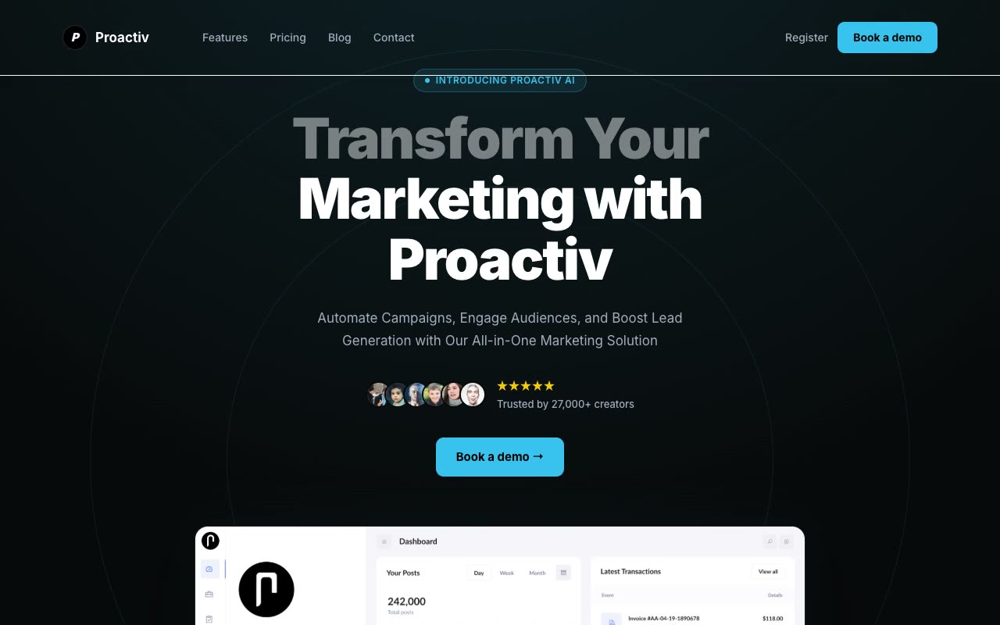

# Proactiv Marketing Template — Dark SaaS Landing Page Clone (Vanilla HTML/CSS/JS)

[](./demo.mp4)

A pixel-faithful, self-contained clone of the Proactiv Marketing Template by Aceternity UI — a six-page, dark-themed SaaS marketing site reproduced entirely in plain HTML, CSS, and vanilla JavaScript with no build step required. The design centres on a near-black (`#08090A`) background with a cyan accent (`#39C3EF`), Inter typeface, and a rich set of animations including a radial spotlight hero, infinite dual-row marquee testimonials, meteor shower effects, conic-gradient card borders, and scroll-triggered reveals. Built for study and to demonstrate that complex, production-quality UI can be achieved without a framework. Generated with Claude Fable 5.

## Pages

| File | Page |
|---|---|
| `index.html` | Home |
| `features.html` | Features |
| `pricing.html` | Pricing |
| `blog.html` | Blog |
| `contact.html` | Contact |
| `register.html` | Register |

## Key Features

- **Fixed floating navbar** — logo, page links, and auth CTAs that persist across all six pages
- **Hero with radial spotlight** — conic-gradient background effect, headline, avatar stack with star rating ("Trusted by 27,000+ creators"), and dashboard screenshot preview
- **Logos marquee** — infinite horizontal scroll of brand logos (Netflix, Google, Meta, etc.)
- **Feature tabs panel** — five-tab interactive panel (Post to Multiple Platforms, Analytics, Integrated AI, Easy Collaboration, Know Your Audience) with switching panel images
- **Infinite dual-row testimonial marquee** — sixteen quote cards scrolling in opposing directions
- **Pricing toggle** — monthly/yearly switch across four tiers (Hobby Free, Starter, Pro, Enterprise)
- **FAQ accordion** — ten collapsible questions on the home page
- **Blog cards** — featured image cards plus a text-list "More Posts" section
- **Contact form** — two-column layout with company details and a full input form
- **Register/auth page** — OAuth buttons (GitHub, Google) and email entry

## Run

Open `index.html` in your browser — no build step required. All assets are vendored locally.

For a local file server (avoids any browser same-origin restrictions on assets):

```sh
python3 -m http.server 8080
# then open http://localhost:8080
```

## Project Spec and Demo

`prompt.md` holds the full build specification. `demo.mp4` shows the finished result in motion.

## Credits

Faithful clone of an existing design, recreated for study/learning. All credit for the original design goes to its creators.

**Original:** Aceternity UI — <https://ui.aceternity.com/template-preview/proactiv-marketing-template>

---

Part of the [Templates](../../README.md) collection in the [claude-directory](../../../../README.md) — an open-source gallery of AI-generated UI built with Claude Fable 5. [Browse the live gallery](https://pulkitxm.com/claude-directory).
