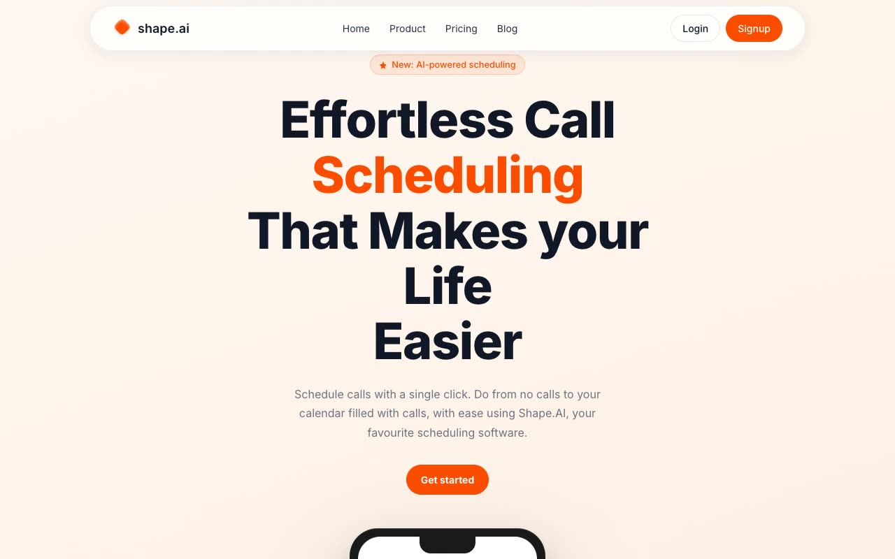

# Aceternity Schedule Marketing Template Clone — shape.ai Landing Page (Vanilla HTML/CSS/JS)

[](./demo.mp4)

Pixel-faithful clone of the Aceternity "Schedule Marketing Template" — a light-themed scheduling software marketing site built for a fictional brand, shape.ai. The site ships two pages: a full home page and a blog listing page. Visual highlights include a floating frosted-glass pill navigation, a warm orange-cream gradient hero with iPhone mockup, a bento-grid features section, an AI integration showcase, three-tier pricing with a dark highlighted card, an animated testimonials row, a smooth FAQ accordion, and a repeated CTA banner. The entire design runs on a clean orange-on-white palette with Inter font and requires no build tooling — it is plain HTML, CSS, and vanilla JavaScript. Generated with Claude Fable 5.

## Run

No build step required. Open the site in any of these ways:

**Option 1 — open directly in browser:**

```
open index.html
```

**Option 2 — serve locally (recommended, avoids any browser file-protocol restrictions):**

```sh
python3 -m http.server 8765
```

Then visit <http://localhost:8765> for the home page and <http://localhost:8765/blog.html> for the blog.

## Pages

| File | Description |
|------|-------------|
| `index.html` | Home — hero, features bento, pricing, testimonials, FAQ, CTA, footer |
| `blog.html` | Blog — featured post hero, article grid, CTA banner, footer |

## Source overview

- `styles.css` — all layout, typography, color tokens, and animation styles
- `main.js` — FAQ accordion toggle, any scroll behaviour, and interactive states
- `assets/images/` — all images vendored locally; no external image requests at runtime

See `prompt.md` for the full design spec and `demo.mp4` to see the site in motion.

## Credits

Faithful clone of an existing design, recreated for study/learning. All credit for the original design goes to its creators.

**Original:** Aceternity UI — <https://ui.aceternity.com/template-preview/schedule-marketing-template>

---

Part of the [Aceternity templates](../../) collection in the [claude-directory](../../../../) — an open-source gallery of AI-generated UI built with Claude Fable 5. [Browse the live gallery](https://pulkitxm.com/claude-directory).
