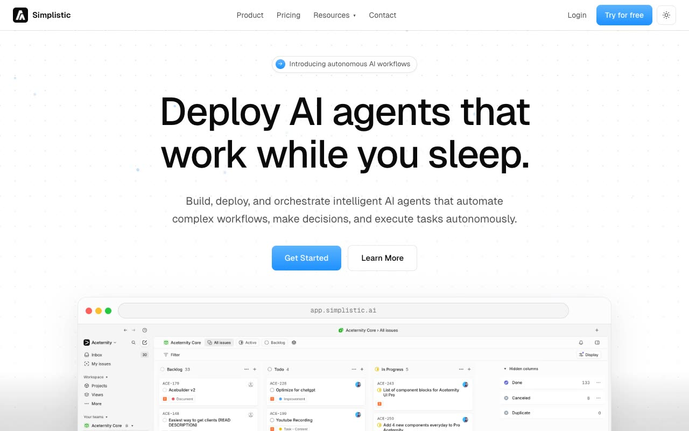

# Simplistic SaaS Template — Website Template Clone (Vanilla HTML + CSS + JS)

[](./demo.mp4)

Pixel-faithful clone of the Aceternity UI "Simplistic SaaS Template" — a clean, minimal AI workflow automation SaaS landing page spanning three pages: home (`index.html`), pricing (`pricing.html`), and login (`login.html`). Built entirely with plain HTML, CSS, and vanilla JavaScript (no framework, no build step), with the Geist variable font vendored locally. Standout techniques include a canvas-based animated dot-grid hero, IntersectionObserver entrance animations (blur + translateY fade-in), a scroll-reactive navbar with backdrop blur, a full light/dark theme system driven by CSS custom properties and persisted in `localStorage`, and responsive layout from a mobile hamburger drawer up to wide desktop breakpoints. Generated with Claude Fable 5.

## Run

This is a plain HTML/CSS/JS project — no build step required. Open any page directly in a browser:

```sh
open index.html
```

Or serve the folder with any static file server, for example:

```sh
python3 -m http.server 8080
# then visit http://localhost:8080
```

Pages:
- `index.html` — home / landing page
- `pricing.html` — pricing tiers and FAQ
- `login.html` — sign-in form with OAuth buttons

## Notes

- `prompt.md` holds the full build specification (layout, palette, typography, animations).
- `demo.mp4` shows the finished template in motion; `poster.jpg` is the preview frame.
- Theme preference is read from and written to `localStorage` under the key `theme`. Toggle buttons appear in the navbar and footer.
- The canvas dot-grid animation in the hero section is masked at the bottom edge and runs entirely in JavaScript using the Canvas 2D API.
- All font files and third-party logos are vendored under `assets/` — the page loads with no external network requests.

## Credits

Faithful clone of an existing design, recreated for study/learning. All credit for the original design goes to its creators.

**Original:** Aceternity UI — <https://ui.aceternity.com/template-preview/simplistic-saas-template>

---

Part of the [Aceternity](../../) collection in the [Templates](../../../) section of the [claude-directory](../../../../) — an open-source gallery of AI-generated UI built with Claude Fable 5. [Browse the live gallery](https://pulkitxm.com/claude-directory).
