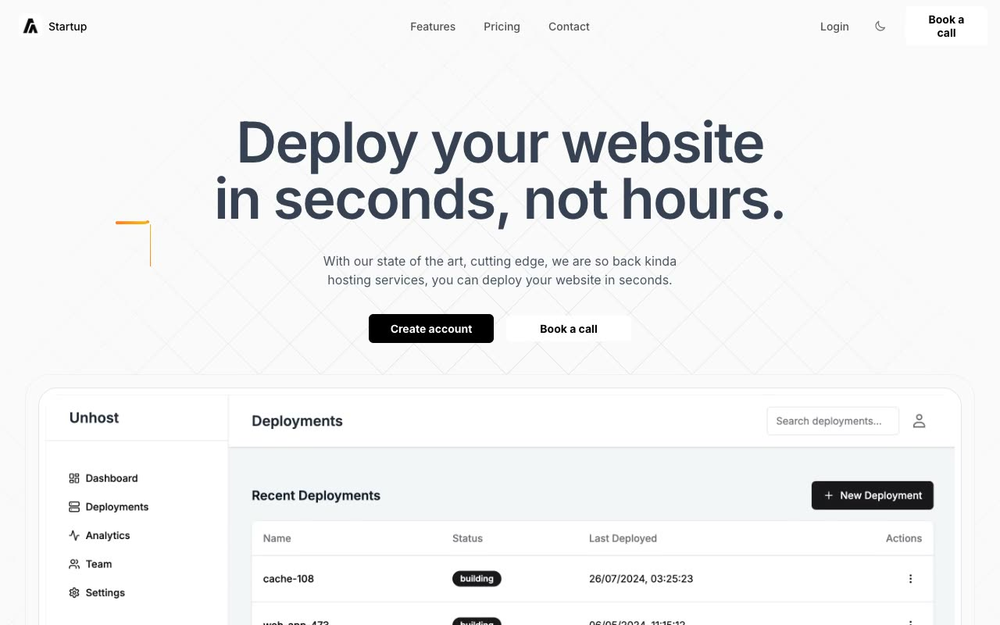

# Startup Landing Page Template

A clean, modern startup landing page with light/dark theme support, animated grid background, and full responsive layout. Faithfully reproduced from the Aceternity UI startup landing page template in pure HTML, CSS, and vanilla JavaScript — no build step required.

## Sections

- **Navbar** — Fixed top navbar with logo, centered navigation links (Features, Pricing, Contact), Login link, dark mode toggle, and "Book a call" CTA button. Mobile-responsive with hamburger menu.
- **Hero** — Full-screen section with diagonal animated grid background, orange/yellow sparkle decoration elements, large bold headline, subtitle, dual CTA buttons, and a product dashboard screenshot in a layered rounded card.
- **Features** ("Deployments made easy") — Bento-style 5-column grid with four feature cards: One Click Deploy (with terminal code snippet), Intuitive Workflow (icon grid), Hosting Over the Edge (dashboard image), and Running Out of Copy (skeleton loader visual).
- **Pricing** ("Simple pricing for advanced people") — Three-column pricing grid with Hobby (free), Starter, and Pro plans. Each card lists features with checkmark icons and a CTA button.
- **CTA** ("Host your websites with zero friction today") — Split layout with headline, description, stacked avatar social proof ("Trusted by 27,000+ developers"), and a gradient "Book a call" button.
- **Footer** — Logo and copyright on the left, four-column link grid (Pages, Socials, Legal, Register) on the right, large "STARTUP" watermark text below using gradient clip.

## Tech Stack

- Pure HTML5, CSS3, vanilla JavaScript
- CSS custom properties for all design tokens (light/dark theme via `html.dark` class)
- Inter font via Google Fonts
- IntersectionObserver for scroll-reveal animations
- No build step — open `index.html` directly or serve with any static file server

## Credits

Faithful clone of an existing design, recreated for study/learning. All credit for the original design goes to its creators.

**Original:** Aceternity UI — https://ui.aceternity.com/template-preview/startup-landing-page-template
