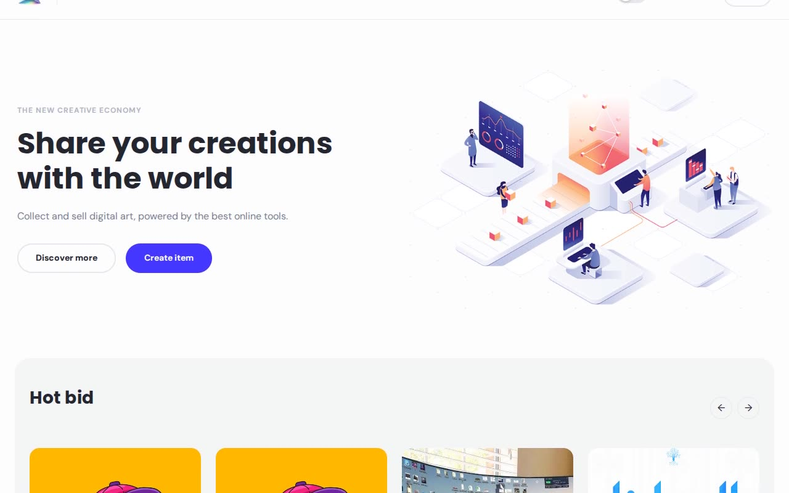

# uNFT Marketplace — NFT & Digital Art Storefront Template (Vanilla HTML/CSS/JS)

[](./demo.mp4)

uNFT Marketplace is a full multi-page digital-art / NFT storefront cloned pixel-faithfully from the Cosmic CMS "uNFT Marketplace" demo, rebuilt as plain HTML, CSS, and vanilla JavaScript with no build step required. It ships a marketing home page (hero, "Hot bid" carousel, category collections, a featured-product spotlight, an introduction banner, a reviews strip, and a full filterable "Discover" grid), an About page, a dedicated Search/filter page, an "Upload details" (create item) page gated behind an authentication modal, and a shared product-detail template rendered for every one of the 50 listings in the vendored catalog dataset. The whole site works natively in light and dark mode via CSS custom properties, with the theme toggle wired into both the header and footer and persisted to `localStorage`. All fonts (Poppins, DM Sans) and every catalog image are vendored locally so the site runs fully offline.

## Pages

| File | Route |
|---|---|
| `index.html` | Home — hero, hot bid carousel, hot collections, spotlight, intro banner, reviews, discover grid |
| `about.html` | About Us |
| `search.html` | Search / filter page (keyword, color, price range sidebar + category chips) |
| `upload-details.html` | Create item form, gated by the "Authentication with Cosmic" modal |
| `item/<slug>.html` | Product detail page — one static file per catalog listing (50 total), all sharing one template driven by `assets/data/catalog.js` |

## Run

No build step. Serve the folder with any static server:

```sh
python3 -m http.server 8080
```

Then open `http://localhost:8080` in a browser. Because pages load catalog data from `assets/data/catalog.js` via `<script src>` (not `fetch`), you can also open `index.html` directly from disk in most browsers without a server.

## Notable techniques

- **One template, 50 generated pages** — every `item/<slug>.html` is the same markup differing only by a one-line `ITEM_SLUG` value; `assets/js/item.js` reads the matching record out of the vendored `assets/data/catalog.js` dataset (title, image, price, stock count, description, category tags) and renders the whole page at runtime.
- **Light / dark theme tokens** — every color is a CSS custom property in `assets/css/tokens.css`, overridden under `:root.dark`. An inline no-flash boot script in every page's `<head>` reads `localStorage` (falling back to `prefers-color-scheme`) and applies the theme before first paint; `assets/js/theme.js` wires the header/footer toggle switches and persists the choice.
- **Shared chrome, zero duplication** — `assets/js/chrome.js` renders the header, mobile nav drawer, footer, and the site-wide "Authentication with Cosmic" modal into `[data-mount]` placeholders on every page, so the announcement bar, nav, and footer stay in sync from one source of truth.
- **Event-delegated modal/drawer** — clicks on `[data-open-modal]` / `[data-close-modal]` / `[data-open-drawer]` / `[data-close-drawer]` are handled via a single delegated listener on `document`, so dynamically-inserted triggers (like the "Choose collection" tiles on the Create Item page) open the modal without extra wiring.
- **Client-side category filtering** — `assets/js/filter.js` toggles `.card` visibility by `data-categories` when a chip is clicked, reproducing the reference site's Sale / Special offer / Cosmos / Artwork filters on the Home, Search, and every item page's Discover grid.
- **Card hover micro-interaction** — product cards scale their image and fade in a "Quick view" overlay button on hover via a CSS `transition`, matching the reference's `Card_control` hover behavior.
- **Gated "Buy Now" / "Create Item" flow** — both actions open the same auth modal as the live Stripe-backed reference (no real checkout is ever triggered), matching the reference site's authentication gate.

## Build spec and demo

`prompt.md` contains the full specification used to build this template. `demo.mp4` shows the home page in motion including the hover states, theme toggle, and mobile menu.

## Credits

Faithful clone of an existing design, recreated for study/learning. All credit for the original design goes to its creators.

**Original:** Cosmic CMS NFT Marketplace Demo — <https://unft-marketplace.vercel.app/>

---

Part of the [Templates](../) collection in the [fable](../../../) gallery. [Browse the live gallery](https://pulkitxm.com/claude-directory).
