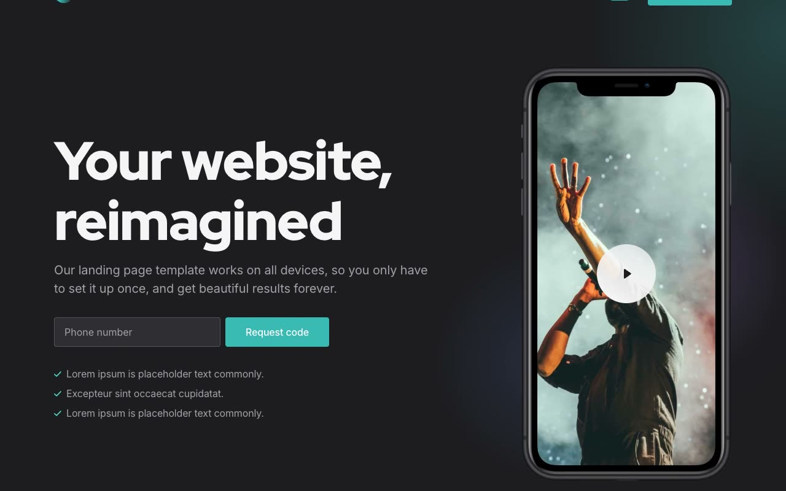

# Appy — Mobile App Landing Page Template Clone

[](./demo.mp4)

A pixel-faithful, self-contained HTML clone of the **Appy** landing page template by Cruip — a polished multi-page mobile app marketing site built with Tailwind CSS, Alpine.js, AOS scroll animations, and Swiper carousel. No build step required: open any HTML file directly in a browser or serve from any static host.

## Features

- **8 fully-cloned pages** — Home, About, Blog, Blog Post, Testimonials, Help Center, 404, and Contact
- **Dark / light theme toggle** — driven by CSS custom properties with `localStorage` persistence and a no-flash boot script
- **Alpine.js interactions** — mobile hamburger menu, dropdown nav, video modal, FAQ accordions
- **AOS scroll animations** — fade-in/up entrance effects on all major sections (ease-out-quart, 750 ms)
- **Swiper carousel** — full-width auto-playing touch carousel of app screenshot images
- **Inter + Red Hat Display typography** — loaded from Google Fonts
- **All assets vendored locally** — images, vendor JS/CSS, and demo video included; no external runtime deps except Google Fonts

## Pages

| File | Description |
|------|-------------|
| `index.html` | Hero, feature sections, carousel, pricing, testimonials, CTA |
| `about.html` | Company story, stats, team grid, careers section |
| `blog.html` | 6-post grid with author avatars, tags, and pagination |
| `blog-post.html` | Full article layout with related posts sidebar |
| `testimonials.html` | 16-quote grid + video testimonial modal |
| `help.html` | Searchable FAQ with Alpine.js accordion |
| `contact.html` | Contact form + address/email/phone cards |
| `404.html` | Illustrated 404 page with back-home link |

## Run Locally

```bash
# Any static server works — no build step needed
python3 -m http.server 8080
# then open http://localhost:8080/index.html
```

Or simply open `index.html` directly in your browser (note: the video modal requires a server for `video.mp4` to load).

## Directory Structure

```
appy/
├── index.html
├── about.html
├── blog.html
├── blog-post.html
├── testimonials.html
├── help.html
├── contact.html
├── 404.html
├── style.css          # compiled Tailwind (vendored from original)
├── css/vendors/       # AOS, Swiper CSS
├── js/
│   ├── vendors/       # Alpine.js, AOS, Swiper JS
│   └── main.js        # theme toggle + Swiper init + AOS init
├── images/            # all template images vendored locally
└── videos/
    └── video.mp4      # demo video for modal player
```

## Tech Stack

- **Tailwind CSS** (compiled, vendored) — utility-first styling with dark-mode variant
- **Alpine.js** — lightweight reactive JS for menus, modals, accordions, toggles
- **AOS** (Animate On Scroll) — scroll-triggered entrance animations
- **Swiper** — touch-enabled carousel with autoplay and navigation

## Credits

Faithful clone of an existing design, recreated for study/learning. All credit for the original design goes to its creators.

**Original:** Cruip — <https://cruip.com/demos/appy/>

---

[Browse all premium templates](../../README.md) · [Back to templates root](../../../README.md)
