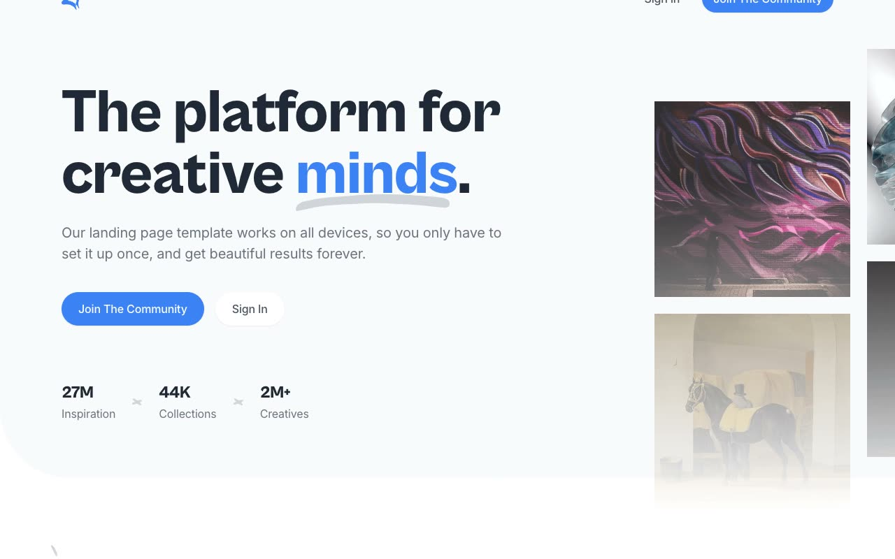

# Creative — Community / Mood-Board Marketing Landing Page Template (HTML/CSS/Alpine.js)

[](./demo.mp4)

A pixel-faithful clone of the **Creative** template by Cruip — a light-themed marketing landing page for a creative-inspiration / mood-board community product ("Join the community"). It pairs a bold Cabinet Grotesk headline with an Inter body type, a hero image collage, AOS scroll-reveal animations, Swiper carousels for trending collections and blog posts, and an Alpine.js-driven mobile nav. Ships with matching sign-in, sign-up, and reset-password pages. Runs offline as plain HTML + CSS + JS with no build step.

## Pages

| Page | Description |
|------|-------------|
| `index.html` | Full marketing home page (hero, inspiration grid, trending collections, creatives, pricing, testimonial, FAQ, blog, CTA, footer) |
| `signin.html` | "Welcome back, Creative!" sign-in form with social sign-in option |
| `signup.html` | "Join the community" sign-up form with terms checkbox and social signup option |
| `reset-password.html` | Password reset form with link back to sign in |

## Sections (Home)

1. **Header** — Logo plus "Sign in" / "Join the community" nav, collapsing to an Alpine.js hamburger menu on mobile
2. **Hero** — Headline "The platform for creative minds.", subcopy, dual CTAs, stat row (27M inspiration / 44K collections / 2M+ creatives), four-image hero collage
3. **Latest Inspiration** — Filter pills (All/Illustration/Branding/Product Design/Typography) above a 3x3 image grid with a "Join the community" CTA
4. **Trending Collections** — Dark navy band with a Swiper carousel of collection cards (cover image, avatar stack, title, collection count) and prev/next arrows
5. **Join Over 2M Creatives** — 2x2 grid of creator cards (avatar, name, follow button) plus copy block and CTA
6. **Pricing** — Yearly/monthly toggle, two plan cards (Free Starter / $29 Business "Most Popular") with feature checklists
7. **Testimonial** — Avatar, quote, Twitter handle, "Read story" link
8. **FAQ** — Two-column list of question/answer pairs
9. **From Our Blog** — Swiper carousel of blog post cards (cover image, title, author avatar + name)
10. **Closing CTA** — Dark navy banner with angled clip-path edge and "Join the community" button
11. **Footer** — Logo, newsletter signup, social icons, legal links, affiliate disclosure

## Interactions

- **AOS scroll reveals** — fade-up / fade-right entrance animations on hero copy, section headings, and grid cards, staggered per element (~120-700ms delays)
- **Swiper carousels** — power the "Trending Collections" and "From Our Blog" horizontal scrollers
- **Alpine.js** — drives the mobile hamburger menu toggle and other `x-show`/`x-data` interactive widgets
- **Hover states** — simple color/opacity transitions on buttons and links

## Stack

- Plain HTML + CSS (no build step)
- Self-hosted **Cabinet Grotesk** (WOFF/WOFF2, weights 500/700/800) for headlines; **Inter** (Google Fonts CDN, weights 400/500/600) for body text
- [AOS](https://michalsnik.github.io/aos/) — scroll animations (vendored under `assets/js/`)
- [Swiper](https://swiperjs.com/) — carousels (vendored under `assets/js/`)
- [Alpine.js](https://alpinejs.dev/) — mobile nav and interactive widgets (vendored under `assets/js/`)
- All CSS, JS, fonts, and images vendored locally under `assets/` except Google Fonts (Inter), which stays on the Google Fonts CDN

## Run

```bash
# From this folder, serve statically and open the pages
python3 -m http.server 8000
# then visit http://localhost:8000/index.html
```

## Verify

- Open `index.html` and scroll — hero copy, section headings, and grid cards fade up/right into view via AOS
- Confirm the "Trending Collections" and "From Our Blog" carousels scroll via Swiper's prev/next arrows
- Resize to mobile width and confirm the Alpine.js hamburger menu opens/closes the nav
- Open `signin.html`, `signup.html`, and `reset-password.html` and confirm the forms render with the shared header/logo
- Confirm `demo.mp4` plays and `poster.jpg` exists

`prompt.md` in this folder holds the full build spec, and `demo.mp4` shows the template in motion.

## Credits

Faithful clone of an existing design, recreated for study/learning. All credit for the original design goes to its creators.

**Original:** Cruip — <https://cruip.com/demos/creative/>

---

Part of the [Cruip](../) premium templates in the [Templates](../../../) collection of the [claude-directory](../../../../) — a gallery of UI experiments and premium template clones.
