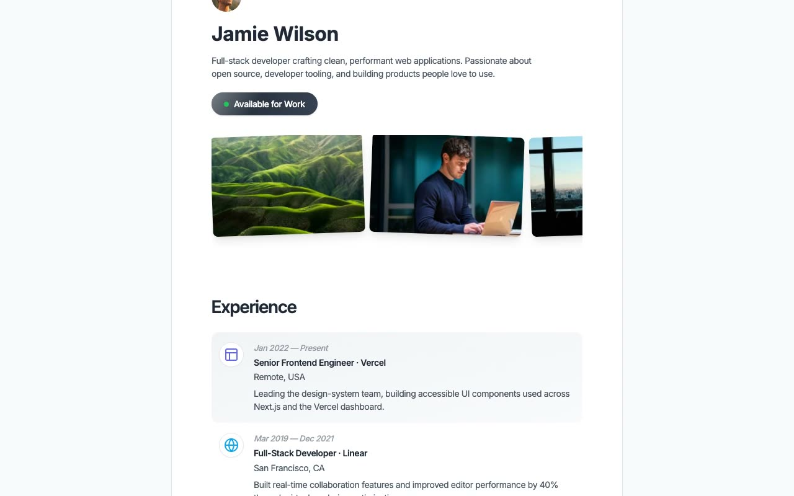

# Cruip Devfolio

A pixel-faithful clone of the [Cruip Devfolio](https://cruip.com/demos/devfolio/) developer portfolio template — a single-page minimal portfolio for freelance developers featuring a light/dark mode toggle, testimonial carousel, and polished hover animations.

## Features

- Light/dark mode toggle with localStorage persistence and no-flash boot script
- Testimonial carousel with auto-advance (3s), pause on hover/focus, and seamless looping
- Header images and tutorial cards with a tilt/reset rotation effect on hover
- "Available for Work" badge with a diagonal shimmer sweep animation
- Article and side-hustle arrow icons that rotate 45° on parent hover
- Gradient `mask-image` fade on carousel sides (desktop)
- All assets vendored locally — no CDN, no build step required

## Usage

Open `index.html` directly in a browser. No server or build step needed.

## Design Tokens

| Token | Light | Dark |
|---|---|---|
| Background | `#F9FAFB` | `#030712` |
| Surface | `#FFFFFF` | `#111827` |
| Border | `#E5E7EB` | `#1F2937` |
| Text primary | `#1F2937` | `#F3F4F6` |
| Text secondary | `#4B5563` | `#9CA3AF` |
| CTA gradient | `#1F2937 → #374151` | `#D1D5DB → #F3F4F6` |

**Fonts:** Inter (400/500/600) + Inter Tight (600/700) via Google Fonts

## Credits

Original: Cruip — https://cruip.com/demos/devfolio/
