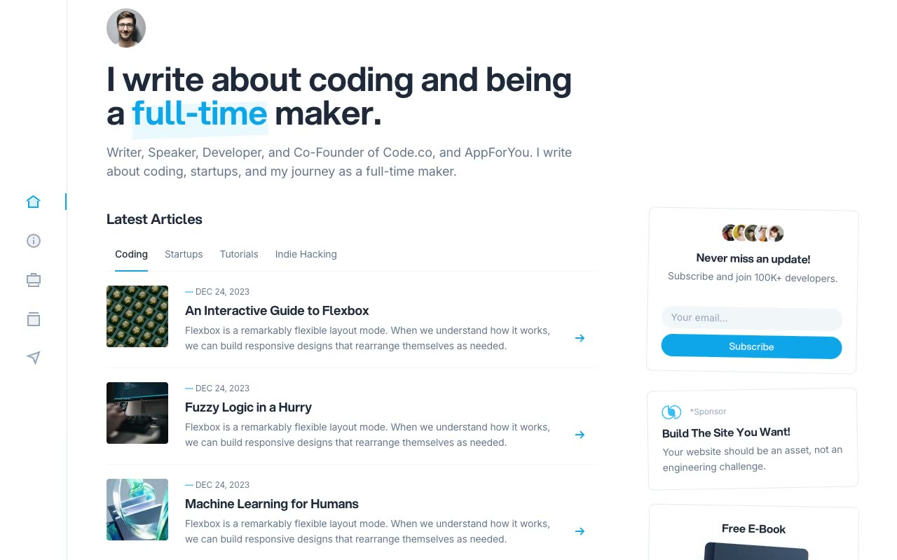

# DevSpace — Developer Blog & Personal-Brand Website Template Clone (HTML/CSS + Alpine.js, offline, no build)

[](./demo.mp4)

A faithful, self-contained clone of the Cruip **DevSpace** developer/maker blog and personal-brand template — a clean, minimal six-page site built on a fixed left icon rail, a centered content column, and a right widget sidebar. Rebuilt as plain HTML + CSS + vanilla JavaScript with Alpine.js driving the article tabs and search modal and a small light-switch script driving light/dark mode, with every asset (images, Aspekta + Inter + PT Mono fonts, Alpine, `main.js`) vendored locally so it runs fully offline with no build step. Ideal as a static personal-site, blog, or portfolio starter and a study in reproducing a production HTML template pixel-for-pixel.

## Pages

1. **Home** (`index.html`) — hero with avatar and intro, Latest Articles with an Alpine-driven tab bar (Coding / Startups / Tutorials / Indie Hacking) over a list of article rows, Popular Talks video cards, Open-Source Projects cards, and a subscribe/sponsor/e-book right sidebar.
2. **About** (`about.html`) — bio, career with inline links, an experience timeline with brand icons, and Let's Connect.
3. **Projects** (`projects.html`) — "Nice stuff I've built": side hustles and a two-column grid of client project cards.
4. **Resume** (`resume.html`) — education and work-experience timelines, awards, recommendations, plus a skills/languages meter sidebar.
5. **Subscribe** (`subscribe.html`) — benefits checklist, email subscribe form, avatar stack, and testimonial cards.
6. **Post** (`post.html`) — long-form article layout with sub-headings, inline links, and dark, syntax-tinted code blocks in PT Mono.

## Features

- Fixed left icon rail (Home, About, Projects, Resume, Subscribe + avatar)
- Sticky top utility row with search field/modal, dark-mode light switch, and subscribe pill button
- Alpine.js article tabs and search modal
- Education / work / experience timelines
- Dark code blocks with PT Mono
- Light/dark theme via a `.dark` class on `<html>`
- Fully vendored assets (local fonts, images, Alpine, `main.js`) — runs offline

## Run

This is a static site with no build step. Serve the project folder over HTTP and open `index.html`:

```sh
python3 -m http.server
```

Then visit `http://localhost:8000/index.html` in your browser. (Opening `index.html` directly from the filesystem also works, but a local server is recommended so fonts and assets load consistently.)

## Verify

There is no automated test script. Verify visually: with the server running, open each of the six pages, switch the dark-mode light switch, cycle the Latest Articles tabs on Home, and open the search modal.

`prompt.md` holds the full build spec (palette, fonts, type scale, per-page structure) and `demo.mp4` shows the template in motion.

## Credits

Faithful clone of an existing design, recreated for study/learning. All credit for the original design goes to its creators.

**Original:** Cruip — https://cruip.com/demos/devspace/

---

Part of the [Templates](../../../) collection in the [claude-directory](../../../../) — an open-source gallery of UI templates. [Browse the live gallery](https://pulkitxm.com/claude-directory).
