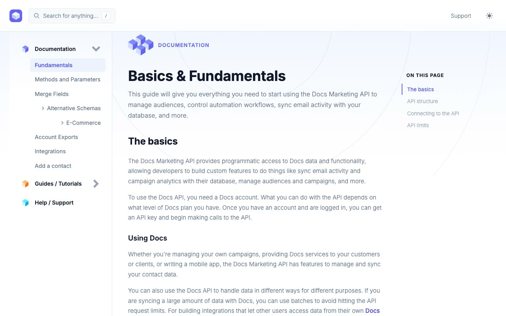

# Cruip Docs

A clean, professional documentation template with a three-column layout: sticky header, collapsible left sidebar navigation, main article content area, and a right-side "On this page" scrollspy TOC.

## Pages

- **index.html** — Basics & Fundamentals (main documentation page)
- **guides.html** — Marketing API Quick Start guide with image/video modal
- **help.html** — Help & Support with FAQ accordion and contact form

## Features

- Sticky 80px header with logo, search modal (keyboard shortcut `/`), and dark/light mode toggle
- Collapsible 260px left sidebar with 3-level nested navigation and 3D cube section icons (blue/orange/teal)
- Main article area with H1/H2/H3 headings, paragraphs, bullet lists, and inline code
- Syntax-highlighted code blocks (dark background, colored keyword/string spans)
- Info and success callout boxes with icons
- "On this page" scrollspy TOC (right column, desktop only)
- Feedback emoji reaction buttons
- Next/Prev page navigation
- Article footer with social icon links (Twitter/X, GitHub, Telegram)
- Mobile hamburger slide-in sidebar with dark backdrop overlay
- Breadcrumbs bar on mobile
- FAQ accordion (help page)
- Contact form with select, input, and textarea fields (help page)
- Video modal with play button overlay (guides page)
- CSS custom-property light/dark theming persisted in localStorage with no-flash boot script
- Fully responsive (mobile, tablet, desktop)

## Tech Stack

- Plain HTML5
- CSS with custom properties (zero framework)
- Vanilla JavaScript (no dependencies)
- Inter from Google Fonts

## Credits

Faithful clone of an existing design, recreated for study/learning. All credit for the original design goes to its creators.

**Original:** Cruip — https://cruip.com/demos/docs/
