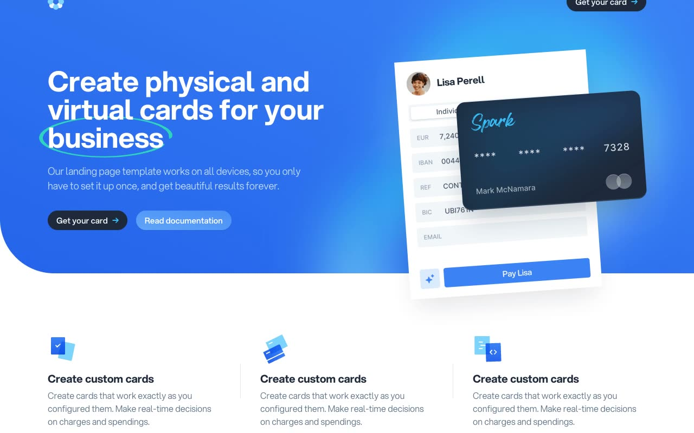

# Fintech — Neobank Card Landing Page Template

[](./demo.mp4)

A pixel-faithful clone of the **Fintech** template by Cruip — a bright, blue neobank / fintech landing page for a "custom card" product (branded **Spark**). It pairs a bold Aspekta display headline with a hand-drawn teal underline flourish, floating payment-UI and credit-card illustrations, soft radial-gradient feature sections, a Swiper testimonial carousel, a four-tier pricing grid, and AOS scroll-reveal animations throughout. Ships with a matching application form page and a collapsible support-center article page. Runs offline as plain HTML + CSS + JS with no build step.

## Pages

| Page | Description |
|------|-------------|
| `index.html` | Full marketing home page (hero, features, pricing, FAQ, CTA, footer) |
| `apply.html` | "Get your card" two-column application form with press logos |
| `support.html` | Support center knowledge-base article with a collapsible topic sidebar |

## Sections (Home)

1. **Header** — Logo (dot-cluster SVG) and a single "Get your card" pill button with arrow
2. **Hero** — Dark blue radial-glow background, large headline with teal underline on "business", dual CTAs, floating payment-UI + credit-card illustration
3. **Feature Trio** — Three "Create custom cards" items with gradient SVG icons
4. **Flexible Card Program** — Copy + author quote + product screenshot on a radial background
5. **Spend Everywhere** — Reversed dark panel with quote and product screenshot
6. **Cashback Rewards** — Two-column brand lists (Physical / Online stores) with check icons
7. **Get Started** — Logo constellation illustration + three numbered step cards
8. **Compliance** — Feature checklist beside a Swiper testimonial carousel
9. **Pricing** — Four plans (Starter / Smart [Popular] / You / Black) with card art and feature lists
10. **FAQs** — Two-column static question/answer grid
11. **CTA** — Dark panel "Get the only custom super card" with two buttons
12. **Footer** — Dark, logo + four link columns and legal fine print over an illustration glow

## Interactions

- **AOS scroll reveals** — `fade-up`, 700ms, `ease-out-cubic`, fire once, staggered via `data-aos-delay` and anchored per-section with `data-aos-anchor`
- **Swiper testimonial carousel** — fade effect with clickable pagination bullets
- **Alpine.js support sidebar** — collapsible topic groups with a rotating chevron plus a slide/fade mobile drawer (`@click.outside` / Escape to close)
- **Hover states** — buttons, nav links, pricing CTAs, and footer links (color shift + arrow nudge)
- **Form controls** — HTML5 `required` fields, native selects, and textarea on the apply page

## Stack

- Plain HTML + CSS (no build step)
- Self-hosted **Aspekta** font (WOFF2, weights 350/400/450/500/550/700) under `fonts/`
- [Swiper](https://swiperjs.com/) — testimonial carousel (vendored under `js/vendors/`)
- [AOS](https://michalsnik.github.io/aos/) — scroll animations (vendored under `js/vendors/`)
- [Alpine.js](https://alpinejs.dev/) — support sidebar accordion/drawer (vendored under `js/vendors/`)
- All images, icons, styles, and scripts vendored locally — fully offline

## Run

```bash
# From this folder, serve statically and open the pages
python3 -m http.server 8765
# then visit http://localhost:8765/index.html
```

## Verify

- Open `index.html` and scroll — feature, pricing, and CTA sections fade up into view
- Confirm the testimonial carousel bullets switch between the two review cards
- Open `apply.html` — the form panel renders with press logos and native selects
- Open `support.html` — click sidebar topics to expand/collapse; resize to mobile to test the drawer
- Confirm `demo.mp4` plays and `poster.jpg` exists

## Credits

Faithful clone of an existing design, recreated for study/learning. All credit for the original design goes to its creators.

**Original:** Cruip — <https://cruip.com/demos/fintech/>
