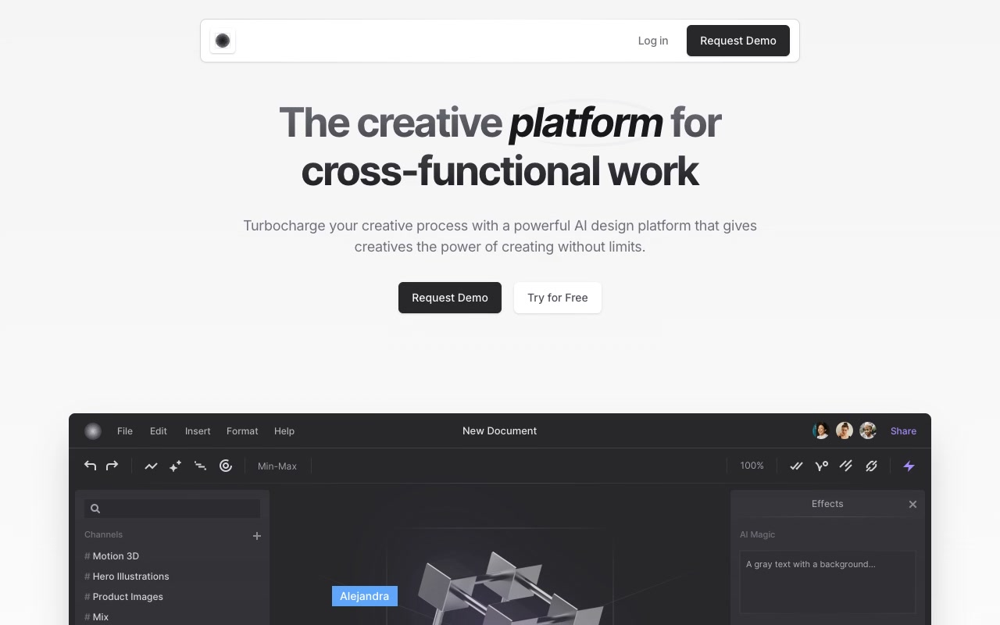

# Gray — AI-Powered Creative Platform Landing Page Template Clone

[](./demo.mp4)

A pixel-faithful, self-contained HTML/CSS/JS clone of the **Gray** SaaS landing page template by [Cruip](https://cruip.com/demos/gray/). This reproduction faithfully recreates a modern AI design platform marketing site — complete with animated counters, tabbed feature carousels, an interactive pricing slider, FAQ accordion, and infinite-scroll testimonials — as plain static files with zero build steps.

## Features

- **4 pages**: Home (index.html), Login, Request Demo, Reset Password
- **Interactive pricing slider** powered by Alpine.js — adjusts plan prices dynamically across 5 contact tiers
- **Animated scroll counters** that count up when scrolled into view (IntersectionObserver + Alpine.js)
- **Tabbed feature sections** with smooth fade/slide transitions
- **Infinite-scroll testimonial rows** — two rows, one scrolling left, one scrolling right, pausing on hover
- **FAQ accordion** with CSS `grid-template-rows` open/close animation
- **Tooltip popovers** on pricing feature items
- **Responsive** navbar, hero, and card grid
- **Inter + Inter Tight** fonts (Google Fonts)
- **Zinc color palette** — light design with mixed dark sections

## Pages

| Page | File |
|------|------|
| Home / Landing | `index.html` |
| Log In | `login.html` |
| Reset Password | `reset-password.html` |
| Request Demo | `request-demo.html` |

## Run Locally

No build step required. Open `index.html` directly in a browser, or serve with any static file server:

```bash
cd templates/premium/cruip/gray
python3 -m http.server 8080
# then open http://localhost:8080
```

## Verify

```bash
# Check all pages exist
ls templates/premium/cruip/gray/*.html

# Check assets are present
ls templates/premium/cruip/gray/assets/images/
ls templates/premium/cruip/gray/assets/js/

# Play demo
open templates/premium/cruip/gray/demo.mp4
```

## Tech Stack

- Plain HTML5 + CSS3 (custom properties, grid, flexbox, animations)
- [Alpine.js v3](https://alpinejs.dev/) — vendored locally for counters, tabs, slider, accordion, tooltips
- CSS `@keyframes` for infinite scroll animations
- No build tools, no frameworks, no bundler

## Credits

Faithful clone of an existing design, recreated for study/learning. All credit for the original design goes to its creators.

**Original:** Cruip — <https://cruip.com/demos/gray/>

---

Browse more templates in the [premium collection](../../) or return to the [full fable gallery](../../../../README.md).
