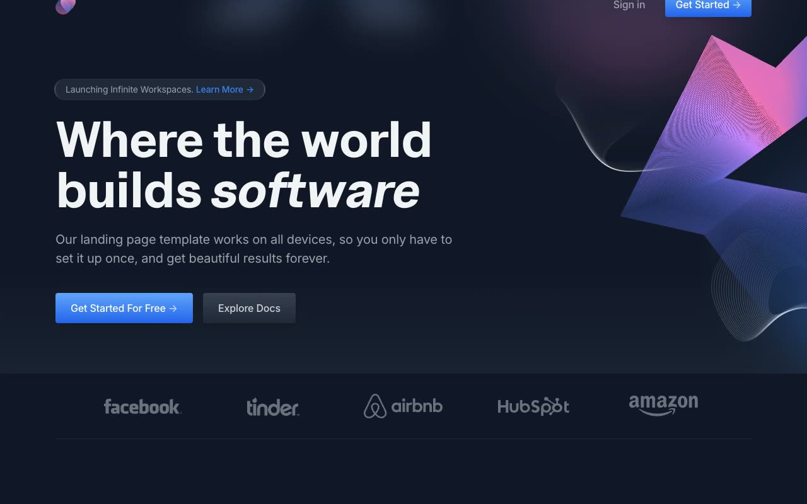

# Neon — Dark-Mode SaaS Landing Page & Auth Flow Template Clone

[](./demo.mp4)

A pixel-faithful, self-contained HTML/CSS/JS clone of the **Neon** dark-mode SaaS landing page template by [Cruip](https://cruip.com/demos/neon/). This reproduction faithfully recreates a gradient-driven developer-platform marketing site — complete with a glowing hero illustration, orbiting feature graphic, code-editor mockup, pricing table, testimonial grid, and gradient CTA banner — plus a matching sign in, sign up, and reset password auth flow, all as plain static files with zero build steps.

## Features

- **4 pages**: Home (index.html), Sign In, Sign Up, Reset Password
- **Dark navy theme** with pink/purple/blue gradient accents throughout
- **Gradient hero illustration** with radial glow behind an animated ribbon SVG
- **Orbiting icon graphic** around a glowing concentric-circle orb in the features section
- **Code-editor mockup panel** with syntax-highlighted lines and a floating git-commit notification chip
- **Pricing table** with a highlighted "Most Popular" tier
- **Testimonial grid** with a gradient fade-out mask on the bottom row
- **Filterable resources section** with pill-shaped tabs
- **Gradient CTA banner** (blue → purple → pink)
- **Scroll-reveal animations** powered by AOS (Animate On Scroll)
- **Alpine.js** for the mobile menu toggle and interactive state
- **Split-layout auth pages** (Sign In / Sign Up / Reset Password) sharing a consistent illustration column
- **Inter** (Google Fonts) + a vendored **Uncut Sans** display webfont

## Pages

| Page | File |
|------|------|
| Home / Landing | `index.html` |
| Sign In | `signin.html` |
| Sign Up | `signup.html` |
| Reset Password | `reset-password.html` |

## Run Locally

No build step required. Open `index.html` directly in a browser, or serve with any static file server:

```bash
cd templates/premium/cruip/neon
python3 -m http.server 8080
# then open http://localhost:8080
```

## Verify

```bash
# Check all pages exist
ls templates/premium/cruip/neon/*.html

# Check assets are present
ls templates/premium/cruip/neon/assets/css/
ls templates/premium/cruip/neon/assets/js/
ls templates/premium/cruip/neon/assets/images/

# Play demo
open templates/premium/cruip/neon/demo.mp4
```

## Tech Stack

- Plain HTML5 + CSS3 (compiled Tailwind-style utility classes, gradients, custom properties)
- [Alpine.js](https://alpinejs.dev/) — vendored locally for mobile menu/dropdown interactivity
- [AOS (Animate On Scroll)](https://michalsnik.github.io/aos/) — vendored locally, initialized with `once: true`, `duration: 500`, `easing: 'ease-out-cubic'`
- Locally vendored fonts (Inter + Uncut Sans, woff2/woff)
- No build tools, no frameworks, no bundler

## Credits

Faithful clone of an existing design, recreated for study/learning. All credit for the original design goes to its creators.

**Original:** Cruip — <https://cruip.com/demos/neon/>

---

Browse more templates in the [premium collection](../../) or return to the [full fable gallery](../../../../README.md).
