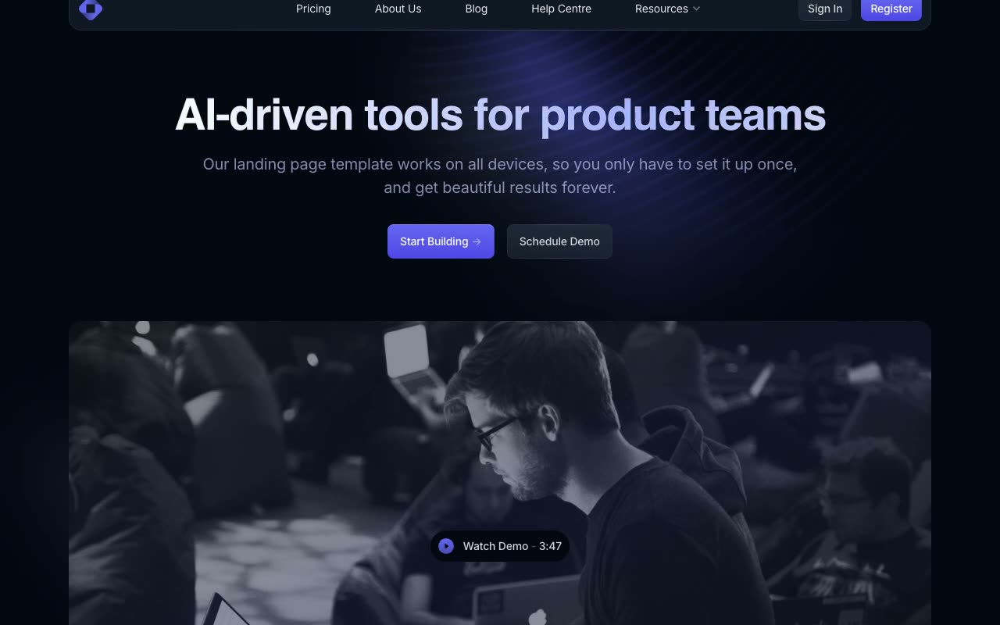

# Open PRO — Dark SaaS Landing Page Template Clone (Alpine.js + AOS + Vanilla HTML/CSS/JS)

[](./demo.mp4)

Open PRO is a pixel-faithful clone of Cruip's premium dark-themed multi-page SaaS marketing site template, spanning 12 pages and built with Alpine.js, AOS (Animate on Scroll), and plain HTML/CSS/JS — no build step required. The design pairs a near-black `#030712` background with indigo accent gradients and the Inter typeface, and ships standout features including an animated gradient headline, spotlight hover cards driven by CSS custom properties on `mousemove`, a masonry blog grid, a billing-toggle pricing section, AOS scroll-entrance animations, and an Alpine.js-powered sticky header with a resources dropdown and mobile hamburger menu. It covers every screen a SaaS marketing site needs: marketing, auth, support, and content.

## Features

- Animated gradient H1 headline (indigo-to-white shimmer, 6 s linear loop)
- Spotlight hover cards — CSS `--mouse-x` / `--mouse-y` custom properties updated on `mousemove`
- AOS scroll-entrance animations (`ease-out-sine`, 600 ms, fires once, disabled on phones)
- Alpine.js sticky header with resources dropdown and hamburger mobile menu
- Annual / monthly billing toggle on Home and Pricing pages
- Masonry blog grid (15 posts)
- Near-black palette (`#030712`) with indigo-500 (`#6366f1`) accent gradients
- Inter typeface (weights 400–900) loaded from Google Fonts
- All assets vendored locally — runs fully offline

## Pages

| # | Page | File |
|---|------|------|
| 1 | Home | `index.html` |
| 2 | Pricing | `pricing.html` |
| 3 | About Us | `about.html` |
| 4 | Blog | `blog.html` |
| 5 | Blog Post | `blog-post.html` |
| 6 | Help Centre | `help.html` |
| 7 | Newsletter | `newsletter.html` |
| 8 | Contact | `contact.html` |
| 9 | 404 | `404.html` |
| 10 | Sign In | `signin.html` |
| 11 | Sign Up | `signup.html` |
| 12 | Reset Password | `reset-password.html` |

## Tech Stack

| Technology | Role |
|-----------|------|
| Alpine.js | Dropdowns, mobile menu, billing toggle, Alpine transitions |
| AOS (Animate on Scroll) | Scroll-entrance animations |
| Inter (Google Fonts) | Typography (weights 400–900) |
| Vanilla HTML / CSS / JS | Markup, layout, spotlight card effect |

No build tool, bundler, or package manager is needed.

## Getting Started

Because there is no build step, open any page directly in a browser:

```
open index.html
```

Or serve the folder with a local static server to avoid any browser CORS restrictions on local assets:

```sh
python3 -m http.server 8080
# then visit http://localhost:8080
```

`prompt.md` holds the full build specification. `demo.mp4` shows the template in motion.

## Credits

Faithful clone of an existing design, recreated for study/learning. All credit for the original design goes to its creators.

**Original:** Cruip — https://cruip.com/demos/open-pro/

---

Part of the [Cruip](../) premium templates in the [Templates](../../../) collection of the [claude-directory](../../../../) — a gallery of UI experiments and premium template clones.
