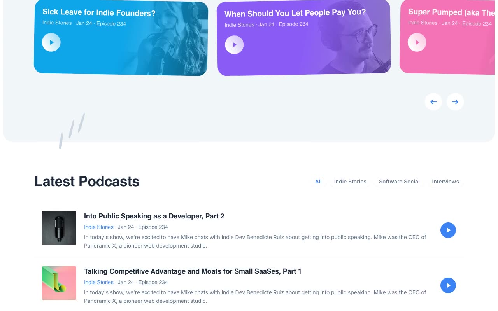

# Indie Stories — Podcast Website Template (Tailwind CSS + Alpine.js + AOS + Swiper.js)

[](./demo.mp4)

A three-page dark-themed podcast website template faithfully reproducing the Cruip Podcast design. It features a hero section with an iPhone mockup and animated SVG blobs, an Alpine.js-powered filterable episode list, a Swiper.js carousel, host profile grid, testimonials, and a fully interactive audio player page with playback-speed control and a seek bar — all built with plain HTML, vendored Tailwind CSS utility classes, Alpine.js, AOS (Animate on Scroll), and Swiper.js, with no build step required.

## Pages

| File | Description |
|---|---|
| `index.html` | Home — hero, episode carousel, filterable podcast list, hosts, testimonials, CTA |
| `podcast.html` | Episode player — audio player with seek bar, speed control, episode notes, related sidebar |
| `subscribe.html` | Subscribe — centered email capture with feature highlights |

## Run

No build step is required. All CSS, JS, fonts, and images are vendored under `assets/`.

Open directly in a browser:

```
open index.html
```

Or serve with any static file server:

```sh
python3 -m http.server 8080
# then visit http://localhost:8080
```

## Key Features

- Dark palette (`#111827` base) with violet (`#7C3AED`), cyan (`#67E8F9`), and pink (`#F472B6`) accents
- Hero two-column layout: headline with wavy SVG underline, dual CTA buttons, avatar stack with listener count, press logo pills, iPhone mockup image
- Soft blurred SVG background blobs (violet, cyan, pink) for visual depth
- Episode carousel powered by Swiper.js with grab cursor and prev/next arrow controls
- Alpine.js category filter tabs (`ALL`, `INDIE STORIES`, `SOFTWARE SOCIAL`, `INTERVIEWS`) with `x-show`
- Alpine.js audio player on `podcast.html`: play/pause, rewind/forward 10 s, playback speed (1x / 1.5x / 2x), gradient seek bar, time display
- AOS scroll animations with `ease-out-cubic` easing, 700 ms duration, staggered delays
- Inter typeface served from local `assets/fonts/`

## Notes

`prompt.md` holds the full build spec. `demo.mp4` shows the template in motion.

## Credits

Faithful clone of an existing design, recreated for study/learning. All credit for the original design goes to its creators.

**Original:** Cruip — https://cruip.com/demos/podcast/

---

Part of the [Cruip](../) collection in the [Templates](../../../) — an open-source gallery of UI. [Browse the live gallery](https://pulkitxm.com/claude-directory).
