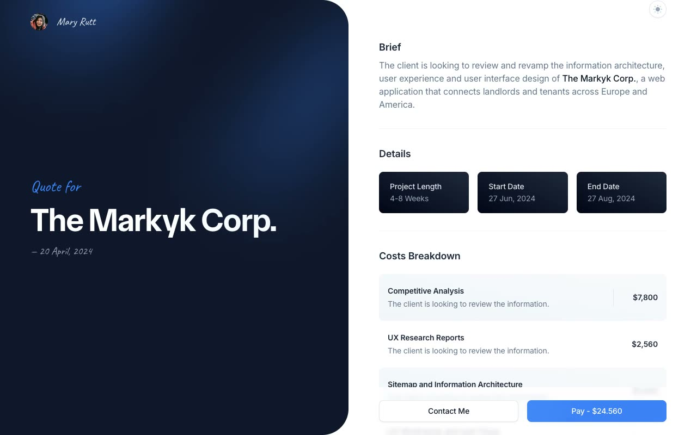

# Quoty — Freelancer Quote/Proposal Web App Template Clone

[](./demo.mp4)

A pixel-faithful, self-contained HTML/CSS/JS clone of the **Quoty** freelancer quote/proposal template by [Cruip](https://cruip.com/demos/quoty/). This reproduction recreates a split-screen client-proposal web app: a sticky left panel with a "Quote for [Client]" summary and a scrolling right panel that swaps between a costs-breakdown table with an accordion of project terms, a line-item details page, a contact form, and a card/PayPal payment form — with a light/dark mode toggle persisted to `localStorage`, all as plain static files with zero build steps.

## Features

- **4 pages**: Home/Quote (index.html), Details, Contact, Pay
- **Split-screen layout**: sticky left panel (background SVG illustration, "Quote for" eyebrow, client-name display heading, quote date) and a scrolling right panel for page-specific content
- **Costs breakdown table**: six line-item rows, each title linking to the details page, with a footer total
- **Project Terms accordion**: 5-item Alpine.js accordion with plus/cross toggle icons
- **Details page**: case-study article with bolded emphasis, a bulleted list, and a light/dark-swapped inline figure
- **Contact form**: email input, disabled prefilled client-name input, subject select, message textarea
- **Pay page**: pill-shaped segmented toggle (Pay with Card / Pay with PayPal) with a sliding thumb indicator via Alpine.js, swapping between a full card form and a PayPal panel
- **Bottom sticky CTA bar** on the home page ("Contact me" ghost button / "Pay" solid button)
- **Light/dark mode** switch in the header, toggling a `.dark` class on `<html>`, flipping `colorScheme`, and persisting to `localStorage`
- **Fonts**: Inter (Google Fonts) for body/UI text, a custom display webfont "Orbiter" for the large client-name heading, and Caveat (Google Fonts) for accent use

## Pages

| Page | File |
|------|------|
| Home / Quote | `index.html` |
| Details | `details.html` |
| Contact | `contact.html` |
| Pay | `pay.html` |

## Run Locally

No build step required. Open `index.html` directly in a browser, or serve with any static file server:

```bash
cd templates/premium/cruip/quoty
python3 -m http.server 8080
# then open http://localhost:8080
```

## Verify

```bash
# Check all pages exist
ls templates/premium/cruip/quoty/*.html

# Check assets are present
ls templates/premium/cruip/quoty/assets/

# Play demo
open templates/premium/cruip/quoty/demo.mp4
```

## Tech Stack

- Plain HTML5 + CSS3 (compiled Tailwind-style utility classes, custom properties)
- [Alpine.js](https://alpinejs.dev/) — drives the Project Terms accordion and the Pay page's payment-method segmented toggle
- Locally vendored fonts (Inter, Orbiter, Caveat)
- No build tools, no frameworks, no bundler

`prompt.md` holds the full build spec, and `demo.mp4` shows the light/dark toggle, accordion, and payment-method switch in motion.

## Credits

Faithful clone of an existing design, recreated for study/learning. All credit for the original design goes to its creators.

**Original:** Cruip — <https://cruip.com/demos/quoty/>

---

Browse more templates in the [premium collection](../../) or return to the [full fable gallery](../../../../README.md).
