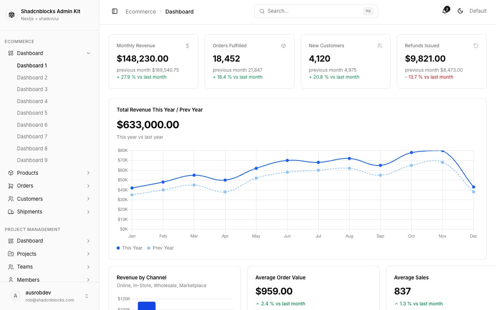

# Shadcnblocks Admin Kit — Ecommerce Admin Dashboard Template (Vanilla HTML + CSS + Chart.js)

[](./demo.mp4)

A pixel-faithful, self-contained clone of the Shadcnblocks Admin Kit — a multi-page ecommerce admin dashboard UI kit with 9 dashboard variants and 2 data-table pages. Built as plain HTML, CSS, and vanilla JavaScript with zero build tooling, it reproduces the full shadcn/ui design-system aesthetic: a collapsible 256 px sidebar, a sticky header with ⌘K search and theme toggle, CSS custom-property theming for light and dark mode, Inter variable font, and all charts rendered with Chart.js v4. The kit covers KPI cards, revenue line and bar charts, donut charts, sparklines, sortable and paginated data tables with row selection and column filters, and a complete set of sidebar navigation items across ecommerce, project-management, and settings sections. Open any `.html` file directly in a browser — no server or build step required.

## Pages

| Path | Description |
|---|---|
| `index.html` | Redirects to `ecommerce/dashboard-1.html` |
| `ecommerce/dashboard-1.html` | KPI cards, total revenue line chart, revenue by channel bar chart, product categories donut |
| `ecommerce/dashboard-2.html` | Welcome banner, alternate widget layout |
| `ecommerce/dashboard-3.html` | Welcome banner, alternate stats layout |
| `ecommerce/dashboard-4.html` | Date-range tabs (1 Year / 3 Months / 30 Days) with charts |
| `ecommerce/dashboard-5.html` | $276 k total revenue, This Year vs Prev Year toggle |
| `ecommerce/dashboard-6.html` | $1.8 M revenue, avg fulfillment days, return rate |
| `ecommerce/dashboard-7.html` | "Dashboard Overview" with date range and platform filter |
| `ecommerce/dashboard-8.html` | $485 k revenue with MoM delta and conversion rate |
| `ecommerce/dashboard-9.html` | Tabbed view: Overview / Orders / Products / Customers / Analytics |
| `original/users.html` | Users data table — 30 rows, 10 per page, status + role badges, sort, filter, row select |
| `original/tasks.html` | Tasks data table — 100 rows, 10 per page, type / status / priority badges |

## Stack

- **Markup / styling:** Vanilla HTML5, CSS3 with custom properties (no framework, no preprocessor)
- **Scripts:** Vanilla JavaScript (`assets/app.js`)
- **Charts:** Chart.js v4 (CDN)
- **Font:** Inter (variable 100–900, Google Fonts), Geist Mono for code areas
- **Theming:** `.dark` class on `<html>` toggles a full set of CSS custom properties
- **Build:** none

## Run

No installation or build step is required. Open any page directly:

```sh
# Option 1 — open the entry point straight in your browser
open index.html

# Option 2 — serve from a local static server (avoids any file:// quirks)
python3 -m http.server 8080
# then visit http://localhost:8080
```

Navigate between all 11 pages using the sidebar. The theme toggle (top-right) switches between light and dark mode; the sidebar collapse button (top-left) hides the nav to full-width content.

## Reference

`prompt.md` holds the full build specification. `demo.mp4` shows all 11 pages in motion.

## Credits

Faithful clone of an existing design, recreated for study/learning. All credit for the original design goes to its creators.

**Original:** Cruip / Shadcnblocks — <https://shadcnblocks-admin.vercel.app/>

---

Part of the [Templates](../../) collection in the [claude-directory](../../../../) — an open-source gallery of UI templates and components. [Browse the live gallery](https://pulkitxm.com/claude-directory).
