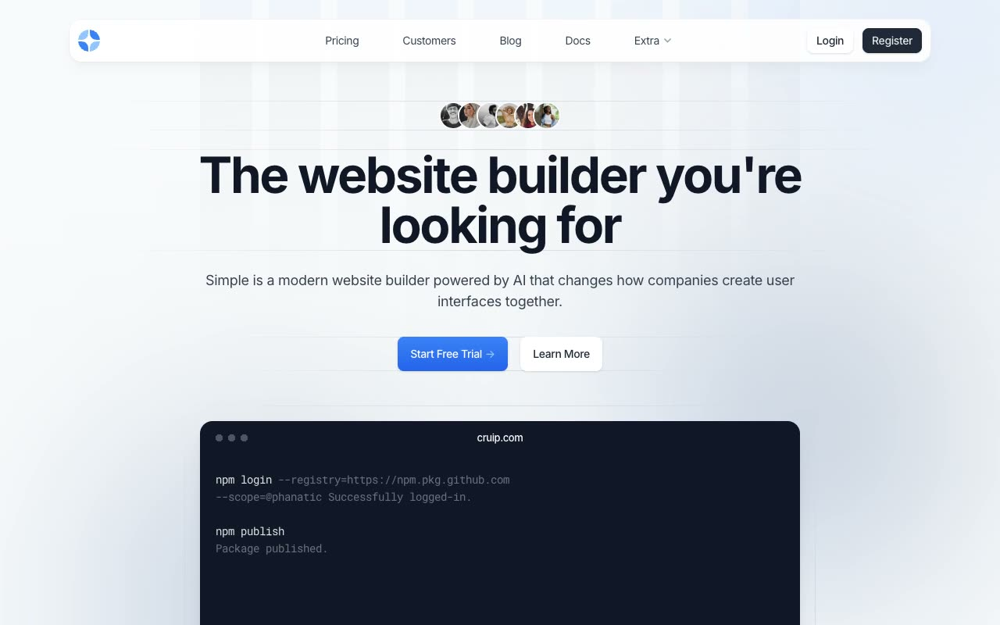

# Simple — Multi-Page SaaS Landing Page Template Clone (Vanilla HTML/CSS/JS + Alpine.js + AOS)

[](./demo.mp4)

A pixel-faithful clone of the Cruip "Simple" multi-page SaaS website builder template, reproduced as a self-contained, static HTML/CSS/JS project. The template features a dark, modern aesthetic with blue accent colors, Inter typography, AOS scroll-triggered entrance animations, Alpine.js-powered interactive components (tabs, pricing toggle, FAQ accordions, mobile nav with dropdown submenu, and masonry testimonials layout), and eleven fully reproduced pages spanning a complete SaaS product site. Generated with Claude Fable 5.

## Pages

- `index.html` — Home: hero, integration tabs, planet feature section, testimonials masonry, client logos, CTA
- `pricing.html` — Pricing: monthly/annual toggle, three-tier cards, comparison table, FAQ accordion
- `customers.html` — Customers: large testimonial, masonry grid (22 testimonials), video testimonials
- `blog.html` — Blog: featured article card, article grid
- `blog-post.html` — Blog Post: full article layout with sidebar
- `documentation.html` — Docs: scrollspy sidebar navigation, code blocks
- `support.html` — Support center: category cards
- `apps.html` — Apps/Integrations: 21 integration logo grid
- `signin.html` — Sign In: auth form with decorative SVG background
- `signup.html` — Sign Up: registration form
- `reset-password.html` — Reset Password: password reset form

## Run

No build step required. Open any HTML file directly in a browser or serve the folder:

```sh
python3 -m http.server 8080 --directory .
# then open http://localhost:8080/
```

All assets (images, SVGs, CSS, JavaScript vendors) are vendored locally in `images/`, `css/vendors/`, and `js/vendors/`. The Google Fonts import (`Inter`, `Roboto Mono`) is loaded via CDN.

## Stack

- Plain HTML + CSS (obfuscated Tailwind utility classes — use `style.css` as source of truth)
- Alpine.js — tabs, pricing toggle, dropdowns, mobile menu, FAQ accordions
- AOS (Animate on Scroll) — scroll-triggered entrance animations (700ms, ease-out-cubic, once)
- Custom masonry layout via `js/main.js` — JavaScript-driven column positioning

## Credits

Faithful clone of an existing design, recreated for study/learning. All credit for the original design goes to its creators.

**Original:** Cruip — https://cruip.com/demos/simple/

---

[Back to Cruip templates](../) · [All premium templates](../../) · [Fable gallery](../../../../)
