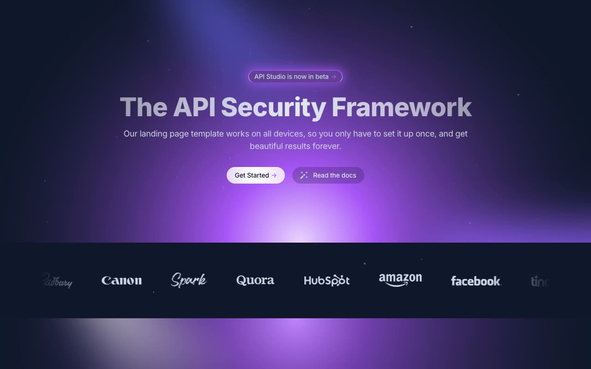

# Stellar — Dark SaaS Landing Page Template

[](./demo.mp4)

A pixel-faithful clone of the Stellar landing page template by Cruip — a dark-themed, multi-page SaaS marketing website built for API security products. Stellar ships with 11 fully connected pages, smooth scroll animations powered by AOS, a Swiper.js testimonials carousel, interactive tabs and pricing toggles via Alpine.js, and a custom canvas-based particle animation that responds to mouse movement.

## Features

- **11 complete pages**: Home, About, Integrations, Integration Post, Pricing, Customers, Customer Post, Changelog, Sign In, Sign Up, Reset Password
- **Dark-themed design**: Deep slate background (`rgb(15, 23, 42)`) with violet/indigo accents (`#6366F1`, `#A855F7`) and gradient text headings
- **Particle canvas animation**: Mouse-responsive floating particles with configurable quantity, staticity, and ease
- **AOS scroll animations**: Elements reveal on scroll with `ease-out-cubic`, 1000ms duration
- **Swiper.js carousel**: Auto-scrolling client logo marquee and a 3-up testimonials carousel with prev/next navigation
- **Alpine.js interactivity**: Tab switcher in Features section, hamburger mobile menu, monthly/yearly pricing toggle
- **Highlighter effect**: CSS `--mouse-x` / `--mouse-y` radial gradient that follows the cursor across card grids
- **Responsive layout**: Mobile-first, hamburger nav, stacks gracefully across all breakpoints
- **Inter font**: Clean sans-serif with weights 400, 500, 700, 800 loaded from Google Fonts
- **All assets vendored locally**: CSS, JS libs, images, and SVGs are served from `assets/` — no external dependencies required at runtime

## Tech Stack

- Plain HTML5 + CSS3 — no build step required
- CSS via the original compiled Tailwind stylesheet (vendored locally)
- Alpine.js v3 for reactive UI components
- AOS v2 (Animate On Scroll) for entrance animations
- Swiper.js v9 for the carousels
- Custom vanilla JS particle animation and box-highlighter effect (vendored in `assets/js/main.js`)

## Pages

| File | Description |
|---|---|
| `index.html` | Home — hero, features tabs, highlight cards, testimonials carousel, pricing preview |
| `about.html` | About — team grid (20 members), recruitment CTA |
| `integrations.html` | Integrations — 24-card grid with hover highlight effect |
| `integrations-single.html` | Integration detail post |
| `pricing.html` | Pricing — monthly/yearly toggle, 3-plan grid, FAQ accordion |
| `customers.html` | Customers — logo grid, case study cards, testimonials |
| `customer.html` | Customer case study post — stats, avatars, quote |
| `changelog.html` | Changelog — versioned release entries with images |
| `signin.html` | Sign In — centered auth card |
| `signup.html` | Sign Up — centered registration card |
| `reset-password.html` | Reset Password — email form |

## Running Locally

Open any `.html` file in a browser, or run a simple HTTP server to avoid CORS issues with fonts:

```bash
python3 -m http.server 8080 --directory .
# then open http://localhost:8080/
```

No build step, no npm install, no dependencies to set up.

## Asset Structure

```
assets/
  css/
    style.css               # compiled Tailwind CSS (obfuscated class names, as shipped)
    vendors/
      aos.css
      swiper-bundle.min.css
  js/
    main.js                 # AOS init, Swiper init, ParticleAnimation, Highlighter
    vendors/
      alpinejs.min.js
      aos.js
      swiper-bundle.min.js
  images/
    logo.svg, glow-*.svg, feature-image-*.png, client-*.svg ...
```

---

[Back to templates](../../../README.md) · [All templates](../../../../templates/README.md)

## Credits

Faithful clone of an existing design, recreated for study/learning. All credit for the original design goes to its creators.

**Original:** Cruip — https://cruip.com/demos/stellar/
