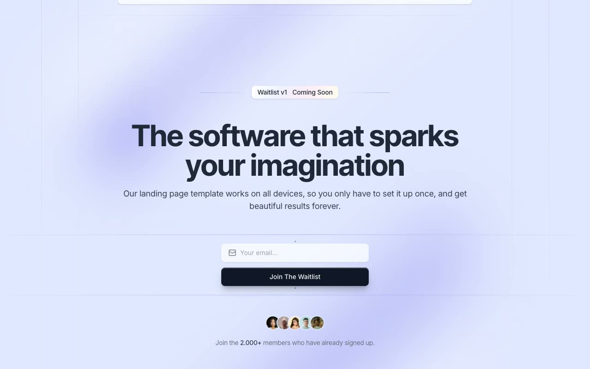

# Cruip Waitlist — Coming Soon Landing Page Template

A pixel-faithful clone of Cruip's **Waitlist** template: a single-page coming-soon / waitlist landing page with a lavender-indigo light theme, a deep-navy dark theme, animated background blobs, and an email capture form. Built as self-contained HTML + CSS + vanilla JS with no build step required.

## Features

- **Self-contained** — one `index.html` file, no framework, no build step, works offline
- **Light / dark theme** — toggled via a sun/moon button in the header; respects `prefers-color-scheme` on first visit; persisted to `localStorage`
- **All colors via CSS custom properties** — `:root` and `.dark` scopes make re-theming trivial
- **Animated background** — six blurred elliptical blobs with a `swing` keyframe float behind the content; two decorative vertical lines run the full page height
- **Floating pill header** — sticky `top: 1rem` card with logo, nav links, and the theme toggle; styled with a gradient background and corner-dot pseudo-elements
- **Badge with decorative lines** — "Waitlist v1 · Coming Soon" pill flanked by gradient horizontal lines
- **Inter Tight headline** — 700 weight, `font-size: 3rem / 4rem (md)`, gradient text in dark mode
- **Email capture form** — mail icon prefix, translucent input, full-width "Join The Waitlist" button with hover state
- **Avatar group** — five circular overlapping avatars with social-proof caption
- **Footer** — border-gradient top rule, copyright and Twitter credits with hover-underline links
- **Vendored assets** — Inter woff2, Inter Tight woff2/woff, and five avatar JPGs; no CDN calls at runtime

## Pages

| File | Description |
|------|-------------|
| `index.html` | Home / waitlist capture page |

## Tech

- HTML5 + CSS3 (custom properties, `border-image`, `filter: blur`, `@keyframes`)
- Vanilla JS (dark-mode toggle, `localStorage`, `prefers-color-scheme`)
- Inter (400–600) + Inter Tight (500–700 + italic 700)

## Credits

Faithful clone of an existing design, recreated for study/learning. All credit for the original design goes to its creators.

**Original:** Cruip — https://cruip.com/demos/waitlist/
