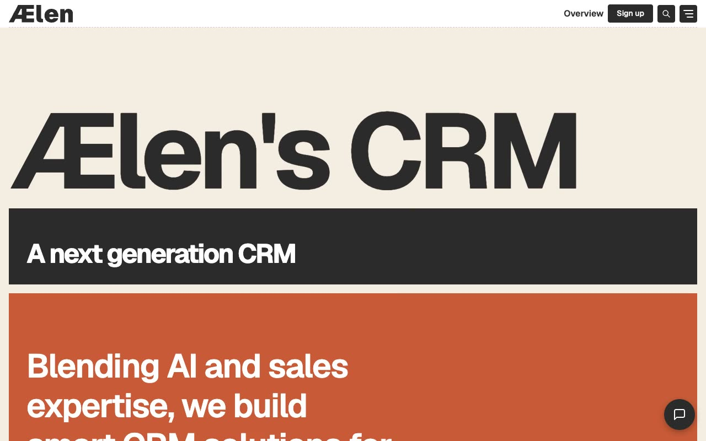

# Aelen — SaaS CRM Marketing Template Clone (Vanilla HTML + CSS + JS)

[](./demo.mp4)

Aelen is a bold, modern SaaS/CRM marketing website template — a pixel-faithful plain HTML/CSS/JS reproduction of the original Astro + Tailwind CSS v4 design by Lexington Themes. The template represents a fictional "next generation CRM" product called ÆLEN, targeting sales teams and agencies. Its design is defined by a warm cream/off-white background, giant bold display typography (up to 12rem), section-level color blocking in burnt orange, muted cyan, warm yellow, and light gray, dashed-border dividers throughout, vertical marquee testimonials, a mega-menu navigation, and a distinctive stacked horizontal-bar footer motif. The clone ships 17 complete pages — no build step, no framework, fully self-contained with vendored assets. Generated with Claude Fable 5.

## Pages

| File | Route | Description |
|---|---|---|
| `index.html` | `/` | Home — hero, features, industries, integrations, testimonials |
| `about.html` | `/about` | About — mission, experience, team grid |
| `blog.html` | `/blog` | Blog listing — 6 post cards on orange background |
| `blog-post.html` | `/blog/posts/1` | Blog post detail with article body |
| `changelog.html` | `/changelog` | Changelog — 3 entries with sign-up CTA |
| `changelog-detail.html` | `/changelog/1` | Single changelog entry detail |
| `contact.html` | `/contact` | Contact form on cyan background card |
| `helpcenter.html` | `/helpcenter` | Help center with knowledge base listings |
| `integrations.html` | `/integrations` | Integrations grid — Chargebee, Stripe, LinkedIn, etc. |
| `integration-detail.html` | `/integrations/1` | Individual integration detail (Chargebee) |
| `pricing.html` | `/pricing` | Pricing — 3 tiers + FAQ accordion |
| `sign-in.html` | `/sign-in` | Full-page sign-in form |
| `sign-up.html` | `/sign-up` | Full-page sign-up form |
| `system-overview.html` | `/system/overview` | Design system — page index |
| `system-colors.html` | `/system/colors` | Design system — color palette swatches |
| `system-buttons.html` | `/system/buttons` | Design system — button components |
| `system-typography.html` | `/system/typography` | Design system — typography specimens |

## Run

No build step required. Open any page directly in a browser:

```sh
open index.html
```

Or serve locally to avoid any relative-path quirks:

```sh
python3 -m http.server
# then open http://localhost:8000
```

## Notes

- All assets (fonts, scripts, images) are vendored under `assets/` — no CDN dependency at runtime.
- `prompt.md` holds the full build specification for this clone.
- `demo.mp4` shows the template in motion (with `poster.jpg` as the preview frame).

## Credits

Faithful clone of an existing design, recreated for study/learning. All credit for the original design goes to its creators.

**Original:** Lexington Themes — https://lexingtonthemes.com/viewports/aelen

---

Part of the [Templates](../) collection in the [claude-directory](../../) — an open-source gallery of AI-generated UI built with Claude Fable 5. [Browse the live gallery](https://pulkitxm.com/claude-directory).
