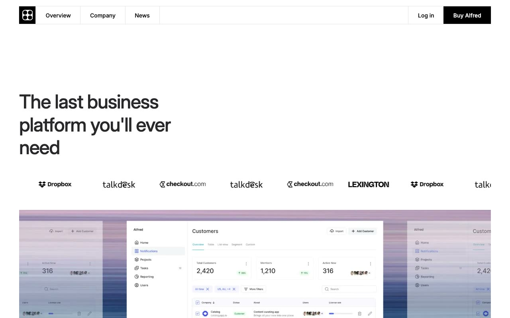

# Alfred — SaaS Business Platform Website Template Clone (Vanilla HTML/CSS/JS)

[](./demo.mp4)

Alfred is a pixel-faithful clone of the Alfred SaaS business platform template by Lexington Themes — a polished, multi-page website template for B2B SaaS products featuring a clean minimal aesthetic, bold accent-color feature sections, dropdown navigation with flyout submenus, a brand logo marquee, tabbed feature sections, and responsive dark/light-mode-ready token architecture. Built as a self-contained plain HTML + CSS + vanilla JavaScript clone with zero build tooling, using InterVariable font and CSS custom properties for the full design token system. Generated with Claude Fable 5.

## Run

No build step required. Open directly in a browser or serve locally:

```sh
# Option 1: open directly
open index.html

# Option 2: Python static server
python3 -m http.server 8080
# then visit http://localhost:8080
```

## Pages

All 16 pages of the original template are reproduced:

| Page | File |
|------|------|
| Home | `index.html` |
| About | `about.html` |
| Pricing | `pricing.html` |
| Customers | `customers.html` |
| Changelog | `changelog.html` |
| Integrations | `integrations.html` |
| Help Center | `helpcenter.html` |
| Blog | `blog.html` |
| Sign In | `forms/sign-in.html` |
| Book a Demo | `forms/book-demo.html` |
| Privacy Policy | `legal/privacy.html` |
| System / Overview | `system/overview.html` |
| System / Colors | `system/colors.html` |
| System / Links | `system/links.html` |
| System / Buttons | `system/buttons.html` |
| System / Typography | `system/typography.html` |

## Stack

- **HTML/CSS/JS** — plain, no framework, no build step
- **InterVariable** via `rsms.me/inter` CDN
- **CSS custom properties** — full OKLCH-based design token system (`--color-base-*`, accent colors per section)
- **Keen Slider** CSS for carousel styling
- All assets vendored locally under `assets/`

The full build spec is in `prompt.md` and the working result is shown in `demo.mp4`.

## Credits

Faithful clone of an existing design, recreated for study/learning. All credit for the original design goes to its creators.

**Original:** Lexington Themes — <https://lexingtonthemes.com/viewports/alfred>

---

Part of the [lexingtonthemes](../) collection in the [claude-directory](../../../) — an open-source gallery of AI-generated UI built with Claude Fable 5. [Browse the live gallery](https://pulkitxm.com/claude-directory).
