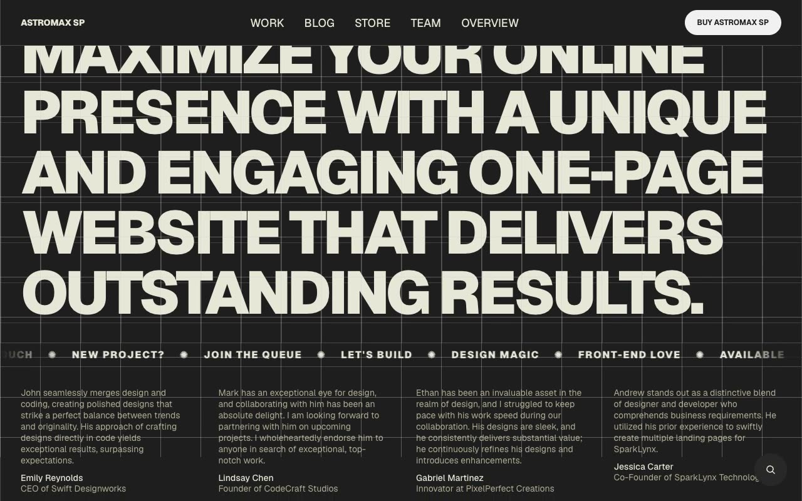

# AstroMax SP — Creative Agency Portfolio Website Clone (Vanilla HTML/CSS/JS + Keen Slider + FuseJS)

[](./demo.mp4)

A pixel-faithful, same-to-same clone of the AstroMax SP premium template by Lexington Themes — a bold, dark-themed creative agency and portfolio website. The clone reproduces all 21 pages including the home page with a full-width hero, continuous marquee ticker, testimonials grid, work carousel (Keen Slider), services grid, and a large CTA morph button; plus work case studies, a blog with 6 posts, a product store with 4 items, team profiles, a system overview page, and legal pages. Every section uses the Geist font family, a warm orange/amber accent (`oklch(62.2% .21 32.02)`), near-black backgrounds, and white/20 opacity grid border lines. Interactive features include a FuseJS-powered site-wide search modal, mobile hamburger menu, and Keen Slider work carousel with prev/next controls. Plain HTML/CSS/JS with no build step required. Generated with Claude Fable 5.

## Run

```sh
# Open directly in browser
open index.html

# Or serve with Python
python3 -m http.server 8080
# Then visit http://localhost:8080
```

No build step or `npm install` required. All assets (images, fonts via Google Fonts CDN) are vendored locally or referenced via stable CDNs (Keen Slider, FuseJS).

## Pages

| Path | Description |
|------|-------------|
| `index.html` | Home — hero, marquee, testimonials, carousel, services, CTA |
| `work/index.html` | Work index — 4 case studies |
| `work/helio-grid.html` | Case study: Helio Grid |
| `work/reverie.html` | Case study: Reverie |
| `work/mesa-health.html` | Case study: Mesa Health |
| `work/signal-north.html` | Case study: Signal North |
| `blog/index.html` | Blog index — 6 posts |
| `blog/posts/1–6.html` | Individual blog posts |
| `store/index.html` | Store index — 4 products |
| `store/1–4.html` | Individual product pages |
| `team/index.html` | Team index |
| `team/alex-chen.html` | Team member: Alex Chen |
| `team/david-lee.html` | Team member: David Lee |
| `system/overview.html` | Design system overview |
| `legal/privacy.html` | Privacy policy |
| `legal/terms.html` | Terms of use |

See `prompt.md` for the full build spec. `demo.mp4` shows the clone in motion.

## Credits

Faithful clone of an existing design, recreated for study/learning. All credit for the original design goes to its creators.

**Original:** Lexington Themes — <https://lexingtonthemes.com/viewports/astromaxsp>

---

Part of the [lexingtonthemes](../) collection in the [claude-directory](../../../) — an open-source gallery of AI-generated UI built with Claude Fable 5. [Browse the live gallery](https://pulkitxm.com/claude-directory).
