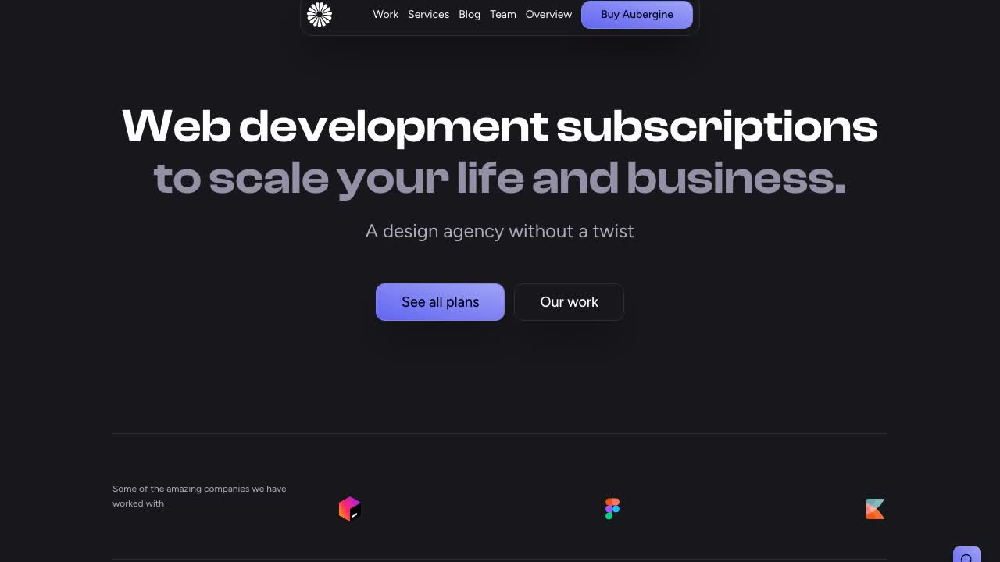

# Aubergine — Dark Agency Website Template Clone (Vanilla HTML/CSS/JS + AOS + Vanilla Tilt + Fuse.js)

[](./demo.mp4)

Aubergine is a pixel-faithful, self-contained clone of the Aubergine template by Lexington Themes — a dark-themed, multi-page design agency website. The UI is built on an OKLCH-based dark purple/indigo palette with Clash Display headings and Figtree body text, delivering a premium agency aesthetic without a framework. Seven pages are included: Homepage, Work listing, Work detail, Blog, Team, Services with FAQ accordion, and Design System overview. Key interactions include a floating glassmorphism pill nav that expands on scroll, AOS entrance animations, Vanilla Tilt 3D card effects on project cards, a Fuse.js-powered fullscreen search modal, and a mobile hamburger menu — all implemented in plain HTML, CSS, and vanilla JS with no build step. Generated with Claude Fable 5.

## Pages

| File | Page |
|---|---|
| `index.html` | Homepage — hero, logo strip, services, pricing, work preview, testimonials, footer |
| `work/index.html` | Work listing — project grid with Vanilla Tilt cards |
| `work/1.html` | Work detail — project gallery, brief, role, deliverables |
| `blog/index.html` | Blog listing — post cards with search modal |
| `team/index.html` | Team — member cards with photos, roles, bios |
| `services/index.html` | Services — service list with FAQ accordion |
| `system/overview.html` | Design system — colors, typography, buttons, components |

## Run

No build step required. Open any page directly in a browser:

```sh
open index.html
```

Or serve the project folder with a local static server to avoid asset path issues:

```sh
python3 -m http.server
# then open http://localhost:8000
```

## Notes

- Dark-only — no light mode toggle.
- All third-party libraries (AOS, Vanilla Tilt, Fuse.js) are vendored locally under `assets/`.
- All fonts (Clash Display via Fontshare, Figtree via Google Fonts) load from CDN — an internet connection is required to render the correct typefaces.
- `prompt.md` holds the full build specification. `demo.mp4` shows the template in motion.

## Credits

Faithful clone of an existing design, recreated for study/learning. All credit for the original design goes to its creators.

**Original:** Lexington Themes — <https://lexingtonthemes.com/viewports/aubergine>

---

Part of the [Templates](../../README.md) collection in the [claude-directory](../../../../README.md) — an open-source gallery of AI-generated UI built with Claude Fable 5. [Browse the live gallery](https://pulkitxm.com/claude-directory).
