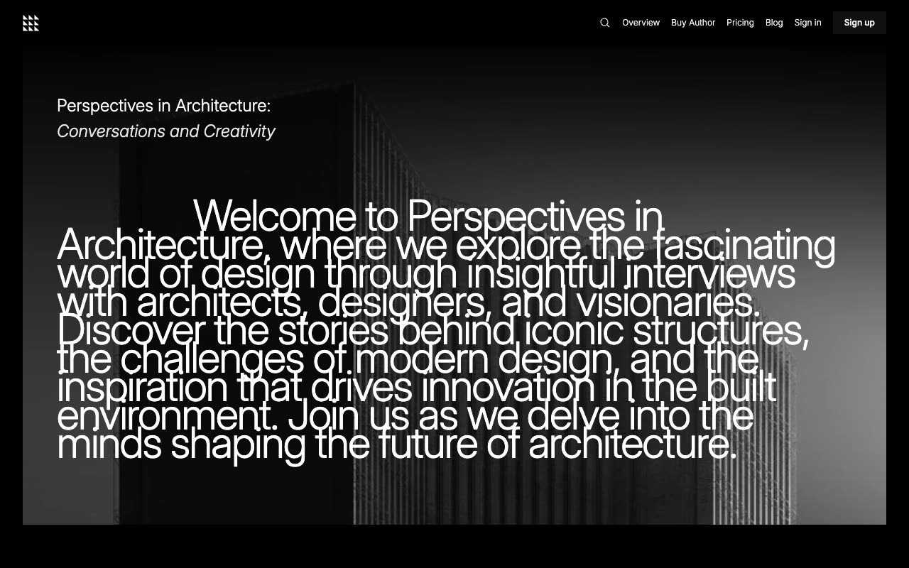

# Author — Dark Editorial Blog & Publication Website Template Clone (Vanilla HTML/CSS/JS + Keen Slider + Fuse.js)

[](./demo.mp4)

A pixel-faithful clone of the Lexington Themes "Author" premium Astro template, rebuilt as a self-contained, zero-build-step plain HTML/CSS/JavaScript project. Author is a dark, publication-style blog template for architecture writing — featuring a fixed navigation bar with a search modal, full-bleed hero imagery, a horizontal Keen Slider carousel for featured posts, a subscriber-only article grid, an individual authors section with profile pages, membership/pricing tiers with an FAQ accordion, sign-in/sign-up forms, and a comprehensive design-system reference. All assets are vendored locally; no server or build tool required. Generated with Claude Fable 5.

## Run

```sh
# Option 1 — open directly in browser
open index.html

# Option 2 — serve with Python
python3 -m http.server 8000
# then visit http://localhost:8000
```

No `npm install` or build step is needed. All dependencies (Inter font via rsms.me CDN, Keen Slider, Fuse.js) are either loaded from CDN or vendored in `assets/js/`.

## Pages

| Path | Description |
|------|-------------|
| `index.html` | Home — hero, featured slider, subscribers section, newsletter signup |
| `blog/index.html` | Blog — hero image + all 6 posts in a 4-column grid |
| `blog/posts/1–6.html` | Individual blog articles with author credit, share buttons, related posts |
| `authors/index.html` | Authors listing — 5 author cards |
| `authors/<slug>.html` | Author profile — bio, portrait, posts by that author |
| `pricing.html` | Membership — 3 pricing tiers + FAQ accordion |
| `signin.html` | Sign-in form |
| `signup.html` | Sign-up form |
| `system/overview.html` | Design system overview |
| `system/colors.html` | Color palette swatches |
| `system/buttons.html` | Button variants |
| `system/typography.html` | Type scale specimens |

## Key interactions

- **Mobile menu** — fullscreen overlay with staggered link entrance animation (translateY + opacity, 0.1 s delay per item)
- **Search modal** — Fuse.js fuzzy search over all 6 posts; Escape / overlay click to close
- **Featured carousel** — Keen Slider with previous/next buttons, responsive `perView` (1.2 → 2.2 → 3.2)
- **Blog card hover** — deep-purple overlay (`#8b0b98`) with `mix-blend-mode: multiply` fade-in
- **FAQ accordion** — smooth `max-height` expand/collapse with plus-to-× icon rotation

See `prompt.md` for the full build spec; `demo.mp4` shows it in motion.

## Credits

Faithful clone of an existing design, recreated for study/learning. All credit for the original design goes to its creators.

**Original:** Lexington Themes — <https://lexingtonthemes.com/viewports/author>

---

Part of the [Lexington Themes](../) collection in the [claude-directory](../../../) — an open-source gallery of AI-generated UI built with Claude Fable 5. [Browse the live gallery](https://pulkitxm.com/claude-directory).
