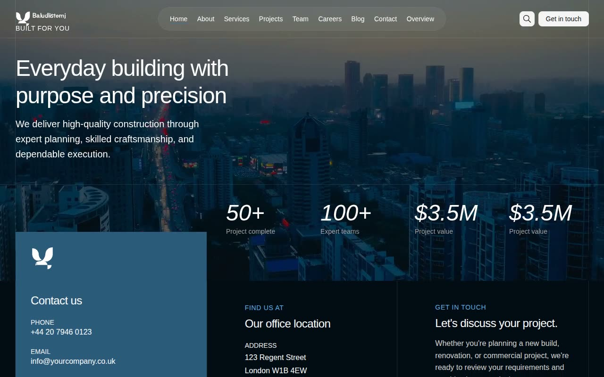

# Bastion — Construction Company Website Template Clone (Vanilla HTML + CSS + JS)

[](./demo.mp4)

A pixel-faithful, self-contained clone of the Bastion premium construction company website template by Lexington Themes, rebuilt as plain HTML, CSS, and vanilla JavaScript with no build step required. The clone reproduces all 23 pages with identical layout, typography, color palette, and interactions — including a full-bleed video hero, a glass-pill fixed navigation that transitions from transparent to white on scroll, scroll-reveal animations, image hover scale effects, a live-filtered search modal, and a Keen Slider carousel. The dark-accented aesthetic uses an OKLCH-based steel-blue/grey palette (accent-950 background for the hero, dark sections, and footer) against a white page body, with Inter Variable as the primary typeface. Generated with Claude Fable 5.

## Pages

| # | Page | File |
|---|------|------|
| 1 | Home | `index.html` |
| 2 | About | `about.html` |
| 3 | Services | `services.html` |
| 4 | Projects | `projects.html` |
| 5 | Team | `team.html` |
| 6 | Careers | `careers.html` |
| 7 | Blog | `blog.html` |
| 8 | Contact | `contact.html` |
| 9 | Why Us | `why-us.html` |
| 10 | Partners | `partners.html` |
| 11 | Mission | `mission.html` |
| 12 | Service Detail: Client Partnerships | `services-client-partnerships.html` |
| 13 | Service Detail: Construction Management | `services-construction-management.html` |
| 14 | Service Detail: Interior Fit-Out & Finishes | `services-interior-fit-out-and-finishes.html` |
| 15 | Service Detail: MEP Coordination & Commissioning | `services-mep-coordination-and-commissioning.html` |
| 16 | Service Detail: Preconstruction & Estimating | `services-preconstruction-estimating.html` |
| 17 | Service Detail: Project Controls & Scheduling | `services-project-controls-and-scheduling.html` |
| 18 | Project Detail: Redwood Transit Hub | `projects-redwood-transit-hub.html` |
| 19 | Project Detail: Westfield Commercial Complex | `projects-westfield-commercial-complex.html` |
| 20 | Legal: Privacy | `legal-privacy.html` |
| 21 | Legal: Terms | `legal-terms.html` |
| 22 | Legal: Cookies | `legal-cookies.html` |
| 23 | Design System Overview | `system-overview.html` |

## Run

No build step is required. Open any page directly in a browser:

```sh
open index.html
```

Or serve the folder with a local HTTP server (recommended, so relative paths resolve correctly):

```sh
python3 -m http.server
# then visit http://localhost:8000
```

All assets (CSS, JS, fonts via Inter CDN, Keen Slider via jsDelivr CDN) are referenced relative to the project root. An active internet connection is needed for the CDN-hosted Inter font and Keen Slider library.

## Reference

`prompt.md` holds the full build specification — palette, type scale, layout system, animation details, and page inventory. `demo.mp4` shows the template in motion.

## Credits

Faithful clone of an existing design, recreated for study/learning. All credit for the original design goes to its creators.

**Original:** Lexington Themes — <https://lexingtonthemes.com/viewports/bastion>

---

Part of the [Lexington Themes](../) collection in the [Templates](../../) directory — an open-source gallery of AI-generated UI built with Claude Fable 5. [Browse the live gallery](https://pulkitxm.com/claude-directory).
