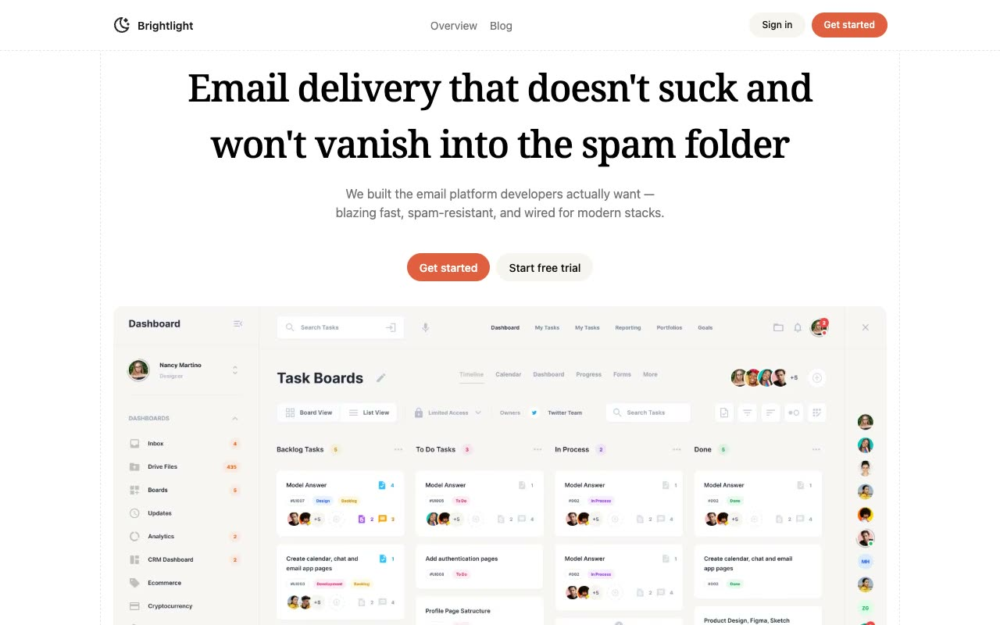

# Brightlight — Developer Email Delivery Platform Template (Vanilla HTML + CSS + JS)

[](./demo.mp4)

Brightlight is a multi-page SaaS landing template for an email delivery platform aimed at developers. It ships as plain HTML, CSS, and vanilla JavaScript — no build step required. The design uses a clean neutral palette with an oklch-based orange accent, Geist variable font, and Noto Serif for headings. Four pages cover every angle of the product: a fully-featured home page with hero, logo marquee, SDK code switcher, 8-feature card grid, email editor mockup, contact management analytics, monthly/annual pricing toggle with a full comparison table, and testimonial; a blog listing page; a centred sign-in card with Google and GitHub social login; and a live system-status page with per-service uptime bars and an incident history.

## Run

No build step is needed. Open `index.html` directly in a browser, or serve the folder with any static file server:

```sh
python3 -m http.server
```

Then visit `http://localhost:8000`.

## Pages

| Path | Description |
|---|---|
| `index.html` | Home — hero, marquee, code tabs, feature grid, editor mockup, analytics, pricing, testimonial |
| `blog.html` | Blog listing — category tags, post cards, dates, read times |
| `sign-in.html` | Sign-in — email/password form, Google and GitHub social auth |
| `system/overview.html` | System status — service uptime bars, overall uptime, incident history |

## Interactions

- **Mobile nav** — hamburger opens a full-screen slide-in menu with fade and translate transition
- **Pricing toggle** — Monthly/Annual switch animates a sliding pill and swaps all plan prices and period labels
- **Code language switcher** — clicking an SDK icon shows the corresponding code block and highlights the active icon
- **Marquee** — two logo ticker strips run a seamless CSS `@keyframes marquee` loop at 12 s
- **Feature card hover** — cards lift with a box-shadow and the icon rotates −12° and translates up

## Assets

All assets are vendored locally:

- `assets/fonts/GeistVariable.woff2` — Geist variable font
- `assets/images/dashboard.webp` — hero dashboard screenshot
- `assets/images/team-1.jpeg` — customer testimonial photo
- `assets/images/logo-1.svg` … `logo-12.svg` — partner company logos

## Notes

- All colors use CSS custom properties (`--color-accent-*`, `--color-sand-*`, `--color-base-*`) in `assets/styles.css` — swap the accent scale to retheme the whole clone.
- `prompt.md` contains the full pixel-faithful build specification.
- `demo.mp4` shows the finished template in motion.

## Credits

Faithful clone of an existing design, recreated for study/learning. All credit for the original design goes to its creators.

**Original:** Lexington Themes — <https://lexingtonthemes.com/viewports/brightlight>

---

Part of the [Templates](../) collection in the [claude-directory](../../../../) — an open-source gallery of AI-generated UI built with Claude Fable 5. [Browse the live gallery](https://pulkitxm.com/claude-directory).
