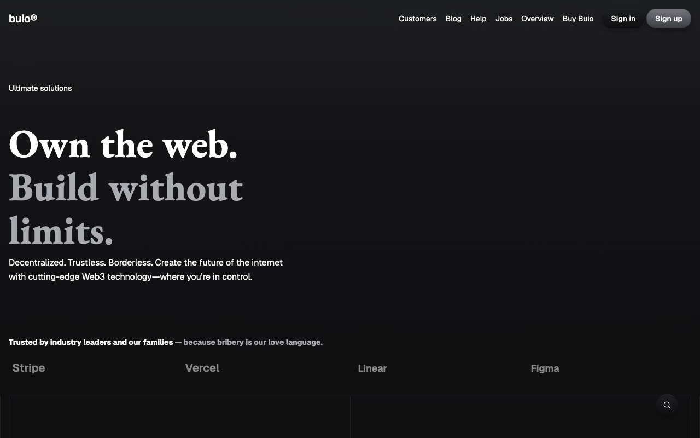

# Buio — Web3 SaaS Marketing Template Clone

[](./demo.mp4)

A pixel-faithful, self-contained HTML/CSS/JS clone of **Buio**, a premium Web3/SaaS marketing template by Lexington Themes. Built as a study in modern dark-theme design, glassmorphism navigation, scroll-triggered animations, and multi-page SaaS site architecture — all without a build step.

## Features

- **16 complete pages** — Home, Pricing, Blog, Blog Post, Changelog, Contact, Customers, Help Center, Integrations, Jobs, Sign In, Sign Up, System Overview, Team, Whitepaper, 404
- **Dark-first design** — Deep near-black background (`oklch(16.89% .002 286.18)`) with blue accent scale and muted neutral grays
- **EB Garamond + Geist** typography — elegant serif display headings paired with modern geometric sans for body and UI
- **Glassmorphism nav** — sticky header with `backdrop-filter: blur(12px)` that activates on scroll
- **Scroll animations** — AOS (Animate On Scroll) for fade-up entrance effects on cards and sections
- **Animated SVG shapes** — rotating triangles, pulsing circles, star polygons, hexagons, and ellipses in feature cards
- **Syntax-highlighted code blocks** — Web3/Solidity code samples with token-based coloring (hotpink keywords, blue functions)
- **Mobile menu** — hamburger with CSS grid-rows `0fr → 1fr` animated reveal
- **Interactive features** — pricing toggle (monthly/annual), blog filter, integrations filter, FAQ accordion, theme tokens
- **Self-contained** — all fonts via Google Fonts CDN, AOS via CDN, no build step required

## Run Locally

```bash
# Serve with any static file server, e.g.:
python3 -m http.server 8080
# Then open http://localhost:8080
```

Or open `index.html` directly in your browser (some browsers need a server for font loading).

## Verify

```bash
# Check all HTML pages exist
ls *.html | wc -l   # expect 16

# Confirm demo + poster
ls demo.mp4 poster.jpg
```

## Pages

| File | Page |
|------|------|
| `index.html` | Home — hero, feature cards, stats, CTA |
| `pricing.html` | Pricing — 3-tier with monthly/annual toggle |
| `blog.html` | Blog — magazine grid with category filter |
| `blog-post.html` | Single post view with sidebar TOC |
| `changelog.html` | Versioned release notes timeline |
| `contact.html` | Contact form + office/social info |
| `customers.html` | Testimonials / social proof |
| `helpcenter.html` | Search + FAQ accordion |
| `integrations.html` | Integration partners with filter |
| `jobs.html` | Open roles by department |
| `sign-in.html` | Email/password login |
| `sign-up.html` | Registration form |
| `system-overview.html` | Status page with 90-day uptime |
| `team.html` | Team member grid |
| `whitepaper.html` | Long-form document with TOC sidebar |
| `404.html` | Not found page |

## Design Tokens

| Token | Value |
|-------|-------|
| Background | `oklch(16.89% .002 286.18)` |
| Text | `#fff` |
| Muted text | `oklch(74.22% .009 278.59)` |
| Accent blue | `oklch(68.5% .169 237.323)` |
| Border | `oklch(23.48% .004 264.49)` |
| Display font | EB Garamond, serif |
| UI font | Geist, sans-serif |
| Mono font | Geist Mono, monospace |

## Credits

Faithful clone of an existing design, recreated for study/learning. All credit for the original design goes to its creators.

**Original:** Lexington Themes — <https://lexingtonthemes.com/viewports/buio>

---

← [Back to Lexington Themes](../README.md) · [All Templates](../../README.md) · [Fable Gallery](../../../README.md)
