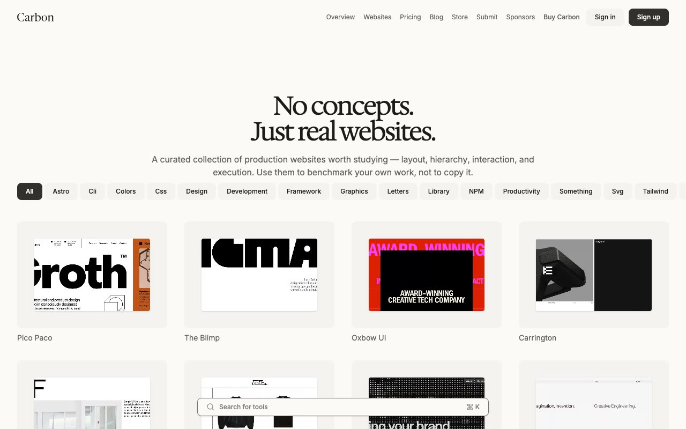

# Carbon — Design Directory & Website Showcase Template Clone (Vanilla HTML/CSS/JS + Tailwind v4)

[](./demo.mp4)

A pixel-faithful clone of the Carbon design directory template by Lexington Themes — a multi-page website showcase platform featuring a curated gallery of production websites, a blog, a digital product store, and a full authentication flow. Built with plain HTML, CSS, and vanilla JavaScript using the original Tailwind v4 compiled stylesheet, InterVariable and Hedvig Letters Serif fonts, and a warm beige/terracotta oklch-based palette. The design is clean, editorial, and minimal — ideal for studying layout systems, typographic hierarchy, and directory-style UI patterns. Generated with Claude Fable 5.

## Run

No build step required. Serve any directory as a static site:

```sh
python3 -m http.server 8080
# then open http://localhost:8080/index.html
```

Or open `index.html` directly in a browser.

## Pages

- **Home** (`index.html`) — website gallery grid with tag filters, fuzzy search modal (⌘K), latest articles, and store preview
- **Pricing** (`pricing.html`) — two-tier pricing cards with feature lists and FAQ accordion
- **Blog** (`blog.html`) — article listing with tag filters and 3-column grid
- **Store** (`store.html`) — digital product catalog
- **Submit** (`submit.html`) — site submission form with two-path CTA
- **Advertise** (`advertise.html`) — sponsor tier pricing cards
- **System Overview** (`system/overview.html`) — design system reference with typography, color swatches, and page index
- **Sign In** / **Sign Up** (`signin.html`, `signup.html`) — centered auth forms
- **Site Detail** (`sites/site/[1-10].html`) — individual website detail pages with related sites
- **Blog Post** (`blog/posts/[1-3].html`) — full article pages with related posts
- **Store Item** (`store/[1-3].html`) — product detail pages with image gallery and feature list
- **Tag pages** (`sites/tags/[tag].html`) — filtered website listings by tag
- **404** (`404.html`) — not-found page

## Notes

- CSS uses the original compiled Tailwind v4 stylesheet (`assets/css/main.css`) vendored from the live template
- All images (`.webp` screenshots), fonts (Inter, Hedvig Letters Serif), and scripts are vendored locally under `assets/`
- Search uses a lightweight inline fuzzy-search implementation (no build-time dependency on Fuse.js)
- Color palette is fully defined as CSS custom properties (oklch-based warm gray + terracotta accent)
- Hover, transition, and responsive behaviors match the reference via the vendored CSS
- The full build specification is in `prompt.md`; the demo recording is `demo.mp4`

## Credits

Faithful clone of an existing design, recreated for study/learning. All credit for the original design goes to its creators.

**Original:** Lexington Themes — <https://lexingtonthemes.com/viewports/carbon>

---

Part of the [Templates](../) collection in the [claude-directory](../../) — an open-source gallery of AI-generated UI built with Claude Fable 5. [Browse the live gallery](https://pulkitxm.com/claude-directory).
