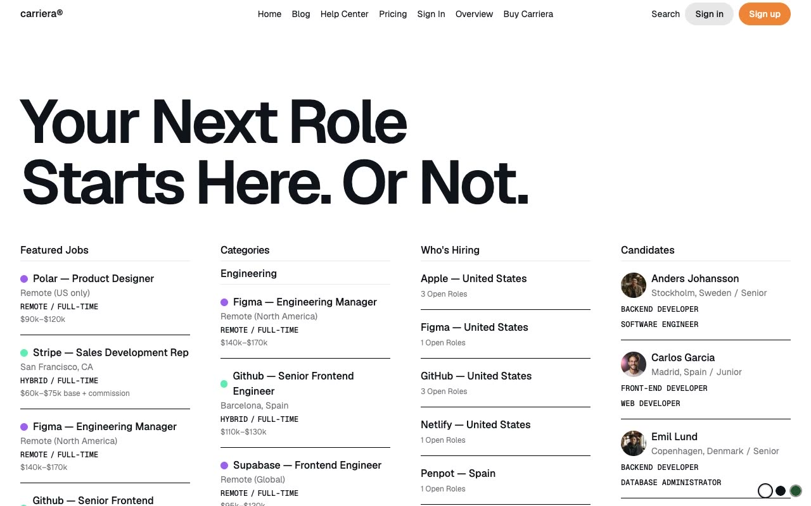

# Carriera — Job Board & Career Platform Website Template (Vanilla HTML + CSS + JS)

[](./demo.mp4)

Carriera is a pixel-faithful HTML/CSS/JS clone of the Lexington Themes Carriera job board and career platform UI template. It covers the full lifecycle of a job board across ten pages — homepage with job listings, categories, featured companies, and candidate profiles; a blog with tag filtering; a help center; a pricing page with monthly/annual toggle and FAQ accordion; sign in and sign up forms; job detail, company detail, and candidate detail pages. The design is minimal and typography-driven, using Geist and Geist Mono fonts, and ships with three switchable color themes (light, dark, and green accent) persisted via `localStorage` with a no-flash boot script. Built as plain HTML, CSS custom properties, and vanilla JS — no build step required. Generated with Claude Fable 5.

## Run

This is a static project with no build step. Open any page directly in a browser:

```sh
open index.html
```

Or serve locally with Python's built-in server for correct relative paths:

```sh
python3 -m http.server 8080
# then open http://localhost:8080
```

## Pages

| File | Page |
|---|---|
| `index.html` | Homepage — hero, job listings, categories, companies, candidates |
| `blog.html` | Blog — tag filter bar, 4-column post grid |
| `helpcenter.html` | Help Center — category cards, ticket CTA |
| `pricing.html` | Pricing — billing toggle, 4 tiers, FAQ accordion |
| `sign-in.html` | Sign In — email/password + OAuth buttons |
| `sign-up.html` | Sign Up — registration form + OAuth buttons |
| `job-detail.html` | Job Detail — description, metadata, apply form, related jobs |
| `company-detail.html` | Company Detail — about, metadata, open roles, related companies |
| `candidate-detail.html` | Candidate Detail — bio, skills, contact links, photo |
| `system-overview.html` | Developer reference — all pages and content types |

## Theme switching

A fixed bottom-right widget provides three themes: light (white), dark (near-black navy), and green accent. The selection is saved to `localStorage` and applied on page load via an inline `<script>` block to prevent any flash of unstyled content. Toggle the `data-theme` attribute on `<html>` to switch themes programmatically.

## Notable interactions

- **Fuse.js search modal** — fuzzy search across jobs, blog posts, companies, candidates, and help articles; triggered from the nav search button on every page.
- **Mobile menu** — full-screen fixed overlay opened by a hamburger button; closes on button click or viewport resize to large breakpoint.
- **Pricing toggle** — monthly/annual billing switch updates displayed prices.
- **FAQ accordion** — click any question to expand or collapse its answer.

`prompt.md` holds the full build spec and `demo.mp4` shows the template in motion.

## Credits

Faithful clone of an existing design, recreated for study/learning. All credit for the original design goes to its creators.

**Original:** Lexington Themes — <https://lexingtonthemes.com/viewports/carriera>

---

Part of the [Lexington Themes](../../README.md) collection in the [Templates](../../../README.md) gallery — an open-source gallery of AI-generated UI built with Claude Fable 5. [Browse the live gallery](https://pulkitxm.com/claude-directory).
