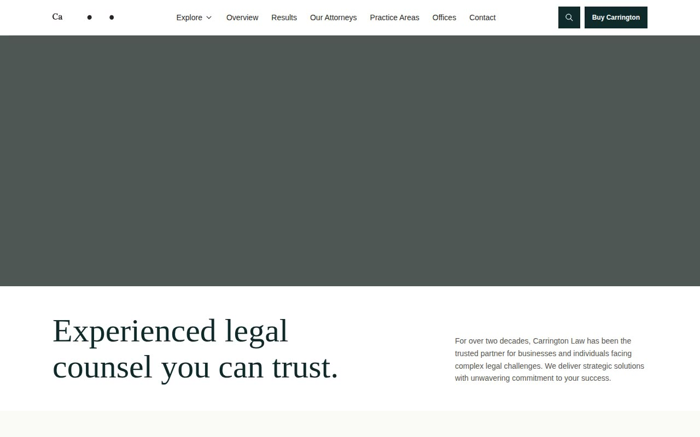

# Carrington — Premium Law Firm Multi-Page Website Template (Vanilla HTML + CSS + JS)

[](./demo.mp4)

Carrington is a pixel-faithful HTML/CSS/JS clone of the Carrington premium law firm website template by Lexington Themes — a dark-accented, multi-page professional services site suited to corporate or litigation-focused law firms. The design pairs a near-black (`#0c0a09`) background with gold (`#fbbf24`) accents, Inter Variable for body copy, and Newsreader serif for display headings. Standout interactions include a four-column mega menu dropdown, sticky navigation with scroll-triggered color swap, Fuse.js-powered fuzzy site search (triggered by clicking the search icon, pressing `Cmd+K`, or `/`), a mobile hamburger menu, and animated countup stats. The clone ships 16 HTML pages, a single `styles.css`, and 37 locally-vendored `.webp` images — no build step required. Generated with Claude Fable 5.

## Pages

| File | Route |
|---|---|
| `index.html` | Home |
| `practice-areas.html` | Practice Areas |
| `cases.html` | Cases listing |
| `cases/acme-acquires-beta.html` | Case detail — Acme Acquires Beta |
| `cases/globaltech-merger-clearance.html` | Case detail — GlobalTech Merger |
| `cases/garcia-wrongful-termination.html` | Case detail — Garcia v. TechStart |
| `cases/megacorp-class-action.html` | Case detail — MegaCorp Class Action |
| `team.html` | Our Attorneys |
| `blog.html` | Journal / Insights listing |
| `blog/posts/1.html` | Blog post detail 1 |
| `blog/posts/2.html` | Blog post detail 2 |
| `blog/posts/3.html` | Blog post detail 3 |
| `careers.html` | Careers / Join our team |
| `press-and-media.html` | Press & Media |
| `offices.html` | Offices |
| `contact.html` | Contact |

## Run

No build step. Serve the project folder with any static file server and open it in a browser.

```sh
# Python (built-in, available on most systems)
python3 -m http.server 8080
# then open http://localhost:8080
```

Or use any other static server (`npx serve .`, VS Code Live Server, etc.).

## Key interactions

- **Sticky nav / scroll color swap** — home page nav starts transparent with white text; scrolling down transitions it to an opaque white background with dark text. All inner pages use the opaque white state by default.
- **Mega menu** — hover "Explore" in the desktop nav to reveal a four-column panel (about panel, explore links, blog previews, featured case). Closes on mouse-leave.
- **Search modal** — click the search icon, press `Cmd+K`, or press `/` to open a full-screen fuzzy-search modal powered by Fuse.js 7. Press `Esc` or click outside to close.
- **Mobile hamburger menu** — full-width dark slide-down panel with all navigation links and CTA buttons.
- **Countup stats** — numeric stat values on the home page animate up on scroll-into-view.

## Assets

37 `.webp` images are vendored locally in `assets/images/` — no external image CDN required.

## Spec and demo

`prompt.md` contains the full build specification. `demo.mp4` shows the finished template in motion (use `poster.jpg` as the preview thumbnail).

## Credits

Faithful clone of an existing design, recreated for study/learning. All credit for the original design goes to its creators.

**Original:** Lexington Themes — https://lexingtonthemes.com/viewports/carrington

---

Part of the [Templates](../../README.md) collection in the [claude-directory](../../../../README.md) — an open-source gallery of AI-generated UI built with Claude Fable 5. [Browse the live gallery](https://pulkitxm.com/claude-directory).
