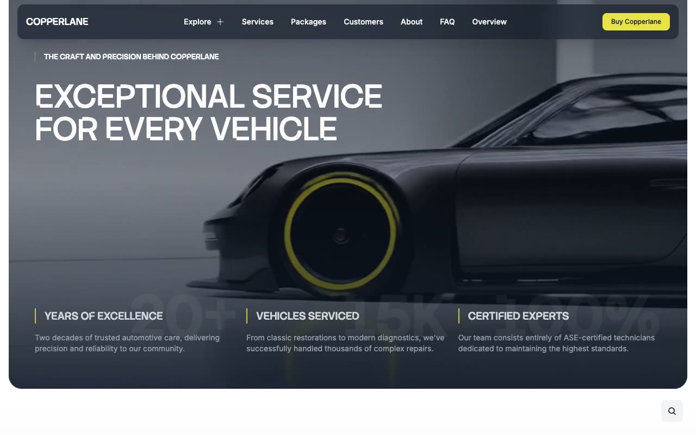

# Copperlane — Premium Auto Detailing & Car Services Website Template (Vanilla HTML + CSS + JS)

[](./demo.mp4)

Copperlane is a pixel-faithful HTML/CSS/JS clone of the Copperlane auto detailing and car services website template by Lexington Themes — a sleek, dark-accented multi-page business site for an automotive service center offering engine diagnostics, full detailing, service packages, and more. The design pairs the **Stack Sans Notch** serif for uppercase display headings and the logo with **Inter** for all body copy, set against a light white background with deep near-black navigation and accent golden/yellow highlights driven by two OKLCH color scales (`base` and `accent`). Standout features include a fixed sticky navigation bar with a three-column mega menu (Services, Resources, Company), a mobile slide-out hamburger menu, image cards with hover scale effects and gradient overlays, FAQ accordions, a booking form, and a background video hero section. The clone ships all 22 HTML pages, a single vendored `main.css` (Tailwind utility-compiled), locally vendored `.webp` images and `.mp4` video — no build step required. Generated with Claude Fable 5.

## Pages

| File | Route |
|---|---|
| `index.html` | Home — hero video, service cards, packages, testimonials, blog preview |
| `services.html` | All Services listing |
| `packages.html` | Service Packages listing |
| `customers.html` | Customer success stories |
| `about.html` | About Us — company story, mission, values |
| `faq.html` | Frequently Asked Questions |
| `system/overview.html` | Design system overview |
| `service-packages.html` | Bundled service packages listing |
| `pricing.html` | Transparent pricing tables |
| `help-center.html` | Help Center — searchable articles |
| `blog.html` | Blog listing |
| `team.html` | Team members profiles |
| `jobs.html` | Open positions / careers |
| `book-appointment.html` | Book an appointment form |
| `contact.html` | Contact form and info |
| `services/engine-diagnostics.html` | Service detail — Engine Diagnostics |
| `services/full-detailing.html` | Service detail — Full Detailing |
| `packages/performance-tune-up.html` | Package detail — Performance Tune-Up |
| `packages/winter-safety-package.html` | Package detail — Winter Safety Package |
| `customers/anthony-smith.html` | Customer story — Anthony Smith |
| `blog/posts/1.html` | Blog post 1 |
| `blog/posts/2.html` | Blog post 2 |

## Run

No build step. Serve the project folder with any static file server and open it in a browser.

```sh
# Python (built-in, available on most systems)
python3 -m http.server 8080
# then open http://localhost:8080
```

Or use any other static server (`npx serve .`, VS Code Live Server, etc.).

## Key interactions

- **Mega menu** — click the "Explore" button in the desktop nav to reveal a three-column dropdown (Services, Resources, Company) with a featured CTA row. Click outside to close.
- **Mobile navigation** — the hamburger button opens a dropdown mobile menu with all nav links; closes on a second click.
- **Image cards with hover scale** — service cards zoom the background image on hover (`group-hover:scale-110 transition-transform duration-500`).
- **Hero video background** — the home page hero section plays a looping muted MP4 video behind a gradient overlay.
- **FAQ accordions** — click any question to expand/collapse the answer using the `data-accordion-target` pattern.
- **Booking form** — the book-appointment page features a structured form for scheduling a service appointment.
- **Contact form** — the contact page has a full form with name, email, subject and message fields.

## Assets

All assets are vendored locally under `assets/`:

- `assets/css/main.css` — compiled Tailwind CSS (80 KB) with all design tokens
- `assets/images/` — 33 `.webp` images (car photos, team portraits, service images)
- `assets/videos/car2.mp4` — hero background video (9.4 MB)

Fonts are loaded from CDN:
- **Inter** via `rsms.me/inter/inter.css`
- **Stack Sans Notch** via Google Fonts

## Verify

```sh
python3 -m http.server 8080
open http://localhost:8080
```

Navigate to any of the 22 pages to verify they render correctly. All images and the hero video should load from local `assets/`.

---

← [Back to Lexington Themes](../README.md) · [All templates](../../README.md) · [Root](../../../../README.md)

## Credits

Faithful clone of an existing design, recreated for study/learning. All credit for the original design goes to its creators.

**Original:** Lexington Themes — <https://lexingtonthemes.com/viewports/copperlane>
