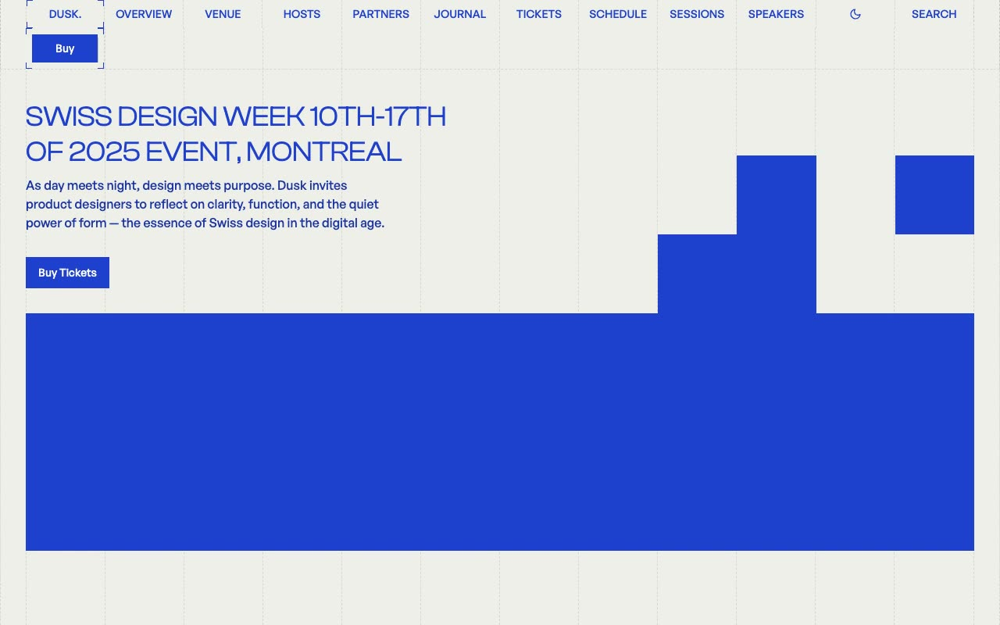

# Dusk — Swiss Design Conference & Event Website Template Clone (Vanilla HTML + CSS + JS)

[](./demo.mp4)

A pixel-faithful, self-contained clone of the **Dusk** premium conference and design-week website template by Lexington Themes, rebuilt as plain HTML, CSS, and vanilla JavaScript with no build step required. Dusk presents a fictional "Swiss Design Week" event in Montreal with a bold International Typographic Style aesthetic: a warm cream canvas, an electric-blue accent, dashed hairline grid dividers, oversized uppercase Clash Display headings, and blocky accent-filled squares. This clone reproduces **all 63 pages** — marketing pages, a six-post journal with thirteen tag archives, six speaker profiles, nine workshop detail pages, four sponsor detail pages, three forms, a five-page design system, and legal/info pages — with identical layout, typography, colour, and interactions. It ports the full-screen Fuse.js fuzzy search modal, the mobile overlay menu, the FAQ accordion, and the animated logo corner-ticks, and adds a token-driven light/dark theme toggle (with `prefers-color-scheme` support and `localStorage` persistence) layered on the template's original OKLCH palette. Clash Display and General Sans are vendored locally as WOFF2, and every image, stylesheet, and the Fuse.js library are served from the project folder so the clone runs fully offline. Generated with Claude Fable 5.

## Pages

| # | Page | File |
|---|------|------|
| 1 | Home | `index.html` |
| 2 | Schedule | `schedule.html` |
| 3 | Sessions | `sessions.html` |
| 4 | Speakers | `speakers.html` |
| 5 | Tickets | `tickets.html` |
| 6 | Venue | `venue.html` |
| 7 | Hosts | `hosts.html` |
| 8 | Partners | `partners.html` |
| 9 | Sponsors | `sponsors.html` |
| 10 | Gallery | `gallery.html` |
| 11 | Recap | `recap.html` |
| 12 | FAQ | `faq.html` |
| 13 | Blog Index | `blog.html` |
| 14 | Blog Tags Index | `blog-tags.html` |
| 15 | Blog Post 1 | `blog-posts-1.html` |
| 16 | Blog Post 2 | `blog-posts-2.html` |
| 17 | Blog Post 3 | `blog-posts-3.html` |
| 18 | Blog Post 4 | `blog-posts-4.html` |
| 19 | Blog Post 5 | `blog-posts-5.html` |
| 20 | Blog Post 6 | `blog-posts-6.html` |
| 21 | Blog Tag: Clarity | `blog-tags-clarity.html` |
| 22 | Blog Tag: Digital | `blog-tags-digital.html` |
| 23 | Blog Tag: Event | `blog-tags-event.html` |
| 24 | Blog Tag: Grids | `blog-tags-grids.html` |
| 25 | Blog Tag: Helvetica | `blog-tags-helvetica.html` |
| 26 | Blog Tag: History | `blog-tags-history.html` |
| 27 | Blog Tag: Minimalism | `blog-tags-minimalism.html` |
| 28 | Blog Tag: Modern | `blog-tags-modern.html` |
| 29 | Blog Tag: Posters | `blog-tags-posters.html` |
| 30 | Blog Tag: Recap | `blog-tags-recap.html` |
| 31 | Blog Tag: Swiss Design | `blog-tags-swiss-design.html` |
| 32 | Blog Tag: Typography | `blog-tags-typography.html` |
| 33 | Blog Tag: Usability | `blog-tags-usability.html` |
| 34 | Speaker: Anna Müller | `speakers-profile-anna-muller.html` |
| 35 | Speaker: Emil Steiner | `speakers-profile-emil-steiner.html` |
| 36 | Speaker: Javier García | `speakers-profile-javier-garcia.html` |
| 37 | Speaker: Martina Rossi | `speakers-profile-martina-rossi.html` |
| 38 | Speaker: Miguel Santos | `speakers-profile-miguel-santos.html` |
| 39 | Speaker: Sofia Hagblom | `speakers-profile-sofia-hagblom.html` |
| 40 | Workshop: Animation for UI | `sessions-workshop-animation-for-ui.html` |
| 41 | Workshop: The Art of White Space | `sessions-workshop-art-of-white-space.html` |
| 42 | Workshop: Color Theory in Practice | `sessions-workshop-color-theory.html` |
| 43 | Workshop: Design Systems Collab | `sessions-workshop-design-systems-collab.html` |
| 44 | Workshop: Designing with Grids | `sessions-workshop-designing-with-grids.html` |
| 45 | Workshop: Modular Design Systems | `sessions-workshop-modular-design-systems.html` |
| 46 | Workshop: Proportion & Harmony in UI | `sessions-workshop-proportion-harmony-ui.html` |
| 47 | Workshop: Typography Mastery | `sessions-workshop-typography-mastery.html` |
| 48 | Workshop: UX Research Essentials | `sessions-workshop-ux-research-essentials.html` |
| 49 | Sponsor: Google | `sponsors-details-google.html` |
| 50 | Sponsor: Medium | `sponsors-details-medium.html` |
| 51 | Sponsor: Polar SH | `sponsors-details-polar-sh.html` |
| 52 | Sponsor: Swissted | `sponsors-details-swissted.html` |
| 53 | Register | `forms-register.html` |
| 54 | Sign In | `forms-sign-in.html` |
| 55 | Contact | `forms-contact.html` |
| 56 | Design System: Overview | `system-overview.html` |
| 57 | Design System: Buttons | `system-buttons.html` |
| 58 | Design System: Colors | `system-colors.html` |
| 59 | Design System: Typography | `system-typography.html` |
| 60 | Design System: Link | `system-link.html` |
| 61 | Terms | `infopages-terms.html` |
| 62 | Code of Conduct | `infopages-code-of-conduct.html` |
| 63 | Privacy | `legal-privacy.html` |

## Run

No build step is required. Open any page directly in a browser:

```sh
open index.html
```

Or serve the folder with a local HTTP server (recommended, so relative paths resolve correctly):

```sh
python3 -m http.server
# then visit http://localhost:8000
```

All assets — the compiled CSS, the Clash Display and General Sans fonts (WOFF2), every image, the favicon, and the Fuse.js search library — are vendored under `assets/` and referenced relative to the project root, so the clone works fully offline.

## Verify

- **Search:** click **Search** in the desktop nav and type a query (e.g. `swiss`) — Fuse.js fuzzy-matches across pages, posts, speakers, sessions, and sponsors, grouped by type.
- **Mobile menu:** narrow the viewport and tap **Menu** to open the full-screen overlay; **Close** or `Esc` dismisses it.
- **FAQ:** open `faq.html` and click any question to expand the native `<details>` accordion.
- **Theme:** click the sun/moon toggle in the nav to switch between light and dark; the choice persists across pages via `localStorage`, and the initial theme follows your OS `prefers-color-scheme`.

## Reference

`prompt.md` holds the full build specification — palette, type scale, layout/grid system, animation details, and the complete page inventory. `demo.mp4` shows the template in motion.

## Credits

Faithful clone of an existing design, recreated for study/learning. All credit for the original design goes to its creators.

**Original:** Lexington Themes — <https://lexingtonthemes.com/viewports/dusk>

---

Part of the [Lexington Themes](../) collection in the [Templates](../../) directory — an open-source gallery of AI-generated UI built with Claude Fable 5. [Browse the live gallery](https://pulkitxm.com/claude-directory).
