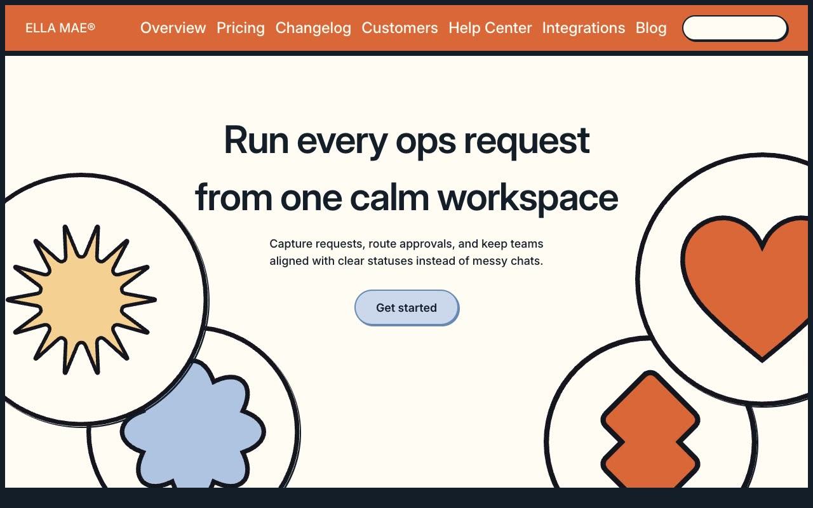

# Ella Mae® — SaaS Operations Workspace Website Template Clone (Vanilla HTML/CSS/JS)

[](./demo.mp4)

Pixel-faithful clone of the Ella Mae® SaaS template by Lexington Themes — a bold, geometric operations workspace landing site featuring 15 pages, thick 8px structural borders, pill-shaped buttons with press-down hover states, an infinite-scroll logo marquee, CSS `<details>` FAQ accordion with icon rotation, responsive mobile navigation with smooth opacity/translate transitions, and a large SVG wordmark footer. Built as self-contained plain HTML/CSS/JS with zero build step required; all fonts (Inter Variable), SVGs, and images are vendored locally. Generated with Claude Fable 5.

## Pages

| Page | File |
|------|------|
| Home (hero, features, pricing, FAQ) | `index.html` |
| Changelog | `changelog/index.html` |
| Customers | `customers/index.html` |
| Help Center | `helpcenter/index.html` |
| Integrations | `integrations/index.html` |
| Blog (with search modal) | `blog/index.html` |
| System Overview | `system/overview/index.html` |
| System Buttons | `system/buttons/index.html` |
| System Colors | `system/colors/index.html` |
| System Typography | `system/typography/index.html` |
| System Links | `system/links/index.html` |
| Login | `forms/login/index.html` |
| Sign Up | `forms/signup/index.html` |
| Contact / 404 | `contact/index.html` |
| 404 | `404.html` |

## Run

No build step required — open any page directly:

```sh
# Static server (recommended)
python3 -m http.server 8080
# then open http://localhost:8080
```

Or open `index.html` directly in a browser.

## Notes

- `styles.css` — shared design tokens (CSS custom properties for the full accent/secondary/base palettes), button system, nav, footer, marquee animation
- `shared.js` — mobile menu open/close logic used across all inner pages
- `assets/` — all fonts (via rsms.me CDN), SVG blobs, brand logos, team photos, blog images, and integration icons vendored locally
- `.reference/` — recon artifacts (screenshots, outlines, source CSS/JS) captured per-page from the live Ellamae demo during cloning
- `prompt.md` holds the full build spec; `demo.mp4` shows the clone in motion

## Credits

Faithful clone of an existing design, recreated for study/learning. All credit for the original design goes to its creators.

**Original:** Lexington Themes — <https://lexingtonthemes.com/viewports/ellamae>

---

Part of the [Templates](../) collection in the [claude-directory](../../) — an open-source gallery of AI-generated UI built with Claude Fable 5. [Browse the live gallery](https://pulkitxm.com/claude-directory).
