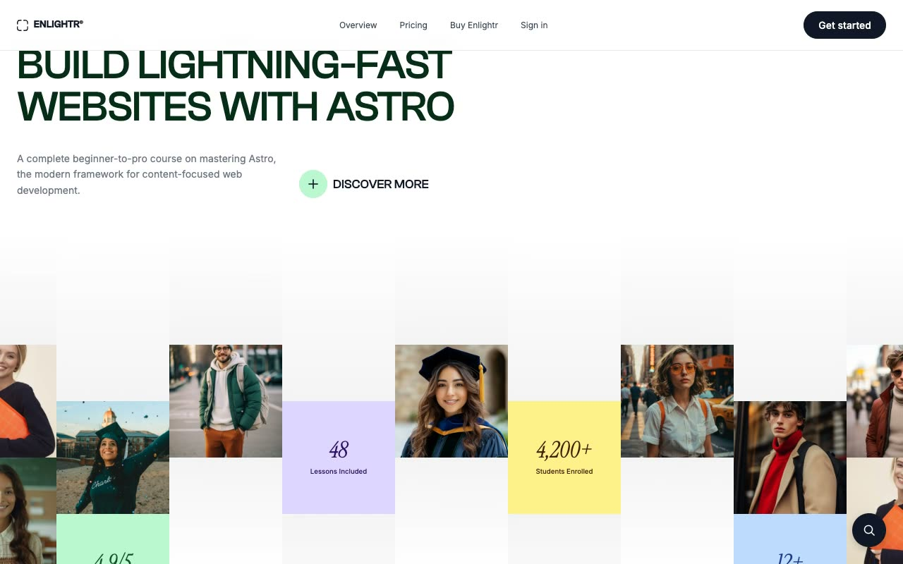

# Enlightr — Multi-Page Online Course Template Clone (Vanilla HTML + CSS + JS)

[](./demo.mp4)

Enlightr is a pixel-faithful, self-contained clone of the Enlightr premium template by Lexington Themes — a multi-page educational platform and online course website. The design features a white base with a green accent (`#22c55e`), Inter Variable for body text, Instrument Serif italic for display headings, Clash Grotesk for uppercase section labels, and Space Mono for monospace content. Key interactions include a Keen Slider testimonials carousel with autoplay, a FAQ accordion, a fixed navigation bar that gains a backdrop blur on scroll, a floating Fuse.js-powered search button, and a mobile hamburger menu with full-screen overlay. All five pages — home, pricing, courses, sign-in, and system overview — are plain `.html` files with no build step. All assets are vendored locally. Generated with Claude Fable 5.

## Pages

| File | Description |
|---|---|
| `index.html` | Home — hero, feature sections, course cards, stats row, testimonials carousel, footer |
| `pricing.html` | Pricing — plan cards (Free vs Pro) and FAQ accordion |
| `courses.html` | Courses — catalog grid with course cards |
| `sign-in.html` | Sign-in — centered email/password authentication form |
| `system-overview.html` | Design system reference — buttons, colors, and typography showcase |

## Run

No build step required. Open any page directly in a browser:

```sh
open index.html
```

Or serve the folder with any static file server:

```sh
# Python
python3 -m http.server

# Node (npx)
npx serve .
```

Then visit `http://localhost:8000` (or whichever port the server reports).

## Notes

- All fonts and vendor scripts (Keen Slider, Fuse.js) are loaded from `assets/` or CDN links already present in the HTML — no npm install needed.
- `styles.css` contains the full shared stylesheet used across all pages.
- `prompt.md` holds the full build specification.
- `demo.mp4` shows the template in motion (use `poster.jpg` as the thumbnail).

## Credits

Faithful clone of an existing design, recreated for study/learning. All credit for the original design goes to its creators.

**Original:** Lexington Themes — <https://lexingtonthemes.com/viewports/enlightr>

---

Part of the [Templates](../../) collection in the [claude-directory](../../../../) — an open-source gallery of AI-generated UI built with Claude Fable 5. [Browse the live gallery](https://fable.pulkitxm.com).
