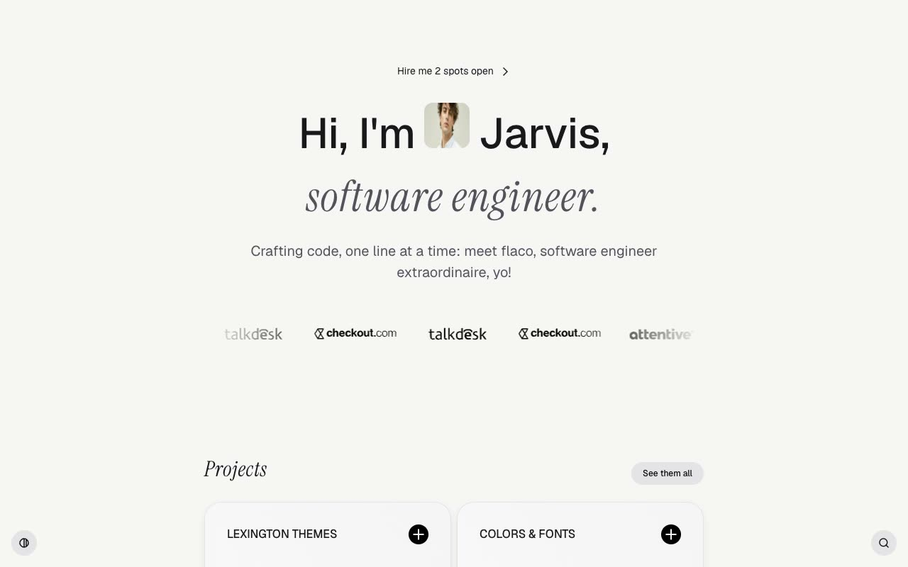

# Flaco — Minimal Personal Portfolio & Blog Template (Vanilla HTML + CSS + Fuse.js)

[](./demo.mp4)

Flaco is a pixel-faithful static clone of the Flaco template by Lexington Themes — a minimal, typographically elegant personal portfolio and blog site for a fictional software engineer named Jarvis. Built entirely with plain HTML, CSS, and vanilla JavaScript (no build step), it ships six pages: Home, Blog, Projects, Store, Studio, and Stack. The design features a warm neutral palette with a lime-green accent, a full light/dark theme toggle persisted to `localStorage`, a Fuse.js-powered fuzzy search modal, an animated brand logo marquee, and hover-driven interactions including project card description slide-up and arrow rotation. Fonts are Geist (UI/body), Instrument Serif italic (display headings), and Geist Mono.

## Run

No build step required. Open `index.html` directly in a browser, or serve the folder locally:

```sh
python3 -m http.server
```

Then visit `http://localhost:8000` in your browser.

## Pages

| File | Page |
|---|---|
| `index.html` | Home — hero, brand marquee, projects grid, featured blog post, stack preview |
| `blog/index.html` | Blog — paginated post list |
| `projects/index.html` | Projects — full project grid |
| `store/index.html` | Store — digital goods listing |
| `studio/index.html` | Studio — services / hire-me page |
| `stack/index.html` | Stack — full tech stack listing |

## Notable techniques

- **Light/dark theme** — toggled by a fixed bottom-left pill button; writes `.dark` on `<html>` and persists the choice to `localStorage`. Colours are driven by CSS custom properties that flip between light and dark semantic tokens.
- **Fuzzy search** — fixed bottom-right button opens a full-screen modal backed by [Fuse.js](https://fusejs.io/) for instant fuzzy search over blog post data.
- **Animated marquee** — brand logo ticker uses a 12 s linear infinite CSS keyframe animation with left/right fade masks.
- **Hamburger overlay menu** — full-screen overlay with `backdrop-filter: blur` and staggered per-link entrance animations (opacity + `translateY(20px → 0)`, 0.3 s ease-out, 0.1 s delay per index).
- **Stack cards** — horizontal-scroll row with subtle static rotations (6 deg / −12 deg); logo icon rotates −45 deg on hover.
- **Project card hover** — description block slides up from below; arrow icon rotates −45 deg on group-hover.

`prompt.md` holds the full build specification and `demo.mp4` shows the template in motion.

## Credits

Faithful clone of an existing design, recreated for study/learning. All credit for the original design goes to its creators.

**Original:** Lexington Themes — https://lexingtonthemes.com/viewports/flaco

---

Part of the [Lexington Themes templates](../../README.md) collection within [All templates](../../../README.md) in the [fable directory](../../../../README.md). [Browse the live gallery](https://pulkitxm.com/claude-directory).
