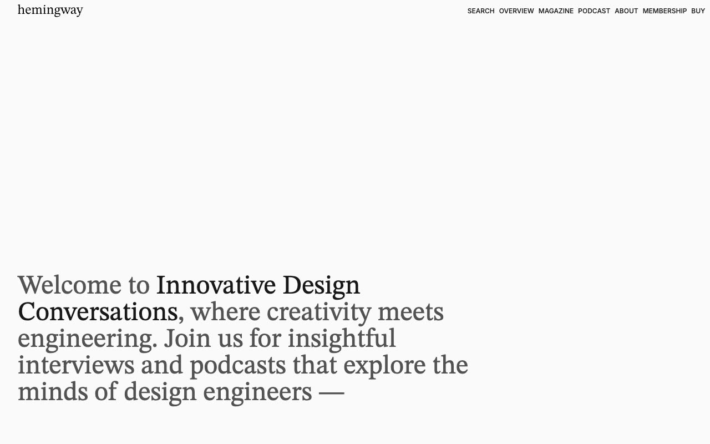

# Hemingway — Editorial Magazine & Podcast Website Template Clone (Vanilla HTML/CSS/JS + Tailwind)

[](./demo.mp4)

Hemingway is a pixel-faithful clone of the Hemingway premium Astro template by Lexington Themes — a clean, editorial-style content and podcast website template built entirely in plain HTML, CSS, and vanilla JavaScript with no build step required. It features a refined typographic system combining Inter sans-serif and STIX Two Text serif fonts, a carefully tuned neutral color palette (oklch-based base scale), and nine fully reproduced pages: home, about, magazine/blog, blog post, podcast listing, podcast interview, pricing tiers, a design system overview, and a 404 page. The clone vendors all images and assets locally, including the full Tailwind utility CSS from the source, and supports both light and dark color themes via CSS custom properties. Generated with Claude Fable 5.

## Run

No build step required — open directly in a browser or serve with:

```sh
python3 -m http.server
```

Then open `http://localhost:8000/index.html`.

## Pages

| File | Description |
|------|-------------|
| `index.html` | Home — hero headline, popular posts grid, interviews, podcast CTA |
| `about.html` | About — two-column editorial layout with grayscale image grid |
| `blog.html` | Magazine — article grid with square images and metadata |
| `blog-post.html` | Blog Post — sticky large title, author bio, subscriber gate |
| `podcast.html` | Podcast — episode list with dual images per entry |
| `podcast-interview.html` | Podcast Interview — hero image, episode detail, subscriber gate |
| `pricing.html` | Pricing — 4-tier pricing grid (Listener / Engager / Editor / Publisher) |
| `overview.html` | Overview — design system page listing all template pages |
| `404.html` | 404 — large serif number with back-home button |

## Assets

All images are vendored locally in `assets/images/`. The Tailwind utility CSS is vendored at `assets/tailwind.css`. Fonts are loaded from Google Fonts and rsms.me CDN (Inter, STIX Two Text).

See `prompt.md` for the full build spec and `demo.mp4` for a live recording of the template in motion.

## Credits

Faithful clone of an existing design, recreated for study/learning. All credit for the original design goes to its creators.

**Original:** Lexington Themes — <https://lexingtonthemes.com/viewports/hemingway>

---

Part of the [Templates](../) collection in the [claude-directory](../../) — an open-source gallery of AI-generated UI built with Claude Fable 5. [Browse the live gallery](https://pulkitxm.com/claude-directory).
