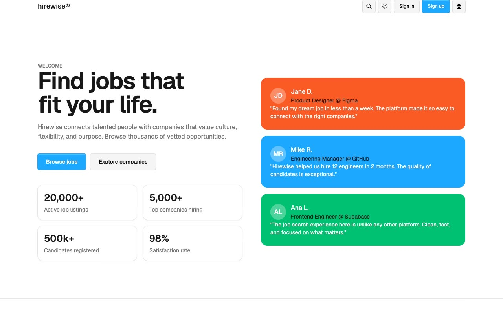

# Hirewise — Job Board Template Clone (Vanilla HTML/CSS/JS + Fuse.js)

[](./demo.mp4)

Hirewise is an 11-page job board website template — a pixel-faithful plain HTML/CSS/JS recreation of the original Astro + Tailwind design by Lexington Themes. It covers every core page a hiring platform needs: job listings with category filters, detailed job and company pages, a candidate directory, pricing, a blog, and authentication forms. Visual highlights include a no-flash dark/light mode toggle persisted in `localStorage`, a fuzzy search modal powered by Fuse.js, a mega-nav with colorful category tiles, and a responsive card-based layout using the Geist typeface and a custom OKLCH color scale. Generated with Claude Fable 5.

## Pages

| File | Page |
|---|---|
| `index.html` | Home — hero, featured jobs, jobs by category, companies, candidates, newsletter |
| `jobs.html` | Browse all jobs |
| `job-detail.html` | Single job listing |
| `companies.html` | Company directory |
| `company-detail.html` | Individual company profile |
| `candidates.html` | Candidate directory |
| `pricing.html` | Pricing plans |
| `blog.html` | Blog / news listing |
| `sign-in.html` | Sign in |
| `sign-up.html` | Register |
| `submit-job.html` | Job submission form |

## Run

No build step required. Serve the folder with any static file server:

```sh
cd templates/premium/lexingtonthemes/hirewise && python3 -m http.server 8080
```

Then open http://localhost:8080 in your browser.

## Notes

- Dark mode is toggled via a `.dark` class on the `<html>` element and persisted in `localStorage`. A boot script prevents flash on page load.
- Fuzzy search across jobs, companies, and candidates is handled client-side by [Fuse.js](https://fusejs.io/), loaded from CDN.
- All pages share a single `styles.css`; no framework or bundler is needed.
- `prompt.md` holds the full build specification and `demo.mp4` shows the template in motion.

## Credits

Faithful clone of an existing design, recreated for study/learning. All credit for the original design goes to its creators.

**Original:** Lexington Themes — https://lexingtonthemes.com/viewports/hirewise

---

Part of the [lexingtonthemes](../) templates collection in the [templates](../../) directory — part of the [fable](../../../..) repo, an open-source gallery of UI built with Claude Fable 5. [Browse the live gallery](https://pulkitxm.com/claude-directory).
