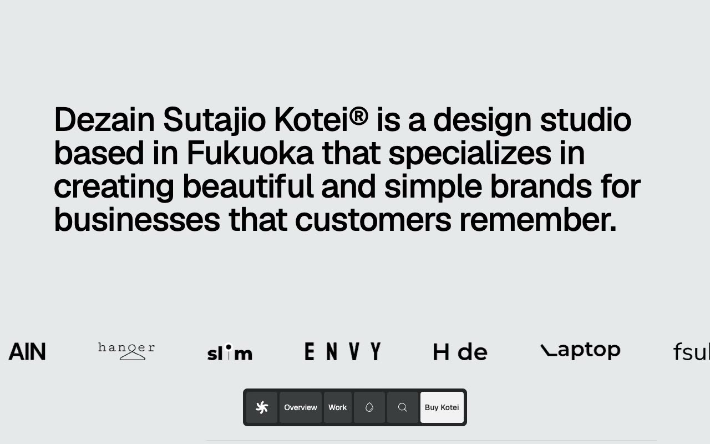

# Kotei — Design Studio Portfolio Template Clone (Vanilla HTML/CSS + Tailwind CSS v4 + AOS)

[](./demo.mp4)

Kotei is a multi-page design studio portfolio website template — a faithful clone of the Lexington Themes Kotei premium template. It presents a minimal, typographically-driven aesthetic suited to branding studios, creative agencies, and independent designers who want a polished web presence. Key interactions include a floating dock navigation bar with dark/light mode toggle, scroll-triggered AOS fade animations, an animated client logo marquee, a Fuse.js-powered full-text search modal spanning blog posts, case studies, and store items, and a live Helsinki clock in the footer. The stack is plain HTML with precompiled Tailwind CSS v4, AOS, and Fuse.js — no build step required.

## Pages

| Route | Description |
|---|---|
| `index.html` | Home — hero statement, services list, featured work grid, philosophy section, insights preview |
| `work/index.html` | Work index — full portfolio case study listing |
| `work/1/` – `work/3/` | Individual case study pages (Sinequan1, Granular, Sekkaa) |
| `blog/index.html` | Blog / Insights index |
| `blog/posts/1/` – `blog/posts/3/` | Individual blog post pages |
| `system/overview/index.html` | Design system overview — colors, typography, buttons, links |

## Tech Stack

- **HTML/CSS/JS** — no framework, no build tooling
- **Tailwind CSS v4** (precompiled to `assets/kotei.css` and `assets/supplements.css`)
- **Geist / Geist Mono** — loaded from Google Fonts
- **AOS 2.3.1** — scroll-triggered fade and slide animations
- **Fuse.js 6.6.2** — client-side fuzzy search across blog, work, and store entries
- **Dark mode** — `localStorage`-persisted preference with `prefers-color-scheme` fallback

## Running Locally

No build step. Open the template directly in a browser:

```sh
open index.html
```

Or serve it over HTTP to avoid any browser same-origin restrictions on local files:

```sh
python3 -m http.server 8080
# then open http://localhost:8080
```

All assets (CSS, images, logos) resolve relative to the file, so the template works correctly from any static file server.

`demo.mp4` shows a full walkthrough of every page in motion. `prompt.md` is not present in this project — the build spec was embedded in the generation prompt directly.

## Credits

Faithful clone of an existing design, recreated for study/learning. All credit for the original design goes to its creators.

**Original:** Lexington Themes — https://lexingtonthemes.com/viewports/kotei

---

Part of the [Templates](../) collection in the [claude-directory](../../) — an open-source gallery of AI-generated UI built with Claude Fable 5. [Browse the live gallery](https://pulkitxm.com/claude-directory).
