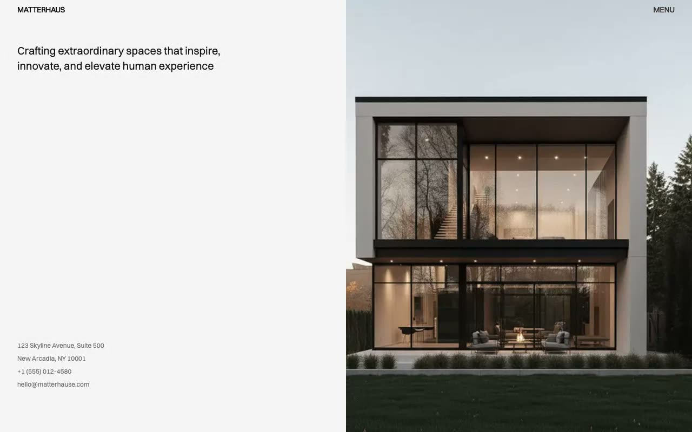

# Matterhaus — Architecture Studio Website Template Clone (Vanilla HTML/CSS/JS + Tailwind CSS v4)

[](./demo.mp4)

Matterhaus is a pixel-faithful same-to-same clone of the Matterhaus architecture studio theme by Lexington Themes — a minimal, editorial-style multi-page website built for architecture and design studios. The design centers on a recurring two-column split layout: a fixed-position header with `mix-blend-difference` navigation that renders white on any background, a sticky left column with headings and metadata, and a full-height right column for images or scrollable content. All 23 page types are reproduced in plain HTML with Tailwind CSS v4 utility classes, Switzer variable font from Fontshare, and vanilla JavaScript for the mobile menu and Fuse.js-powered full-site search modal. Generated with Claude Fable 5.

## Run

No build step required — all files are plain HTML/CSS/JS.

```sh
# Open directly in a browser
open index.html

# Or serve statically
python3 -m http.server 8000
# Then visit http://localhost:8000
```

## Pages

The clone reproduces all discovered pages from the original:

- **Home** (`index.html`) — split hero with headline + contact details left, full-height image right
- **Projects** (`projects/index.html`) — sticky heading left, scrollable project listing right (10 projects)
- **Project Detail** (`projects/[slug].html` × 10) — sticky metadata + thumbnail grid left, prose right
- **Services** (`services/index.html` + 8 detail pages) — services listing and individual service pages
- **Studio** (`studio/index.html`) — studio about page with 2-column text and full-height image
- **Contact** (`contact/index.html`) — contact info left, image right
- **Careers** (`careers/index.html` + 5 detail pages) — career listings and job detail pages
- **Blog** (`blog/index.html` + 4 posts + tags pages) — journal listing, individual posts, tag pages
- **Team** (`team/index.html` + 3 member pages) — team grid and individual profiles
- **Awards** (`awards/index.html`), **Process** (`process/index.html`) — standalone info pages
- **System** (`system/overview.html` + colors, typography, buttons, links) — design system documentation
- **Legal** (`legal/` × 5: terms, privacy, cookies, copyright, disclaimer)
- **404** (`404.html`)

## Interactions

- **Mobile menu** — hamburger toggle reveals full-width nav panel, closes on outside click
- **Search modal** — Fuse.js fuzzy search over all content (projects, services, blog, team, careers, legal); triggered by the Search button, keyboard `/`, or `Cmd/Ctrl+K`; `Esc` to close

## Notes

`prompt.md` contains the full build specification with design token documentation and page-by-page layout breakdown. `demo.mp4` shows the clone in motion.

Assets are vendored locally under `assets/images/`. Switzer font is loaded from the Fontshare CDN (`api.fontshare.com`); all other dependencies are vanilla.

## Credits

Faithful clone of an existing design, recreated for study/learning. All credit for the original design goes to its creators.

**Original:** Lexington Themes — <https://lexingtonthemes.com/viewports/matterhaus>

---

Part of the [Lexington Themes](../) collection under [Premium Templates](../../) in the [claude-directory](../../../) — an open-source gallery of AI-generated UI built with Claude Fable 5. [Browse the live gallery](https://pulkitxm.com/claude-directory).
