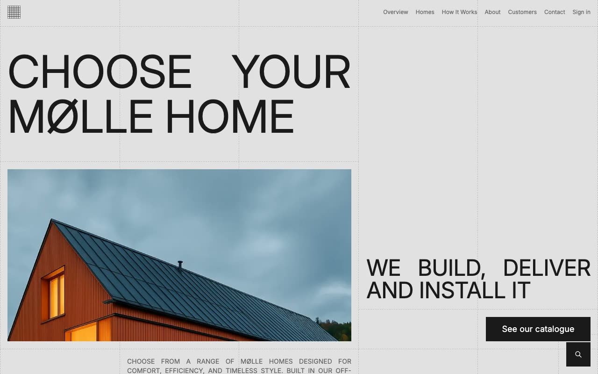

# Mølle — Scandinavian Prefab Home Company Website Clone (Vanilla HTML/CSS/JS + Tailwind CSS)

[](./demo.mp4)

Pixel-faithful clone of the Mølle premium Astro + Tailwind CSS e-commerce template by Lexington Themes, reproduced as a self-contained plain HTML/CSS/JS project with no build step required. The design follows Scandinavian minimalist principles: a strict five-column grid, dashed borders as decorative elements throughout, uppercase typography using InterDisplay and Inter, and a black-and-white base palette with a single purple accent colour. All 13 pages of the live preview are reproduced — including the keen-slider product carousel, Gantt-chart process timeline, accordion FAQ, Fuse.js search modal, mobile hamburger navigation, and full-page customer gallery. Generated with Claude Fable 5.

## Pages

| File | Description |
|------|-------------|
| `index.html` | Home — hero, about, why Mølle, models carousel, process gantt, customer gallery, articles |
| `homes.html` | Product grid — all 8 cabin models with FAQ accordions |
| `process.html` | How it works — 8-step detailed process list + images |
| `about.html` | About — mission, team (Kalle Bergström, Jonas Mikkelsen), story, why Mølle |
| `customers.html` | Customer photo gallery |
| `contact.html` | Contact form + three Scandinavian office addresses |
| `sign-in.html` | Sign-in form |
| `sign-up.html` | Registration form |
| `blog.html` | Blog listing — 6 articles |
| `blog-post.html` | Representative blog post — "Living Lightly: Off-Grid Comfort" |
| `product.html` | Product detail — Halo X, specs table, floor plan, related models |
| `system-overview.html` | Design system — colour swatches, type scale, button styles |
| `helpcenter.html` | Help center — 4 topic categories + contact CTA |

## Stack

- **Plain HTML5 + CSS** — no build step, runs directly from the filesystem or any static server
- **Tailwind CSS** — vendored compiled stylesheet (`assets/css/base.css`) extracted from the source
- **Inter + InterDisplay** — loaded from `rsms.me/inter/inter.css`
- **Keen Slider 6.8.6** — vendored (`assets/js/keen-slider.min.js`) for the product carousel
- **Fuse.js 7.1.0** — vendored (`assets/js/fuse.min.js`) for full-text search across blog posts and products

## Run Locally

```bash
# Open directly in your browser — no server required
open index.html

# Or serve with Python (recommended for correct MIME types)
python3 -m http.server 8080
# then visit http://localhost:8080
```

## Assets

All images, fonts (via CDN), and JS libraries are either vendored locally in `assets/` or loaded from stable CDN URLs. The project works fully offline (except Inter from rsms.me and external CDN references in older pages).

## Interactions

- **Mobile nav** — hamburger menu with full-screen overlay and slide-down animation
- **Search modal** — Fuse.js fuzzy search across blog posts and products, triggered by the fixed bottom-right button
- **Keen Slider** — draggable product carousel with prev/next controls
- **FAQ accordions** — native `<details>`/`<summary>` with CSS `group-open` rotation
- **Hover states** — product card grayscale, nav link colour transitions, button colour changes

## Credits

Faithful clone of an existing design, recreated for study/learning. All credit for the original design goes to its creators.

**Original:** Lexington Themes — <https://lexingtonthemes.com/viewports/molle>

---

[← Lexington Themes](../) · [← Templates](../../) · [← Fable Root](../../../../)
