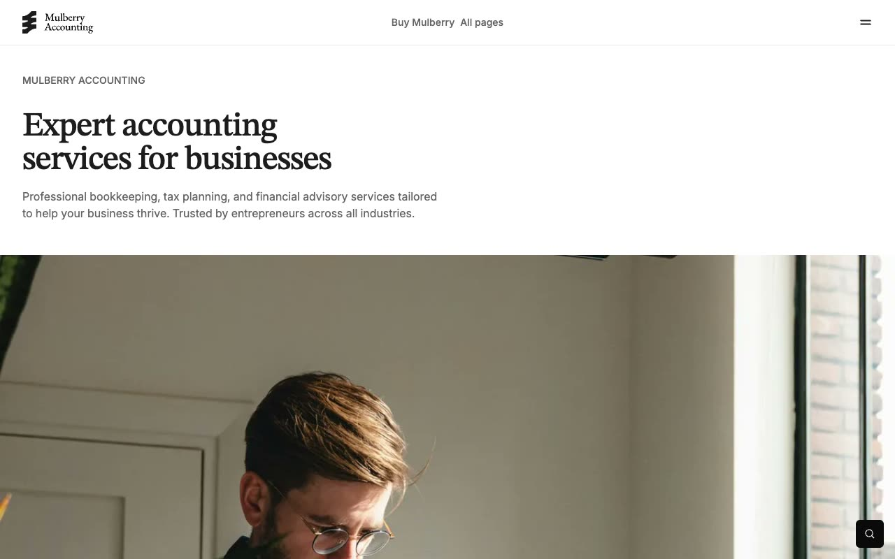

# Mulberry — Premium Accounting Firm Multi-Page Website Template (Vanilla HTML + CSS + JS)

[](./demo.mp4)

Mulberry is a pixel-faithful HTML/CSS/JS clone of the Mulberry premium accounting & financial-services website template by Lexington Themes — a refined, editorial multi-page marketing site for a fictional accounting firm ("Mulberry Accounting"). The design pairs the STIX Two Text serif for display headings with Inter for body copy, a warm neutral grey palette, and a golden-amber accent (`oklch(70.2% .144 93.61)`), set against full-bleed editorial photography, `base-50` section panels, and a black footer and call-to-action band. Standout interactions include a full-width four-column mega menu, a Fuse.js-powered fuzzy site search modal, native `<details>` FAQ accordions, scroll-triggered count-up stats, and group-hover card and link transitions. The clone ships **68 HTML pages**, the original compiled Tailwind CSS vendored as `theme.css`, and all images, fonts, video, and icons vendored locally — no build step required. Generated with Claude Fable 5.

## Pages

68 pages are reproduced. Highlights:

| Area | Files |
|---|---|
| Core | `index.html` (Home), `about.html`, `contact.html`, `pricing.html`, `faq.html`, `testimonials.html`, `locations.html`, `404.html` |
| Services | `services.html` + 6 detail pages (`services-bookkeeping-accounting.html`, `services-audit-support-assurance.html`, …) |
| Industries | `industries.html` + 8 detail pages (`industries-technology-software.html`, `industries-healthcare-medical.html`, …) |
| Case studies | `case-studies.html` + 6 detail pages (`case-studies-manufacturing-optimization.html`, …) |
| Blog | `blog.html`, 6 posts (`blog-posts-1.html` … `blog-posts-6.html`), `blog-tags.html` + 15 tag pages |
| Team | `team.html` + 6 profile pages (`team-david-lee.html`, `team-sarah-chen.html`, …) |
| Legal | `legal-privacy.html`, `legal-terms.html` |
| Design system | `system-overview.html`, `system-buttons.html`, `system-colors.html`, `system-link.html`, `system-typography.html` |

## Run

No build step. Serve the project folder with any static file server and open it in a browser.

```sh
# Python (built-in, available on most systems)
python3 -m http.server 8080
# then open http://localhost:8080
```

Or use any other static server (`npx serve .`, VS Code Live Server, etc.).

## Key interactions

- **Mega menu** — click "All pages" (or the hamburger) in the header to open a full-width black dropdown with a gold "Get in touch" panel and four link columns (Overview, Services, Industries, Resources). Closes on outside-click or `Esc`; the trigger arrow rotates 90°.
- **Search modal** — click the fixed bottom-right search button to open a fuzzy-search modal powered by Fuse.js 7 over an inline content index. Press `Esc` or click outside to close.
- **FAQ accordions** — native `<details>`/`<summary>` accordions on the FAQ and pricing pages expand/collapse with an animated plus/minus indicator.
- **Count-up stats** — numeric stat values animate from zero on scroll-into-view via an `IntersectionObserver` and a cubic ease-out.
- **Hover states** — preview cards reveal an accent "Read further" label, and nav/footer links shift to the accent color with a fade-in arrow on hover.

## Assets

All images (`.webp`), the CEO `.mp4`, certification SVGs, the favicon, the RSS feed, and Fuse.js are vendored locally under `assets/`. The original compiled Tailwind CSS is vendored as `theme.css`; only the Inter and STIX Two Text web fonts are loaded from their CDNs.

## Spec and demo

`prompt.md` contains the full build specification. `demo.mp4` shows the finished template in motion (use `poster.jpg` as the preview thumbnail).

## Credits

Faithful clone of an existing design, recreated for study/learning. All credit for the original design goes to its creators.

**Original:** Lexington Themes — https://lexingtonthemes.com/viewports/mulberry

---

Part of the [Templates](../../README.md) collection in the [claude-directory](../../../../README.md) — an open-source gallery of AI-generated UI built with Claude Fable 5. [Browse the live gallery](https://pulkitxm.com/claude-directory).
