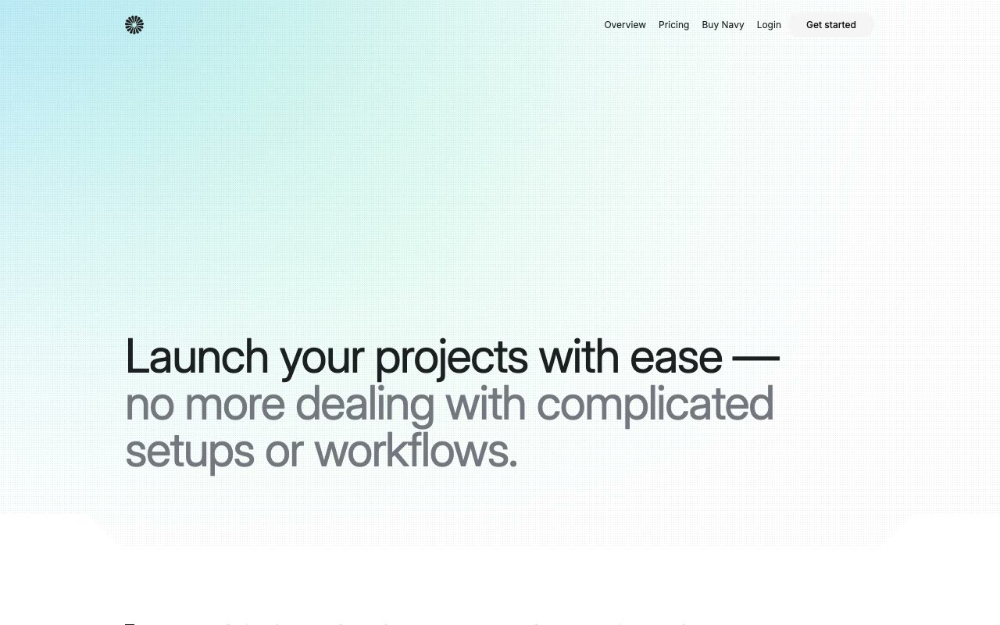

# Navy — SaaS Cloud Hosting Website Template Clone (Vanilla HTML/CSS/JS + Tailwind CSS v4)

[](./demo.mp4)

Pixel-faithful clone of the **Navy** SaaS cloud hosting template by Lexington Themes — a clean, minimal white design built for cloud infrastructure and hosting services. The template features a viewport-height hero with teal/green radial-gradient "burst" background accents, dot-pattern overlays, SVG trapezoid corner decorators for section transitions, interactive tab panels with IntersectionObserver scroll-reveal animations, a live stat grid with hover burst effects, and a full pricing page with feature comparison table. All 15 pages are reproduced: home, pricing, sign-in, 6 customer case study detail pages, a customer index, and 5 design-system showcase pages (overview, buttons, links, colors, typography). Built with compiled Tailwind CSS v4, Inter and InterDisplay typefaces, and JetBrains Mono — all assets vendored locally and runnable offline with no build step. Generated with Claude Fable 5.

## Run

No build step required — plain HTML/CSS/JS. Serve from any static HTTP server:

```sh
# From this folder:
python3 -m http.server 8080
# Then open http://localhost:8080/index.html
```

Or open `index.html` directly in a browser (some assets may require a server due to CORS on font files).

## Pages

| Page | File |
|---|---|
| Home | `index.html` |
| Pricing | `pricing.html` |
| Sign In | `forms/sign-in.html` |
| Customers Index | `customers/home.html` |
| Customer 1–6 | `customers/1.html` … `customers/6.html` |
| System Overview | `system/overview.html` |
| System Buttons | `system/buttons.html` |
| System Links | `system/links.html` |
| System Colors | `system/colors.html` |
| System Typography | `system/typography.html` |

## Assets

All fonts (Inter, JetBrains Mono) are loaded via CDN (`rsms.me/inter` and `fontshare`). Logos, dashboard screenshots, and team photos are vendored under `assets/`. The compiled Tailwind CSS v4 stylesheet is vendored at `assets/main.css`.

`prompt.md` holds the full build spec; `demo.mp4` shows the template in motion.

## Credits

Faithful clone of an existing design, recreated for study/learning. All credit for the original design goes to its creators.

**Original:** Lexington Themes — <https://lexingtonthemes.com/viewports/navy>

---

Part of the [Templates](../) collection in the [claude-directory](../../) — an open-source gallery of AI-generated UI built with Claude Fable 5. [Browse the live gallery](https://pulkitxm.com/claude-directory).
