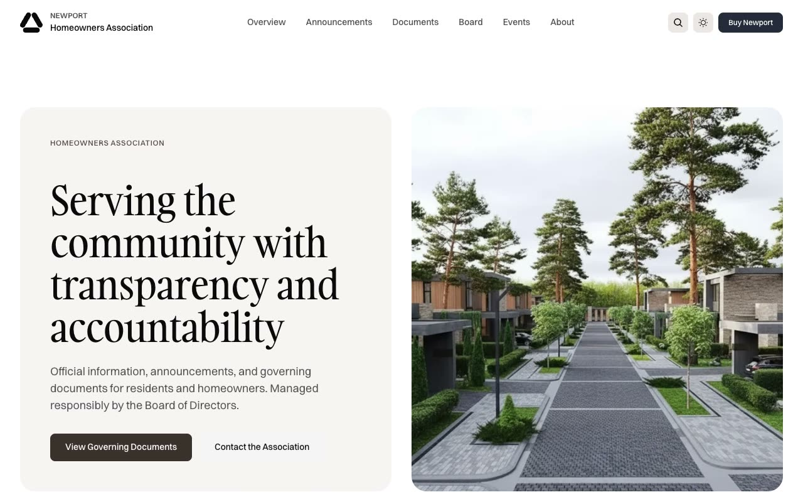

# Newport — Premium HOA / Community Website Template (Vanilla HTML + CSS + JS)

[](./demo.mp4)

Newport is a pixel-faithful HTML/CSS/JS clone of the Newport homeowners association (HOA) website template by Lexington Themes — a calm, editorial multi-page community site for a fictional HOA that publishes announcements, governing documents, board profiles, events, and amenities. The design pairs the **Gambarino** serif for large display headings with the **Switzer** sans-serif for body copy, soft rounded cards on a light neutral background, and deep near-black neutral panels for hero, contact, and CTA sections, all driven by three OKLCH color scales (`base`, `accent`, `secondary`). Standout interactions include a Fuse.js-powered site search modal (open via the header search icon, `Cmd+K`, or `/`) that filters a 53-item index in real time, a slide-in mobile navigation panel, native `<details>` FAQ accordions, sticky "on this page" sidebars, and scroll-reveal entrance animations. Unlike the light-only source, this clone is fully theme-aware: every color flows through light **and** dark theme tokens, honors `prefers-color-scheme`, and ships a header theme toggle with `localStorage` persistence and a no-flash boot script. The clone ships 27 HTML pages, a single `styles.css`, locally-vendored Switzer + Gambarino fonts, and 26 `.webp` images — no build step required. Generated with Claude Fable 5.

## Pages

| File | Route |
|---|---|
| `index.html` | Home |
| `overview.html` | Overview / sitemap |
| `about.html` | About the Association |
| `contact.html` | Contact (form + office info) |
| `faq.html` | Frequently Asked Questions |
| `gallery.html` | Community Gallery |
| `governance.html` | Governance |
| `amenities.html` | Amenities listing |
| `amenities/pool.html` | Amenity detail — Community Pool |
| `announcements.html` | Community Updates listing |
| `announcements/pool-maintenance.html` | Announcement detail |
| `blog.html` | Community Blog listing |
| `blog/post.html` | Blog post detail |
| `blog/tags.html` | Blog tag index |
| `blog/tag.html` | Blog tag category |
| `board.html` | Board of Directors listing |
| `board/president.html` | Board member detail |
| `documents.html` | Association Documents listing |
| `documents/bylaws.html` | Document detail |
| `events.html` | Community Events listing |
| `events/budget-hearing.html` | Event detail |
| `rules-and-regulations.html` | Rules and Regulations |
| `privacy.html` | Privacy Policy |
| `terms.html` | Terms of Service |
| `accessibility.html` | Accessibility Statement |
| `fair-housing.html` | Fair Housing Notice |
| `404.html` | Not found |

## Run

No build step. Serve the project folder with any static file server and open it in a browser.

```sh
# Python (built-in, available on most systems)
python3 -m http.server 8080
# then open http://localhost:8080
```

Or use any other static server (`npx serve .`, VS Code Live Server, etc.).

## Key interactions

- **Site search modal** — click the header search icon, press `Cmd+K`, or press `/` to open a centered search box. Typing filters a 53-item index (posts, announcements, events, documents, board, amenities, legal) in real time with Fuse.js 7. Press `Esc` or click the backdrop to close.
- **Mobile navigation** — the hamburger button opens a slide/fade-in panel with a dimmed overlay, full nav links, and a Buy Newport CTA; closes on link click, overlay tap, or `Esc`.
- **FAQ accordions** — native `<details>`/`<summary>` accordions grouped by topic, with a `+` icon that rotates to `×` when open.
- **Sticky "on this page" sidebars** — the FAQ and Governance pages keep a table-of-contents sidebar pinned while scrolling, with the active section highlighted.
- **Theme toggle** — a header sun/moon button switches between light and dark themes; the choice persists in `localStorage` and the initial theme respects `prefers-color-scheme`.
- **Scroll-reveal animations** — sections and cards fade/slide into view on scroll via IntersectionObserver, with a reduced-motion fallback.

## Assets

26 `.webp` images and the Switzer + Gambarino web fonts are vendored locally in `assets/` — no external image or font CDN required. Fuse.js 7 is loaded from a CDN at runtime for the search modal.

## Spec and demo

`prompt.md` contains the full build specification. `demo.mp4` shows the finished template in motion (use `poster.jpg` as the preview thumbnail).

## Credits

Faithful clone of an existing design, recreated for study/learning. All credit for the original design goes to its creators.

**Original:** Lexington Themes — https://lexingtonthemes.com/viewports/newport

---

Part of the [Templates](../../README.md) collection in the [claude-directory](../../../../README.md) — an open-source gallery of AI-generated UI built with Claude Fable 5. [Browse the live gallery](https://pulkitxm.com/claude-directory).
