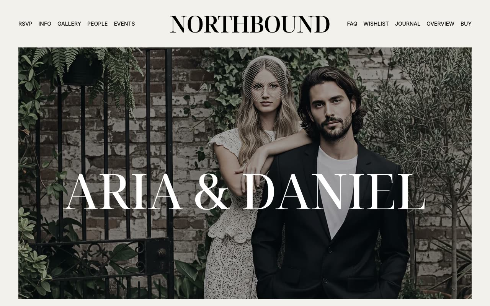

# Northbound — Wedding Website Template Clone (Vanilla HTML/CSS/JS + Tailwind CSS)

[](./demo.mp4)

Northbound is a pixel-faithful HTML/CSS/JS clone of the Northbound wedding website template by Lexington Themes — an elegant, editorial design for couples sharing ceremony details, gallery albums, RSVP forms, wishlists, and schedules with guests. The clone reproduces all 13 pages (home, RSVP, info, gallery index, three gallery albums, people, events, FAQ, wishlist, journal, and system overview) using plain HTML with the original compiled Tailwind CSS v4 utility classes, Noto Serif Display and Noto Serif fonts (Google Fonts), Inter (rsms.me), and Keen Slider for the intro image carousel. All images and CSS assets are vendored locally; no build step is required. Generated with Claude Fable 5.

## Run

This is a self-contained, plain HTML/CSS/JS project — no build step required.

```sh
# Serve locally (any static server works)
python3 -m http.server 8080
# then open http://localhost:8080/index.html
```

Or simply open `index.html` directly in a browser (some interactions such as fonts may require a server context to load correctly from cross-origin CDNs).

## Pages

| File | Route | Description |
|---|---|---|
| `index.html` | `/` | Home — hero, intro slider, story, schedule, CTA cards, gallery preview |
| `rsvp.html` | `/rsvp` | RSVP form with split layout (photo + dark panel) |
| `info.html` | `/info` | Venue details, maps, accommodation, dress code |
| `gallery.html` | `/gallery` | Gallery album index (6 albums) |
| `gallery/getting-ready.html` | `/gallery/getting-ready` | Getting Ready album (3 photos) |
| `gallery/ceremony.html` | `/gallery/ceremony` | Ceremony album (3 photos) |
| `gallery/reception.html` | `/gallery/reception` | Reception album (3 photos) |
| `people.html` | `/people` | Wedding party grid (bride, groom, attendants) |
| `events.html` | `/events` | Full schedule of wedding events |
| `faq.html` | `/faq` | FAQ (event details, travel, food, photos, gifts) |
| `wishlist.html` | `/wishlist` | Wishlist grouped by category (experiences, kitchen, bedroom, outdoor) |
| `blog.html` | `/blog` | Journal/blog with featured post + grid |
| `system/overview.html` | `/system/overview` | Developer reference page |

## Assets

All images and CSS are vendored under `assets/`:

- `assets/images/` — 53 `.webp` photos from the original Northbound demo
- `assets/css/main.css` — compiled Tailwind CSS v4 (downloaded from the live site)
- `assets/css/keen-slider.min.css` — Keen Slider CSS (CDN copy)
- `assets/css/custom.css` — custom token overrides and missing Tailwind utilities

Fonts are loaded from Google Fonts CDN and rsms.me (Inter) — an internet connection is needed for fonts to render correctly.

## Notes

- The full build specification is in `prompt.md`.
- `demo.mp4` records a full scroll of the home page at 1280×800, 30 fps.
- Images use `filter: saturate(0.5)` at rest and `saturate(1)` on hover (`transition-all duration-300`), matching the original's editorial desaturated aesthetic.
- The mobile hamburger menu is reproduced faithfully in vanilla JS.
- The intro slider uses [Keen Slider 6.8.6](https://keen-slider.io) loaded from CDN.

## Credits

Faithful clone of an existing design, recreated for study/learning. All credit for the original design goes to its creators.

**Original:** Lexington Themes — <https://lexingtonthemes.com/viewports/northbound>

---

Part of the [Templates](../) collection in the [claude-directory](../../) — an open-source gallery of AI-generated UI built with Claude Fable 5. [Browse the live gallery](https://pulkitxm.com/claude-directory).
