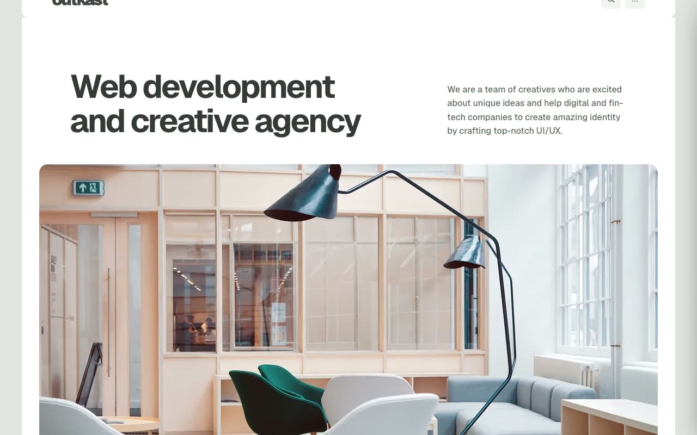

# Outkast — Dark-Mode Web Development Agency Website Template (Vanilla HTML + CSS + JS)

[](./demo.mp4)

Outkast is a pixel-faithful static clone of the Outkast premium Astro template by Lexington Themes, reproduced as plain HTML, CSS, and vanilla JavaScript with no build step required. The template covers eight complete pages — Home, Services, Work, Team, Pricing, Blog, Contact, and System Overview — all sharing a single stylesheet and JS file. It features a dark-mode-first design using the Geist variable font, a near-black oklch color palette with muted sage-green accents, a sticky hamburger-drawer nav, CSS marquee ticker animations, scroll-triggered entrance reveals via IntersectionObserver, a custom scrollable work carousel, and a contact form with a live character counter. Built for web development agencies and creative studios looking for a production-ready multi-page site template. Generated with Claude Fable 5.

## Run

No build step is needed. Open any HTML file directly in a browser, or serve the folder with a local static server:

```sh
python3 -m http.server
```

Then visit `http://localhost:8000` and navigate between pages using the hamburger drawer menu.

## Pages

| File | Page |
|---|---|
| `index.html` | Home — hero, marquee, services teaser, work slider, awards, testimonials, blog preview |
| `services.html` | Services — bordered service rows, process steps, tech stack |
| `work.html` | Work — project card grid |
| `team.html` | Team — avatar cards, social links, slow-scroll marquee ticker |
| `pricing.html` | Pricing — three-tier cards, FAQ accordion |
| `blog.html` | Blog — featured post, article grid |
| `contact.html` | Contact — form with 500-char counter, contact details |
| `system-overview.html` | System Overview — color swatches, typography scale, component samples |

## Notable techniques

- **No dependencies** — drawer, slider, search modal, IntersectionObserver reveals, and character counter are all implemented in `main.js` with under 100 lines of vanilla JS.
- **Geist variable font** — loaded via Google Fonts; weights 100–900 used across headings and body.
- **oklch color palette** — near-black `oklch(14% 0.01 325)` base with muted green accent `oklch(38.6% 0.014 149.5)`.
- **CSS marquee** — two independently-paced marquee animations: `linear 12s infinite` for the hero strip and `linear 300s infinite` for the slow awards ticker.
- **Entrance animations** — opacity 0→1 + translateY 24px→0 at 600ms ease-out, triggered by IntersectionObserver on each `.reveal` element.
- **Drawer slide** — full-height right panel, `translateX(100%)→0` at 300ms, controlled by aria attributes.

`prompt.md` holds the full build specification and `demo.mp4` shows the template in motion.

## Credits

Faithful clone of an existing design, recreated for study/learning. All credit for the original design goes to its creators.

**Original:** Lexington Themes — https://lexingtonthemes.com/viewports/outkast

---

Part of the [Lexington Themes](../) provider collection inside [Templates](../../) in the [claude-directory](../../../../../) — an open-source gallery of AI-generated UI built with Claude Fable 5. [Browse the live gallery](https://pulkitxm.com/claude-directory).
