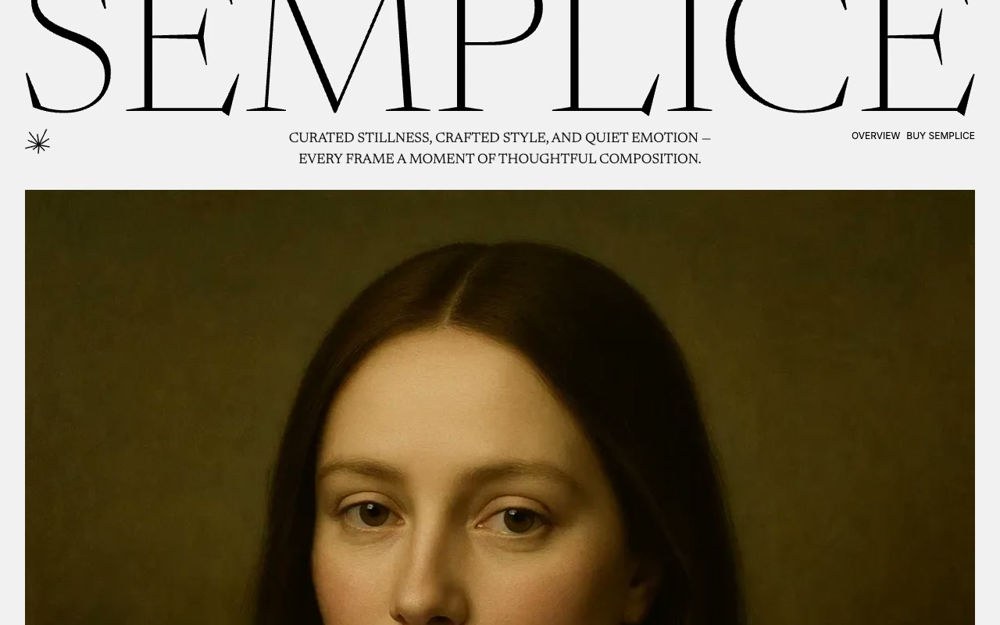

# PrimaPersona — Minimal Personal Portfolio Template (Vanilla HTML + CSS + JS)

[](./demo.mp4)

PrimaPersona is a clean, minimal personal portfolio template aimed at creative technologists. It ships as plain HTML, CSS, and vanilla JavaScript — no build step required. The single-page layout is anchor-linked across four sections (Work, Projects, Education, and Speaking), anchored by a fixed 4-column grid navigation and capped with a matching footer. Article images use large `2rem` border-radius for a refined editorial feel. Light and dark modes are handled entirely through CSS custom properties toggled via a `dark` class on the `<html>` element, with an automatic `prefers-color-scheme` fallback. The Inter typeface, a neutral monochromatic palette, and an accent green tie the design together. A companion system directory provides standalone showcase pages for colors, typography, links, and buttons. Generated with Claude Fable 5.

## Run

No build step is needed. Open `index.html` directly in a browser, or serve the folder with any static file server:

```sh
python3 -m http.server
```

Then visit `http://localhost:8000`.

## Pages

| Path | Description |
|---|---|
| `index.html` | Main portfolio page (Work, Projects, Education, Speaking) |
| `404.html` | 404 error page |
| `system/overview/index.html` | Site overview / component index |
| `system/links/index.html` | Link styles showcase |
| `system/buttons/index.html` | Button styles showcase |
| `system/colors/index.html` | Color palette showcase |
| `system/typography/index.html` | Typography scale showcase |

## Notes

- Dark mode: add the `dark` class to `<html>` to force dark theme; without it the page respects `prefers-color-scheme`.
- All CSS custom properties (palette, spacing, radii, type scale) live in `styles.css`.
- `prompt.md` contains the full pixel-faithful build specification.
- `demo.mp4` shows the finished template in motion.

## Credits

Faithful clone of an existing design, recreated for study/learning. All credit for the original design goes to its creators.

**Original:** Lexington Themes — https://lexingtonthemes.com/viewports/primapersona

---

Part of the [Templates](../) collection in the [claude-directory](../../../../) — an open-source gallery of AI-generated UI built with Claude Fable 5. [Browse the live gallery](https://pulkitxm.com/claude-directory).
