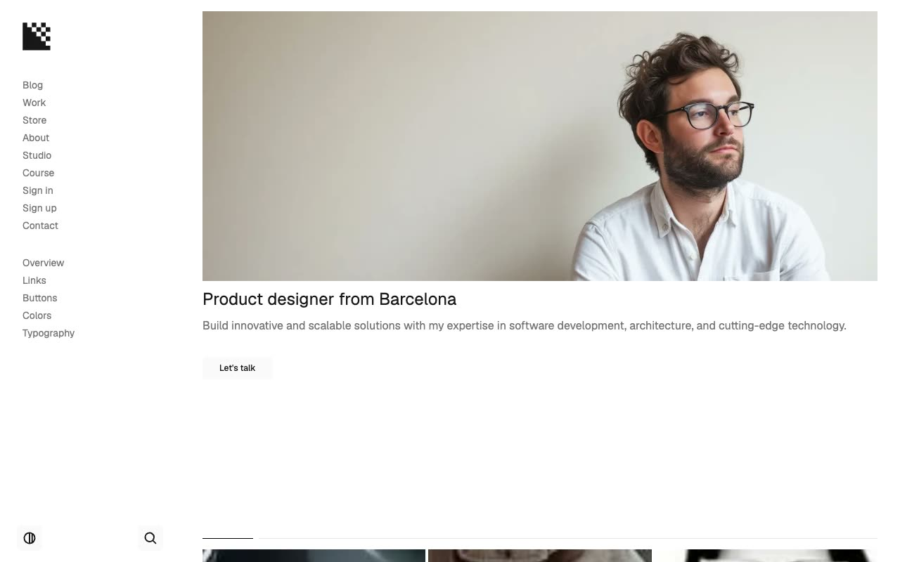

# ProFolioX — Portfolio & Folio Website Template Clone (Vanilla HTML/CSS/JS)

[](./demo.mp4)

ProFolioX is a pixel-faithful HTML/CSS/JS clone of the ProFolioX portfolio template by Lexington Themes — a minimal, dark/light-mode portfolio theme for designers and developers. The clone reproduces all 18 pages (home, blog listing, 6 blog posts, work listing, 6 work case studies, store listing, 6 store items, about, studio, course, sign in, sign up, contact, and 5 design-system reference pages) using plain HTML, custom CSS design tokens built on OKLCH colors, and vanilla JavaScript. All assets — images, AOS animation library, and Fuse.js fuzzy search — are vendored locally or loaded from CDN. No build step is required. Generated with Claude Fable 5.

## Run

This is a self-contained, plain HTML/CSS/JS project — no build step required.

```sh
# Serve locally (any static server works)
python3 -m http.server 8080
# then open http://localhost:8080/index.html
```

Or open `index.html` directly in a browser (fonts load from Google Fonts CDN).

## Pages

| File | Route | Description |
|---|---|---|
| `index.html` | `/` | Home — hero portrait, featured work grid, 3-step process section, latest blog posts, featured store products |
| `blog/index.html` | `/blog` | Blog listing — "Reflexions" — 2-column grid with hover overlay reveal, show-more pagination |
| `blog/posts/1.html` | `/blog/posts/1` | Blog post: Breaking down complex UI patterns |
| `blog/posts/2.html` | `/blog/posts/2` | Blog post: Crafting user experiences with precision |
| `blog/posts/3.html` | `/blog/posts/3` | Blog post: The art of balancing beauty and function |
| `blog/posts/4.html` | `/blog/posts/4` | Blog post: Design systems as a foundation for success |
| `blog/posts/5.html` | `/blog/posts/5` | Blog post: Optimizing UI/UX for performance |
| `blog/posts/6.html` | `/blog/posts/6` | Blog post: Accessibility in design engineering |
| `work/index.html` | `/work` | Work listing — 2-column project grid with hover overlay |
| `work/1.html` | `/work/1` | Work detail: Sinequanone — branding & web |
| `work/2.html` | `/work/2` | Work detail: Granular — web design |
| `work/3.html` | `/work/3` | Work detail: Sekkaa — brand identity |
| `work/4.html` | `/work/4` | Work detail: EarthWise — UX research & web |
| `work/5.html` | `/work/5` | Work detail: Stucko — web development |
| `work/6.html` | `/work/6` | Work detail: Enviroson — full service |
| `store/index.html` | `/store` | Store — "Digital products for your business" — 3-column product grid |
| `store/1.html` | `/store/1` | Product: Sample Notebook — $99 |
| `store/2.html` | `/store/2` | Product: The Field Journal — $199 |
| `store/3.html` | `/store/3` | Product: The Field Keyboard — $299 |
| `store/4.html` | `/store/4` | Product: Apple Smartwatch — $399 |
| `store/5.html` | `/store/5` | Product: Grid System Planner — $49 |
| `store/6.html` | `/store/6` | Product: The Focus Journal — $79 |
| `about.html` | `/about` | About — bio, portrait, awards & honors list, client roster |
| `studio.html` | `/studio` | Studio services — UI/UX, Development, Branding cards + FAQ accordion |
| `course.html` | `/course` | Course — hero, overview, course details sidebar, 6-module accordion |
| `signin.html` | `/signin` | Sign in form |
| `signup.html` | `/signup` | Sign up form with password validation |
| `contact.html` | `/contact` | Contact form |
| `system/overview.html` | `/system/overview` | Design system overview |
| `system/links.html` | `/system/links` | Link variants |
| `system/buttons.html` | `/system/buttons` | Button variants (ghost, primary, icon) |
| `system/colors.html` | `/system/colors` | Full OKLCH color palette swatches |
| `system/typography.html` | `/system/typography` | Type scale specimens |

## Design Tokens

The design system is built on CSS custom properties defined in `assets/css/tokens.css`:

- **Font:** Geist (sans) + Geist Mono — loaded from Google Fonts
- **Neutrals:** `--base-50` → `--base-950` (OKLCH grays, 11 stops)
- **Accent:** `--accent-50` → `--accent-900` (OKLCH indigo/violet)
- **Semantic tokens:** `--bg`, `--text-primary`, `--text-secondary`, `--border-color`, etc. — switch between light and dark via `.dark` class
- **Radii:** `--radius-md` 0.375rem, `--radius-lg` 0.5rem, `--radius-xl` 0.75rem
- **Dark mode:** driven by `.dark` class on `<html>`, toggled via localStorage + `prefers-color-scheme` fallback

## Interactions

- **Theme toggle** — light/dark with localStorage persistence and `prefers-color-scheme` auto-detect; no flash on reload
- **Search modal** — keyboard shortcut ⌘K / Ctrl+K, ESC to close; fuzzy search via Fuse.js across blog posts, work projects, and store items
- **Mobile drawer** — hamburger menu, overlay, slide-in panel with staggered nav link entrance animation
- **Nav link stagger** — each nav link fades in and slides up with 0.1s step delay on page load
- **Card hover overlay** — on desktop (≥1024px), work/blog/store cards show a semi-transparent overlay and the card title/description slides up from `translateY(3rem)` to 0 on hover, with 800ms ease-in-out
- **AOS scroll animations** — fade-up on headings, hero images, and section content using [AOS 2.3.1](https://github.com/michalsnik/aos)
- **Accordion** — studio FAQ and course modules use a click-to-open/close accordion with `max-height` transition
- **Show more** — blog listing hides posts beyond 4 with a "Show all 6" button

## Assets

All images are vendored under `assets/images/` (27 `.webp` files downloaded from the live Astro demo at `profoliox-astro.pages.dev`). JavaScript libraries in `assets/js/`:

- `aos.js` — [AOS 2.3.1](https://unpkg.com/aos@2.3.1/dist/aos.js) (scroll animations)
- `fuse.min.js` — [Fuse.js 7.0.0](https://cdn.jsdelivr.net/npm/fuse.js@7.0.0/dist/fuse.min.js) (fuzzy search)
- `theme-init.js` — inline script to set the theme class before first paint (prevents FOUC)

## Notes

- The full build specification is in `prompt.md`.
- `demo.mp4` records a full scroll of the home page at 1280×800, 30 fps.
- Dark mode uses `oklch()` colors throughout — no hardcoded hex values in component markup; all colors reference CSS tokens so both light and dark render faithfully.
- The sidebar is a 256px fixed panel on `≥1024px`; below that a hamburger triggers a slide-in drawer.
- `Buy ProFolioX` nav link points to the original Lexington Themes product page.

---

[← Back to Lexington Themes templates](../README.md) · [← All templates](../../README.md) · [← Root](../../../README.md)

## Credits

Faithful clone of an existing design, recreated for study/learning. All credit for the original design goes to its creators.

**Original:** Lexington Themes — <https://lexingtonthemes.com/viewports/profoliox>
