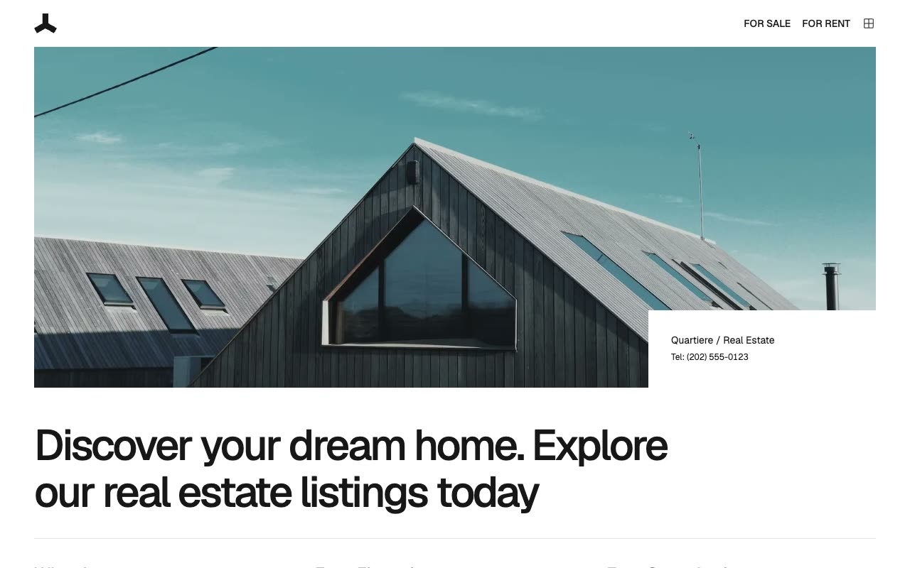

# Quartiere — Real Estate Website Template Clone (Plain HTML + CSS + Vanilla JS)

[](./demo.mp4)

Quartiere is a pixel-faithful reproduction of the Lexington Themes Quartiere luxury real estate template — a minimal, editorial multi-page site covering the full lifecycle of a real estate business: browsing listings, viewing property details, meeting agents, submitting a sell inquiry, and getting in touch. The design uses a strict black-and-white palette, sharp corners, no shadows, and the Geist typeface throughout. AOS (Animate On Scroll) entrance effects and Fuse.js-powered client-side search are wired in as vanilla JS — no build step required.

## Pages

1. **Home** (`index.html`) — Full-width hero with contact overlay box, "Why Choose Us" feature grid, available properties for sale card grid, sell CTA, agents teaser, and footer with Quartiere letterform SVG.
2. **For Sale** (`for-sale.html`) — Text-only intro header, Fuse.js search trigger, 5-card property grid with hover-fade, sell CTA, and footer.
3. **For Rent** (`for-rent.html`) — Same structure as For Sale, with rental properties and monthly rent labels.
4. **Property Detail** (`property-detail.html`) — 75 vh hero image, two-column detail layout (main content + sidebar), property specs, 3-up photo gallery, contact agent form, and related properties.
5. **Agents** (`agents.html`) — Full-width hero, worldwide agents heading with Fuse.js search, vertical agent list (photo + name/role/contact), sell CTA, and footer.
6. **Sell Property** (`sell-property.html`) — Hero with contact box, large heading, two feature rows with images, global reach CTA, and a contact form.
7. **Contact** (`contact.html`) — 3-column grid: image with dark overlay on the left, full contact form on the right (name, email, phone, location fields, concern type, and description).

## Run

This project is plain HTML, CSS, and JavaScript — no build step or package manager required.

Open directly in a browser:

```
open index.html
```

Or serve locally with any static server, for example:

```sh
python3 -m http.server
```

Then visit `http://localhost:8000` in your browser.

## Notes

- `prompt.md` holds the full build specification.
- `demo.mp4` shows the finished template in motion (with `poster.jpg` as the thumbnail).
- AOS animations are configured with `once: true` — they fire on first scroll into view and do not repeat.
- Fuse.js search on the For Sale, For Rent, and Agents pages filters results client-side against the inline property/agent data; no server is needed.

## Credits

Faithful clone of an existing design, recreated for study/learning. All credit for the original design goes to its creators.

**Original:** Lexington Themes — https://lexingtonthemes.com/viewports/quartiere

---

Part of the [Templates](../) collection in the [Fable](../../) repository — an open-source gallery of UI experiments. [Browse the live gallery](https://pulkitxm.com/claude-directory).
